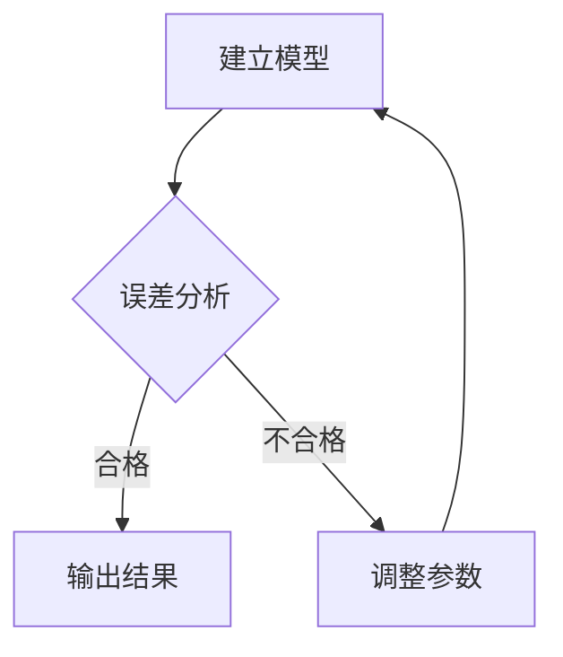

> [!NOTE]
> 提供补充信息，帮助理解上下文。（蓝色）

> [!TIP]
> 提供有助于操作的建议或技巧。（绿色）

> [!IMPORTANT]
> 强调必须知晓的信息，通常影响操作的顺利进行。（紫色）

> [!WARNING]
> 警告可能发生的风险或预期之外的结果。（橙黄色）

> [!CAUTION]
> 强烈警告，提示可能导致数据丢失或严重负面后果的操作。（红色）

---


    
 <div style="padding: 15px; border-left: 5px solid #2196F3; background-color: #12456a; border-radius: 4px;">
        <strong>提示：</strong> 这是一个使用 HTML 自定义的蓝色提示框。
    </div>

 <div style="padding: 15px; border-left: 5px solid #f44336; background-color: #701422; border-radius: 4px; margin-top: 10px;">
        <strong>警告：</strong> 这是一个红色的警告框。
    </div>

---




---

<details>
<summary>点击展开查看完整代码</summary>

这里可以放置任意 Markdown 内容，包括代码块：
```python
def simulate():
    pass
```

</details>


---

- [x] 完成动力学模拟代码
- [x] 绘制数据图表
- [ ] 撰写 LaTeX 报告


---


```diff
- 原有的旧函数实现
+ 优化后的新函数实现
```