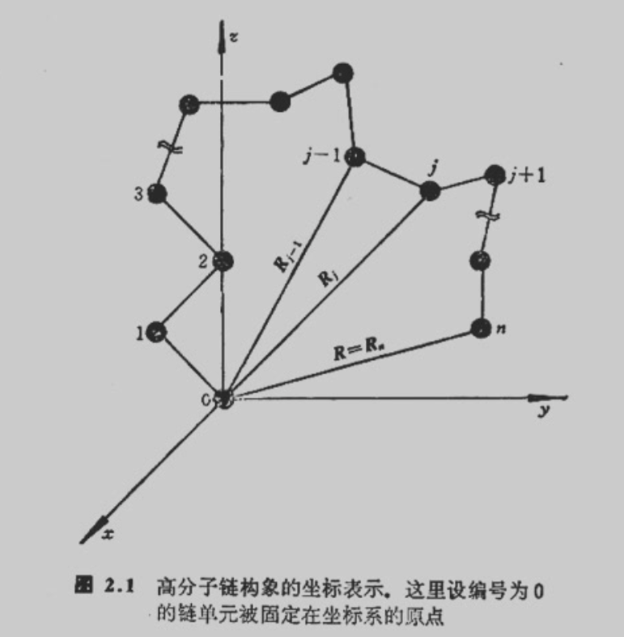

# Monte Carlo Method in Polymer Science

Q:Is universe random?

>上帝掷骰子


Q:MC模拟中增加样本量，一定可以获得更准确的结果？

>宏观统计正确，微观具体错误

## Drawing random events in $n$ channels

Probabilities of a single random event

  - $p'(i)$ for the $i^\text{th}$ event
  
  - $\sum p'(i) = 1;\ i \in [1, n]$

Distributions in all events
  
  - $p(\ell) = \sum p'(j);\ j \in [1, \ell];\ \ell \in [1, n]$

  - $p(\ell-1) \le r < p(\ell)$

## An Example of MC

Integral of equation: $f(x)=e^{-x}$

- Generating two random numbers:
  - $r1, r2 \in [0,1)$, thus, $yr=exp(-r1)$
- Comparing $r2$ with $yr$
  - $if\ (r2<=yr)\ then\ v++$
- Repeating the above two steps and summarizing the total times
  - $\mathcal{N}++$ in every repeating cycle
- $\mathcal{Result} = v/\mathcal{N}$
  

## Limitations of Monte Carlo method

- Incompatibility of economy and precision

- No unified criteria of models and results

## The evaluation of Monte Carlo model

- Does the model coincide with the real mechanism?
  
- Is the result repeatable?
  
- Is the calculating precision guaranteed with feasible time consumption?

---

## 蒲丰投针法求圆周率π
蒲丰投针试验是法国数学家蒲丰（Buffon，1707-1788）提出的经典几何概率试验，也是**蒙特卡洛随机模拟方法**的最早应用，可通过随机投针的统计结果估算圆周率$\pi$。

### 试验步骤
1. 在平面上绘制一组间距为$a$的等距平行线
2. 取一根长度为$l$（满足$l \le a$，避免针同时穿过两条线）的针，随机向平面投掷$n$次，记录针与平行线相交的次数$m$
3. 统计针与平行线相交的频率（近似概率）：$p = \frac{m}{n}$

### 公式
针与平行线相交的理论概率为：
$$p = \frac{2l}{\pi a}$$

>随机变量：

>- $y$：针中点到最近线的距离，$y∈[0,2a​]$

>- $θ$：针与线的夹角，$θ∈[0,2π​]$

>针与线相交当且仅当：$$y≤2l​sinθ$$

>概率为相交区域面积与总样本空间面积之比：

>$$
\begin{align*}
p &= \frac{\int_{0}^{\frac{\pi}{2}} \int_{0}^{\frac{l}{2}\sin\theta} dy d\theta}{\int_{0}^{\frac{\pi}{2}} \int_{0}^{\frac{a}{2}} dy d\theta} \\
&= \frac{\int_{0}^{\frac{\pi}{2}} \frac{l}{2}\sin\theta d\theta}{\int_{0}^{\frac{\pi}{2}} \frac{a}{2} d\theta} \\
&= \frac{\frac{l}{2} \cdot 1}{\frac{a}{2} \cdot \frac{\pi}{2}} \\
&= \frac{2l}{\pi a}
\end{align*}
$$


将试验得到的频率$p=\frac{m}{n}$代入上式，变形得到$\pi$的估算公式：
$$\boldsymbol{\pi = \frac{2 l n}{a m}}$$

> 简化约定：为了计算方便，工程上通常取**针长$l =$ 平行线间距$a$**，此时公式可简化为：
> 
> $$\pi = \frac{2n}{m}$$


### 代码实现

```python
import numpy as np
import matplotlib.pyplot as plt

# ===================== 1. 初始化试验参数 =====================
a = 2.0       # 平行线间距
l = 1.0       # 针的长度（满足 l <= a）
n_total = 1000  # 总投针次数（可视化建议1000次以内，收敛计算可设10万+）

# ===================== 2. 随机投针模拟 =====================
# 生成随机参数：
# theta: 针与平行线的夹角，均匀分布在 [0, π/2]
theta = np.random.uniform(0, np.pi/2, size=n_total)
# y: 针中点到最近平行线的距离，均匀分布在 [0, a/2]
y = np.random.uniform(0, a/2, size=n_total)

# 相交判定
cross_condition = y <= (l / 2) * np.sin(theta)
m = np.sum(cross_condition)  # 相交的次数

# 计算π的估算值
if m == 0:
    pi_estimate = 0
    print("投针次数过少，无相交事件，无法估算π")
else:
    pi_estimate = (2 * l * n_total) / (a * m)
    print(f"总投针次数: {n_total}")
    print(f"相交次数: {m}")
    print(f"π的估算值: {pi_estimate:.6f}")
    print(f"与真实π的绝对误差: {np.abs(pi_estimate - np.pi):.6f}")

# ===================== 3. 投针过程可视化作图 =====================
plt.rcParams['font.sans-serif'] = ['SimHei']  # 解决中文显示
plt.rcParams['axes.unicode_minus'] = False

# 子图1：投针直观示意图
fig, (ax1, ax2) = plt.subplots(2, 1, figsize=(12, 10), gridspec_kw={'height_ratios': [3, 1]})

# 绘制平行线
line_num = 6  # 绘制的平行线数量
for i in range(line_num):
    ax1.axhline(y=i*a, xmin=0, xmax=1, color='black', linewidth=1.2)

# 绘制每一根针
x_center = np.random.uniform(0, 1, size=n_total)  # 针中点的x坐标，仅用于可视化
y_center = np.random.uniform(0, (line_num-1)*a, size=n_total)  # 针中点的y坐标

for i in range(n_total):
    # 计算针两端的坐标
    half_len_x = (l / 2) * np.cos(theta[i])
    half_len_y = (l / 2) * np.sin(theta[i])
    x_start = x_center[i] - half_len_x
    x_end = x_center[i] + half_len_x
    y_start = y_center[i] - half_len_y
    y_end = y_center[i] + half_len_y
    
    # 相交为红色，不相交为蓝色
    if cross_condition[i]:
        ax1.plot([x_start, x_end], [y_start, y_end], color='red', linewidth=0.8, alpha=0.7)
    else:
        ax1.plot([x_start, x_end], [y_start, y_end], color='blue', linewidth=0.8, alpha=0.5)

ax1.set_xlim(0, 1)
ax1.set_ylim(-a/2, line_num*a)
ax1.set_title(f'蒲丰投针试验可视化（总次数{n_total}，相交次数{m}）', fontsize=14)
ax1.set_axis_off()  

# 子图2：π值随投针次数的收敛曲线
# 重新计算累计的π估算值（用于收敛曲线）
n_list = np.arange(1, n_total+1)
m_cum = np.cumsum(cross_condition)
pi_cum = np.zeros(n_total)
# 避免除以0，从第一次相交开始计算
valid_idx = m_cum > 0
pi_cum[valid_idx] = (2 * l * n_list[valid_idx]) / (a * m_cum[valid_idx])

ax2.plot(n_list, pi_cum, label='π估算值', color='darkorange', linewidth=1.2)
ax2.axhline(y=np.pi, color='black', linestyle='--', label='真实π值')
ax2.set_xlabel('投针次数', fontsize=12)
ax2.set_ylabel('π估算值', fontsize=12)
ax2.set_title('π估算值随投针次数的收敛过程', fontsize=14)
ax2.legend()
ax2.grid(True, alpha=0.3)

plt.tight_layout()
plt.show()
```

---


## Monte Carlo method in polymer physics

- A polymer with molecular weight about $10^4$ to $10^6$ exhibits huge numbers of conformation states.
  
- A single polymer chain becomes a system with hundreds of atoms.

传统的分子动力学模拟计算成本极高，MC是处理这类复杂多体体系、统计构象分布的核心数值方法.


### Set a unit at origin of coordinate system




### Simple sampling method


坐标与键向量 (Coordinate & Bond Vector)

$$r_j = R_j - R_{j-1}$$

* **$R_j$**：高分子链上第 $j$ 个单元的**绝对坐标**（相对于坐标系原点）。
  
* **$r_j$**：第 $j$ 个键的**键向量**（相对坐标）。它表示相邻两个单元之间的矢量差。在统计物理中，使用键向量 $\{r\}$ 描述链的形态通常比绝对坐标更方便。

系统哈密顿量

$$\mathcal{H}(\{r\}) = \sum_{j=1}^{n} u_j(r_j) + w(\{r\})$$

* **$\mathcal{H}(\{r\})$**：在特定构象 $\{r\}$ 下，高分子系统的**总能量**。
  
* **$\sum u_j(r_j)$**：**局部/短程相互作用能**。代表相邻结构单元之间的能量，例如化学键的伸缩能、键角的弯曲能。
  
* **$w(\{r\})$**：**长程相互作用能**。代表在化学序列上相距较远，但在三维空间中互相靠近的链段之间的能量，例如排斥体积效应（两个原子不能占据同一空间）或范德华引力。

简单抽样法求统计平均值

$$\langle A(\{r\}) \rangle \approx \overline{A(\{r\})} = \frac{\sum_{l=1}^{M} A(\{r\}_l) \cdot \exp[-\mathcal{H}(\{r\}_l)/kT]}{\sum_{l=1}^{M} \exp[-\mathcal{H}(\{r\}_l)/kT]}$$

* **$\langle A(\{r\}) \rangle$**：我们想要计算的某个宏观物理量 $A$（如均方末端距、回转半径）的**真实统计平均值**。
  
* **$M$**：蒙特卡洛模拟中，计算机随机生成的**构象总数**（样本量）。下标 $l$ 表示第 $l$ 个随机生成的构象。
  
* **$A(\{r\}_l)$**：第 $l$ 个特定构象所对应的物理量 $A$ 的值。
  
* **$\exp[-\mathcal{H}(\{r\}_l)/kT]$**：**玻尔兹曼因子**。它是每个构象的**概率权重**。能量 $\mathcal{H}$ 越低，该权重值越大，代表此构象在真实自然界中出现的概率越高（$k$ 为玻尔兹曼常数，$T$ 为绝对温度）。
  


### Random walks

Freely jointed chain:假设高分子链链段之间没有体积排斥（即链可以穿过自身），相隔较远的原子之间也没有任何相互作用力。随机生成的每一个构象，其出现的概率都是相等的，直接进行算数平均。完全的Marcov链。

$$
\mathcal{H}(\{r\}) = \sum_{j=1}^n u_j(r_j)
$$

$$
\langle A(\{r\}) \rangle \approx \overline{A(\{r\})} = \frac{1}{M} \sum_{l=1}^M A(\{r\}_l)
$$

#### Flow of RW algorithm for $\langle R^2 \rangle$

**Step 0:** put the start unit of $r_1$ to the origin, set $j=1$

**Step 1:** generate a random point on the surface of a sphere with radii of $a$, and make it as the end of $r_j$ and the start of $r_{j+1}$

**Step 2:** calculate $R_j$
$$\vec{R}_j = \vec{R}_{j-1} + \vec{r}_j$$

**Step 3:** $j=j+1$, and return to step 1 until $j==n$

**Step 4:** calculate $R_n^2$


$$
\left\langle R^2 \right\rangle_{RW} \propto n
$$

### Self-avoiding walks

Excluded-volume effect

长程相互作用的总能量：

$$
w(\{r\}) = \frac{1}{2} \sum_{i \neq j} w\left(|r_i - r_j|\right)
$$

相邻片段之间硬球排斥：

$$
w\left(|r_i - r_j|\right) =
\begin{cases}
\varepsilon, & |r_i - r_j| \le \upsilon_0 \\
0, & |r_i - r_j| > \upsilon_0
\end{cases}
$$

SAW的均方末端距

$$
\left\langle R^2 \right\rangle_{SAW} \propto n^{2\nu}, \quad \nu = 0.59 \quad \text{when} \quad n \to \infty
$$
