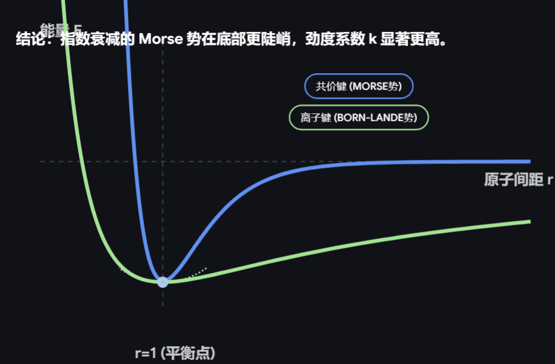

# 第一章 能量与能量量子化

> 从分子物质观过渡到**超多分子系统**（宏观系统）的研究。

---

**科学**——用少数可实证的**基本变量**认识世界。

## 第一节 科学认识论与科学第一标度

### 1.第一标度：力与能量

**第一标度**：以力和能量这两个基本量来标度物体间的相互作用，是伽利略-牛顿力学框架的基石。

---

### 2.伽利略-牛顿框架

**(1) 物体的性质**：关注质量 $m$ 为常数，将物体抽象为**质点**。

**(2) 对物体施加作用，引发变化**：在四维时空中描述其演化。

**牛顿第二定律**：

$$\vec{F} = \frac{d(m\vec{v})}{dt}$$

**牛顿第一定律**：

$$\sum \vec{F} = 0 \implies \vec{v} = \mathrm{const}$$

**牛顿第三定律**：

$$\vec{F}_{12} = -\vec{F}_{21}$$

---

### 3.相互作用的标量标度

从力的矢量描述转向**能量**这一标量描述，以功作为桥梁。

弹性碰撞中能量守恒：

$$\frac {d(\frac{1}{2}m_1v_1^2 + \frac{1}{2}m_2v_2^2)}{dt}= \mathrm{const}$$

由牛二推导动量定理：

$$\vec{F}\, dt = d\vec{p}$$

由牛二推导功的表达式：

$$dW = \vec{F} \cdot d\vec{x} = \frac{d(m\vec{v})}{dt} \cdot d\vec{x} = m\vec{v} \cdot d\vec{v}$$

积分得动能定理：

$$W = \int_{\text{路径}} m\vec{v} \cdot d\vec{v}$$

$$\Delta W = \frac{1}{2}mv_b^2 - \frac{1}{2}mv_a^2 = \Delta E_k$$

当外势场 $\neq 0$ 时，引入势能 $E_p = f(x,y,z)$：

$$dW = dE = d(E_k + E_p)$$

若系统不受外力做功（$dW = 0$），则 $dE = 0 = dE_k + dE_p$，即动能与势能之和守恒：

$$E = E_k + E_p$$

> **庞加莱（Jules Henri Poincaré）指出**：尽管在理想力学模型中动能与势能区分明确，但在涉及热力学等复杂系统中，两者无法被严格界定。这是由于宏观**内能**包含了微观层面不可观测的分子动能与势能，在缺乏微观状态完全信息的条件下，无法在数学上将系统总能量绝对剥离为仅依赖速度的项与仅依赖位置的项。因此，脱离了简单的理想模型后，在真实物理系统中对动能和势能的严格划分往往具有任意性。

---

### 4.系统的能量

系统总能量由**整体动能**、**整体势能**和**内能**三部分构成：

$$E = \underbrace{E_k}_{\text{整体动能}} + \underbrace{E_p}_{\text{整体势能}} + \underbrace{U}_{\text{内能}}$$

在**机械能守恒**的前提下，内能可进一步分解为**基态能**与**热能**：

$$\underbrace{U}_{\text{内能}} = \underbrace{U(0)}_{\text{基态能}} + \underbrace{Q}_{\text{热能}}$$

**热力学第一定律**：

$$\underbrace{dq}_{\text{传热作用}} + \underbrace{dW}_{\text{作功}} = dE = \underbrace{dU}_{\text{系统内能变化}}$$

即系统内能的变化等于过程中吸收的热量与外界对系统所做功之和。

---

## 第二节 原子分子与能量量子化

### 1.原子和分子

原子与分子的行为由**量子力学**描述，而宏观系统表现热力学行为。

---

### 2.分子自由度

分子运动自由度的数量决定了能量在各运动模式间的分配方式。对于一个含 $N$ 个原子的分子：

- **平动自由度** $F_{\text{平}} = 3$（始终为 3，对应三维空间中质心运动）
  
- **转动自由度**：
  
$$
F_{\text{转}} = \begin{cases} 
0, & \text{单原子分子} \\ 
2, & \text{线性分子} \\ 
3, & \text{非线性分子} 
\end{cases}
$$

- **振动自由度**：$F_{\text{振}} = 3N - F_{\text{转}} - 3$

| 实例 | $F_{\text{平}}$ | $F_{\text{转}}$ | $F_{\text{振}}$ |
| :--- | :---: | :---: | :---: |
| **氧原子** (O) | 3 | 0 | — |
| **水分子** (H₂O) | 3 | 3| $3 \times 3 - 3 - 3 = 3$ |
| **丙烷** (C₃H₈) | 3 | 3 | $3N - 6 = 3 \times 11 - 6 = 27$ |

对于**氢原子**这类简单体系，除了核自由度（平动），还需考虑**电子自由度**，其电子能级结构由量子力学确定。

每一种自由度，都对应各自的量子能级。

每一种宏观的运动自由度，在微观上都严格对应一种量子力学模型：

*   **平动自由度** $\rightarrow$ 三维势箱模型 $\rightarrow$ 对应平动能级 $E_t$
  
*   **转动自由度** $\rightarrow$ 刚性转子模型 $\rightarrow$ 对应转动能级 $E_r$
  
*   **振动自由度** $\rightarrow$ 谐振子模型 $\rightarrow$ 对应振动能级 $E_v$

---

#### 平动自由度

$$F_{平}=3$$

三维势阱箱：

$$E_{n_x, n_y, n_z}=\frac{h^2}{8m}\left[\left(\frac{n_x}{l_x}\right)^2+\left(\frac{n_y}{l_y}\right)^2+\left(\frac{n_z}{l_z}\right)^2\right]$$

$$n_x, n_y, n_z=1, 2, \dots$$

(1) 基态能 $E_{1,1,1}\neq0$

(2) $\Delta E_{1\rightarrow2}$ (相邻能级) $\doteq10^{-42}\text{ (J)}\doteq10^{-23}\text{ (kJ/mol)}$

>**回忆一下结构Ⅰ...**

>**1. 薛定谔方程**
势箱内 ($V=0$) 的定态薛定谔方程为：

>$$-\frac{\hbar^2}{2m} \left( \frac{\partial^2}{\partial x^2} + \frac{\partial^2}{\partial y^2} + \frac{\partial^2}{\partial z^2} \right) \psi(x,y,z) = E\psi(x,y,z)$$

>**2. 分离变量**
令 $\psi(x,y,z) = X(x)Y(y)Z(z)$，且 $E = E_x + E_y + E_z$。
代入方程可将其分解为三个独立的一维方程，以 $x$ 方向为例：

>$$-\frac{\hbar^2}{2m} \frac{d^2 X(x)}{dx^2} = E_x X(x)$$

>**3. 一维求解与边界条件**
上述方程的通解为：

>$$X(x) = A \sin(k_x x) + B \cos(k_x x) \quad \left( k_x = \frac{\sqrt{2mE_x}}{\hbar} \right)$$

>代入势箱边界条件 $X(0) = 0$ 且 $X(l_x) = 0$：

>*   $X(0) = B = 0$
  
>*   $X(l_x) = A \sin(k_x l_x) = 0$
要求波函数不全为零 ($A \neq 0$)，则必须满足：

>$$k_x l_x = n_x \pi \quad (n_x = 1, 2, 3, \dots)$$

>**4. 推导单维能量**
将 $k_x = \frac{\sqrt{2mE_x}}{\hbar}$ 和 $\hbar = \frac{h}{2\pi}$ 代入量子化条件：

>$$\frac{\sqrt{2mE_x}}{h/2\pi} l_x = n_x \pi$$

>解得 $x$ 方向的平动能：

>$$E_x = \frac{n_x^2 h^2}{8m l_x^2}$$

>**5. 组合三维能量**
同理可得 $E_y$ 和 $E_z$。总能量为三者之和：

>$$E_{n_x, n_y, n_z} = E_x + E_y + E_z = \frac{h^2}{8m}\left[\left(\frac{n_x}{l_x}\right)^2+\left(\frac{n_y}{l_y}\right)^2+\left(\frac{n_z}{l_z}\right)^2\right]$$

>$$(n_x, n_y, n_z = 1, 2, 3, \dots)$$

---

#### 分子内自由度:电子、振动、转动

>详见结构Ⅱ。

**电子自由度**

能隙较大，绝大多数在基态。

**振动自由度**

$$j_{\text{振动}}=0$$

>能级间隔 $\gg$ 热运动能量,常温下粒子绝大数在基态，对体系的宏观热容和内能变化没有贡献，有效自由度为0。

简谐振动，第 $j$ 个振动自由度的能级：

$$E_v = \left(v+\frac{1}{2}\right)h\nu \implies h\nu, \quad hc\tilde{\nu}$$

$$v=0, 1, 2, \dots$$

① $E_{v=0}=\frac{1}{2}h\nu$

② $\Delta E_{0\rightarrow1}=h\nu$

双原子振动：

$$\tilde{\nu}=\frac{1}{2\pi c}\sqrt{k_{\text{键}}/M_{\text{折合}}}=1302\sqrt{k_{\text{键}}/M_{\text{折合}}}$$

>谐振子近似在低能级区域精度高

$$k_{\text{键}}=\frac{\partial^2 E_p}{\partial x^2}$$

>平衡位置一阶偏导为0，二阶偏导反应力常数。

$$M_{\text{折合}}=\frac{M_1M_2}{M_1+M_2}$$

① 轻原子更大地影响折合质量

② 与键能有关，势阱越深，开口往往越窄，同类型键 $E_p\uparrow$，$k_{\text{键}}\uparrow$

③ 离子键，$k_{\text{键}}$ 更小

**转动自由度**

线性分子：

$$E_J = J(J+1)\frac{h^2}{8\pi^2 I}$$

简并度 $= 2J+1$

$$J=0, 1, 2, \dots$$

(1) 基态能 $E_0=0$

(2) $E_{0\rightarrow1} \gg E_{1\rightarrow2(平)}$

---

### 3.量子自由度正交与耦合

分子总能量直接写为 $E = E_{\text{平}} + E_{\text{转}} + E_{\text{振}} + E_{\text{电}}$ ，建立在假设之上：**各个运动自由度相互正交**。

- 解耦（正交）：假设总哈密顿算符可以完全分离变量（如玻恩-奥本海默近似分离了核与电子运动，刚性转子-谐振子模型分离了振动与转动）。各运动模式互不干扰。

- 耦合：自由度之间往往存在相互作用。如转动引发的离心畸变会改变键长（振转耦合），或核的振动导致电子态简并破除（电子-声子耦合 / 姜-泰勒效应）。此时，哈密顿矩阵的非对角项不再为零，分离变量失效，引入微扰理论或重构波函数进行修正。
                        

