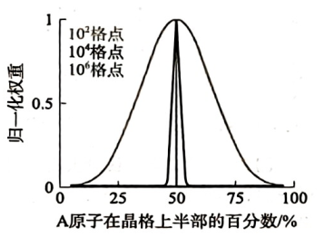
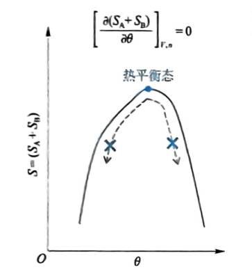
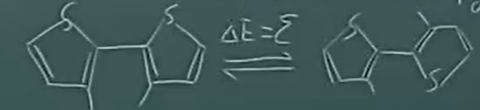

# 第二章 从单原子分子到多原子：熵与温度

## 第一节 相互作用研究的局限性

### 1.1能量图像

$$dq + \underbrace{dW}_{\text{作用}} = \underbrace{dE}_{\text{物体}}$$

多体作用$\Rightarrow$势场:

$$\vec{F}_{\text{保守}} = -\frac{\partial E_p}{\partial r}$$

定态薛定谔方程：

$$ \left( -\frac{\hbar^2}{2m}\frac{d^2}{dx^2} + V(x) \right) \psi(x) = E\psi(x) $$

多体作用抽象为势场 ($V(r)$) $\rightarrow$ 代入薛定谔方程求解 $\rightarrow$ 获得离散的量子化能级 ($E_n$) $\rightarrow$ 构建统计物理配分函数 ($q$) $\rightarrow$ 导出宏观热力学状态函数 ($U, C_V$) $\rightarrow$ 解释宏观体系内能变化 ($dE$)与能量交换 ($dq+dW$)

---

### 1.2 超多分子系统的特点

$$ \text{始态} \xrightarrow{\text{作用}} \text{终态 (变化)} $$

由能量$E$（相互作用），系统转化为最大概率状态，带来熵变，熵$S$被定义为系统微观状态多样性。多样性改变的难易度即为温度$T$。

---

## 第二节 宏观状态的微观多样性：熵

### 2.1 排列组合

一个 3 行 4 列的晶格，被中间的竖线平分为左右两半，左右各 6 个格位。有Au (8 个)，Ag (4 个)。现观照左侧Ag的比例。

| 宏观状态 $i$ ($N_{\text{Ag(左)}}$) | $W_i$ | $W_i/W_{\max}$ |
| :---: | :---: | :---: |
| 4 | $\frac{6!}{4!2!} \frac{6!}{6!} = 15$ | 0.07 |
| 3 | $\frac{6!}{3!3!} \frac{6!}{1!5!} = 120$ | 0.53 |
| 2 | $\left(\frac{6!}{4!2!}\right)^2 = 225$ | 1 |
| 1 | 120 | 0.53 |
| 0 | 15 | 0.07 |

---

### 2.2 最概然分布与统计涨落

超多分子系统：对微观足够大，宏观足够小~$10^6$

(1)最概然分布：宏观上均匀的状态，对应了**最多的微观状态数**。
(2)统计涨落：宏观测量的偏差，小。

---

### 2.3 统计热力学的基本假定

边界条件允许的任何微观状态出现概率相等。

（1）宏观实验时间足够长
（2）时间域复制

对任一宏观状态 $i$ , 出现概率：

$$
P_i = \frac{W_i}{\sum_{i=1}^n W_i}
$$

$n$ 是宏观状态的数目

---

### 2.4 熵的定义

1840年左右，克劳修斯定义了熵（热温熵）：

$$
dS = \frac{dq_{\text{rev}}}{T}
$$

熵作为状态函数，具广度性质。玻尔兹曼将其定义为系统多样性的量度：

$$
S \equiv k \ln W
$$

k为玻尔兹曼系数

气体常数：

$$
R = N_A·K
$$

① 是某宏观状态的熵
② 对于某平衡态的系统，最概然分布的熵等同于平衡态的熵。
③
$$
\because W_{\text{min}} = 1, \therefore S_{\text{min}} = 0
$$

对应着热力学第三定律的微观统计解释：宏观熵对于等于 0。

---

### 2.5 熵增原理（热力学第二定律）

孤立系统：与环境无物质与能量交换的系统

始态 $\xrightarrow{\text{概率增加}}$ 终态 ($W_{\text{max}}$)

热力学第二定律：孤立系统内的任一过程一定满足 $dS \ge 0$

>假设一个极小的宏观熵差：$\Delta S = 0.0001 \text{ J/K} = 10^{-4} \text{ J/K}$

>$$\Delta S = S_1 - S_2 = k \ln W_1 - k \ln W_2 = k \ln\left(\frac{W_1}{W_2}\right)$$

>$$\frac{W_1}{W_2} = e^{\frac{\Delta S}{k}}$$

>$$\frac{\Delta S}{k} = \frac{10^{-4}}{1.38 \times 10^{-23}} \approx 0.72 \times 10^{19}$$

>$$\frac{W_1}{W_2} \approx e^{10^{20}}$$

对于扩展的大孤立系统 (系统 + 环境)：

$$
\boxed{dS_{\text{孤}} = dS + dS_{\text{环}} \ge 0}
$$

(1)放弃了以做功为唯一相互作用方式
(2) $dq$ 所致

---

## 第三节 熵改变的难易度：温度

### 3.1 熵改变与能量

对于单一量子自由度而言，$U\uparrow$ ，能布居的能级数目增加，粒子数不变，$S\uparrow$

$$
W = \frac{N!}{\prod_i N_i!}
$$

$$
\left(\frac{\partial S}{\partial U}\right)_{n,V}=\left(\frac{\partial S}{\partial Q}\right)_{n,V} \ge 0
$$

---

### 3.2 熵改变难易度

孤立系统中，将 $A$ 与 $B$ 两个物块接触。

总熵增加：

$$
dS_A + dS_B \ge 0
$$

同时：

$$
dU_A + dU_B = 0, \quad dU_A = -dU_B < 0
$$

$$
dS_A + dS_B > 0 \quad \text{（两边同除以 } dU_B \text{）}
$$

$$
\frac{dS_A}{dU_B} + \frac{dS_B}{dU_B} > 0
$$

$$
\frac{dS_A}{dU_A} < \frac{dS_B}{dU_B}
$$

$$
\because dS_B > 0, \quad dU_B > 0
$$

$$
dS_A < 0, \quad dU_A < 0
$$

$$
\frac{dU_B}{dS_B} < \frac{dU_A}{dS_A}
$$

改为偏导数

$$
\therefore \left(\frac{\partial U_B}{\partial S_B}\right)_{n,V} < \left(\frac{\partial U_A}{\partial S_A}\right)_{n,V}
$$

定义：

$$T \equiv \left( \frac{\partial U}{\partial S} \right)_{n, V} = \left( \frac{\partial Q}{\partial S} \right)_{n, V}$$

温度是系统一个状态在 $n, V$ 不变条件下，熵改变的难易度。为强度性质。

---

### 3.3 热力学第零定律与热平衡

我们一般测量的是温度的效应，而非温度自身。熵作为多样性，反而最容易观测。

热力学第零定律：

$$A \Leftrightarrow B, \quad T_A = T_B$$

$$B \Leftrightarrow C, \quad T_B = T_C$$

那么，

$$A \Leftrightarrow C, \quad T_A = T_C$$

一个矩形容器被中间的隔板分为左右两个部分，标记为 $A$ 和 $B$。

$$\left( \frac{\partial (S_A + S_B)}{\partial \theta} \right)_{n, V} = 0$$

$\theta$为截面两侧热能交换量

$$\left( \frac{\partial S_A}{\partial Q_A} \right)_{n, V} - \left( \frac{\partial S_B}{\partial Q_B} \right)_{n, V} = 0$$

$$d\theta = dQ_A = -dQ_B$$

$$\frac{1}{T_A} - \frac{1}{T_B} = 0$$

**熵极大原理与热平衡**

将总熵微商表示为对热交换量 $\theta$ 的导数：

$$\left( \frac{\partial S}{\partial \theta} \right)_{n,V} = \frac{1}{T_A} - \frac{1}{T_B}$$

根据热力学第二定律，孤立系统$dS > 0$。若 $T_A \neq T_B$，热量会自发从高温区流向低温区，使状态点在曲线上向顶点移动。曲线的最高点，此时系统总熵达到最大。极值点处导数为零：
$$  \left( \frac{\partial S}{\partial \theta} \right)_{n,V} = 0$$

$$  \frac{1}{T_A} - \frac{1}{T_B} = 0 \implies T_A = T_B$$

---

## 第四节 玻尔兹曼分布

### 4.1 分子物质观的统计热力学———量子统计热力学

(1) 分布在量子自由度的各能级

(2) 各量子自由度正交，分子在各自由度的能级上独立分布。

(3) 微观状态数$W = \prod_j W_j, \quad S = \sum_j S_j$

---

### 4.2 一个只有两个能级的自由度的分布

小系统 + 环境 $\rightarrow$ 大孤立系统

$$\frac{P(\varepsilon)}{P(0)} = \frac{W(\varepsilon) \cdot W_{\text{环}}(U_{\text{环}} - \varepsilon)}{W(0) \cdot W_{\text{环}}(U_{\text{环}})} = e^{\frac{S_{\text{环}}(U_{\text{环}} - \varepsilon) - S_{\text{环}}(U_{\text{环}})}{k}} = e^{-\frac{\varepsilon}{kT}}$$

>这里不考虑两个能级简并度，即$W(\varepsilon)$和$W(0)$为一。

其中对环境熵的进行了泰勒展开

$$S_{\text{环}}(U_{\text{环}} - \varepsilon) \approx S_{\text{环}}(U_{\text{环}}) - \left( \frac{\partial S}{\partial U} \right)_{n,V} \varepsilon$$

由 $\left( \frac{\partial S}{\partial U} \right)_{n,V} = \frac{1}{T}$：

$$dS_{\text{环}} = S_{\text{环}}(U_{\text{环}} - \varepsilon) - S_{\text{环}}(U_{\text{环}}) = -\frac{\varepsilon}{T}$$

---

### 4.3 玻尔兹曼分布

设基态能级的能量 $\varepsilon = E_0 - E_0 = 0$。任一能级 $i$，$\varepsilon_i = E_i - E_0$

任选能级 $i$ 和 $0$，有：

$$\frac{P(i)}{P(0)} = e^{-\frac{\varepsilon_i}{kT}}$$

$$P(i) = \frac{N_i}{\sum_{i=0}^n N_i} = \frac{N_i}{N}$$

$$\because \sum_{i=0}^n P(i) = 1$$

$$\therefore 1 = P(0) \sum_{i=0}^n e^{-\frac{\varepsilon_i}{kT}} \Rightarrow P(0) = \frac{1}{\sum_{i=0}^n e^{-\frac{\varepsilon_i}{kT}}}$$

配分函数：

$$\boxed{\boldsymbol{q} \equiv \sum_{i=0}^n e^{-\frac{\varepsilon_i}{kT}}}$$

>$q$ 代表了在给定温度 $T$ 下，系统可以有效热占据的微观状态总数。

(1) 给定量子自由度，温度，$q$ 有定值

(2) $T \uparrow$, $q \uparrow$

(3) $T$ 一定，$\Delta \varepsilon_{1 \to 0} \uparrow$, $q \downarrow$

$q = 1$即能量最低原理显然需要基于如下假设：

① $T \to 0$

② $\Delta \varepsilon_{1 \to 0} \to \infty$

$$\frac{\varepsilon}{kT} \to \infty \quad
\begin{cases} 
\text{电子跃迁}\Delta \varepsilon_{1 \to 0} = 1000 \text{ meV} \\ 
\text{室温 } kT = 25 \text{ meV} 
\end{cases}$$

---

## 第五节 浓度定律

### 5.1 单相溶液中的分子分布

$$\frac{P_A}{P_B} \equiv \frac{C_A}{C_B} = e^{-\frac{(\varepsilon_A - \varepsilon_B)}{kT}} = 1 \quad (\varepsilon_A = \varepsilon_B)$$

变量定义：

- $A$、$B$：代表单相溶液中的任意两个不同位置。
  
- $P_A$、$P_B$：微观上，溶质分子出现在位置 $A$ 和 $B$ 的概率。
  
- $C_A$、$C_B$：宏观上，位置 $A$ 和 $B$ 的溶质浓度。
  
- $\varepsilon_A$、$\varepsilon_B$：溶质分子在位置 $A$ 和 $B$ 的势能。

在热平衡状态下，单相溶液内部各处的溶质分子分布是均匀的，宏观浓度处处相等。 玻尔兹曼分布不仅能处理不同能级间的粒子分布，也能解释空间上的粒子分布。

---

### 5.2 离心机

考虑粒子在重力场中从容器底部 ($h=0$) 升至高度 $h$,体系能量包括两部分重力势能相减

$$\varepsilon(h) = (\rho_{\text{质}} - \rho_{\text{剂}}) V_{\text{质}} g h = \Delta \rho V_{\text{质}} g h$$

浓度 $C$ 正比于粒子出现的概率 $P$：

$$\frac{C(h)}{C(0)} = \frac{P(h)}{P(0)} = e^{-\frac{\Delta \rho V_{\text{质}} g h}{kT}}$$

$V_{\text{质}} \to \infty$：从微观纳米晶过渡到宏观大尺寸物体，由统计物理得到宏观浮力定律

* **沉降 ($\Delta \rho > 0$)**
固体密度大于溶剂密度，参考点取底部 $C(0)$：

$$\lim_{V_{\text{质}} \to \infty} \frac{C(h)}{C(0)} = \lim_{V_{\text{质}} \to \infty} e^{-\frac{\Delta \rho V_{\text{质}} g h}{kT}} = 0$$

* **上浮 ($\Delta \rho < 0$)**

$$\lim_{V_{\text{质}} \to \infty} \frac{C(h)}{C(\text{面})} = \lim_{V_{\text{质}} \to \infty} e^{\frac{\Delta \rho V_{\text{质}} g h}{kT}} = 0$$

* **悬浮 ($\Delta \rho = 0$)**

$$\frac{C(h)}{C(0)} = e^0 = 1$$

