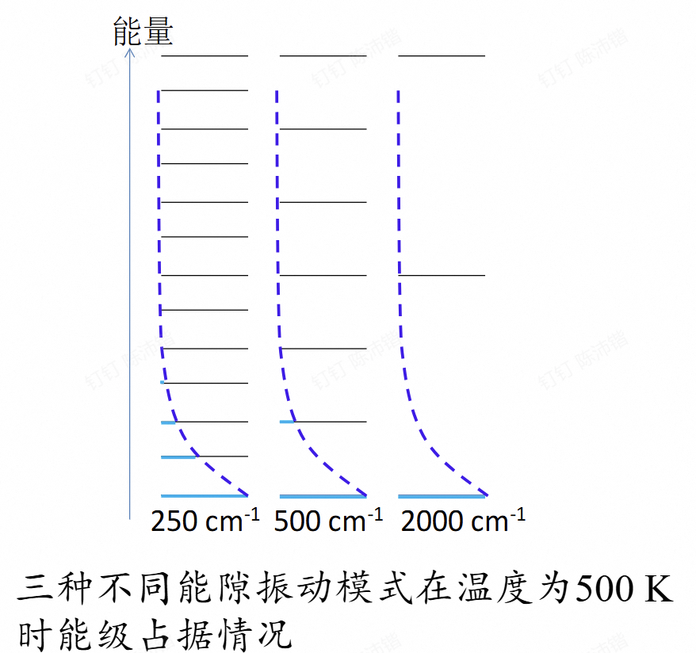

# 第三章 分子结构与宏观测量

## 第一节 不同自由度的的配分函数

### 1.1 正交自由度与配分函数

对任意自由度

$$f = \sum_{i=1}^{\infty} e^{-\frac{\varepsilon_i}{kT}}$$

如果在给定的能量类别中，第 $i$ 个能级的简并度为 $g_i$

$$f = \sum_{i=1}^{n} g_i e^{-\frac{\varepsilon_i}{kT}}$$

多个正交自由度：

$$E = E_1 + E_2 + E_3 + \cdots + E_j$$

$$f = \prod_j f_j$$

!!!EXAMPLE
    假定 $\varepsilon^1$ 一共只有3个不同的量子能级，而 $\varepsilon^2$ 有2个不同的量子能级。

    解：记 $\varepsilon^1$ 的3个量子能级为 $\varepsilon_{11}, \varepsilon_{12}$ 和 $\varepsilon_{13}$，$\varepsilon^2$ 的2个量子能级为 $\varepsilon_{21}$ 和 $\varepsilon_{22}$，则根据配分函数的定义可知：

    **先求积结果：**

    $$f = \sum_{i=1}^{2 \times 3} e^{-\frac{\varepsilon_i}{kT}} = \sum_{i=1}^{6} e^{-\frac{\sum_{j=1}^{2}\varepsilon_{ij}}{kT}}$$

    $$= \sum_{i=1}^{6} \prod_{j=1}^{2} e^{-\frac{\varepsilon_{ij}}{kT}} = e^{-\frac{\varepsilon_{11}}{kT}} \cdot e^{-\frac{\varepsilon_{21}}{kT}} + e^{-\frac{\varepsilon_{11}}{kT}} \cdot e^{-\frac{\varepsilon_{22}}{kT}} + e^{-\frac{\varepsilon_{12}}{kT}} \cdot e^{-\frac{\varepsilon_{21}}{kT}} + e^{-\frac{\varepsilon_{12}}{kT}} \cdot e^{-\frac{\varepsilon_{22}}{kT}} + e^{-\frac{\varepsilon_{13}}{kT}} \cdot e^{-\frac{\varepsilon_{21}}{kT}} + e^{-\frac{\varepsilon_{13}}{kT}} \cdot e^{-\frac{\varepsilon_{22}}{kT}}$$

    **先求和结果：**

    $$f = \prod_{j=1}^{2} f_j = \left(e^{-\frac{\varepsilon_{11}}{kT}} + e^{-\frac{\varepsilon_{12}}{kT}} + e^{-\frac{\varepsilon_{13}}{kT}}\right) \cdot \left(e^{-\frac{\varepsilon_{21}}{kT}} + e^{-\frac{\varepsilon_{22}}{2kT}}\right)$$

    $$= e^{-\frac{\varepsilon_{11}}{kT}} \cdot e^{-\frac{\varepsilon_{21}}{kT}} + e^{-\frac{\varepsilon_{11}}{kT}} \cdot e^{-\frac{\varepsilon_{22}}{kT}} + e^{-\frac{\varepsilon_{12}}{kT}} \cdot e^{-\frac{\varepsilon_{21}}{kT}} + e^{-\frac{\varepsilon_{12}}{kT}} \cdot e^{-\frac{\varepsilon_{22}}{kT}} + e^{-\frac{\varepsilon_{13}}{kT}} \cdot e^{-\frac{\varepsilon_{21}}{kT}} + e^{-\frac{\varepsilon_{13}}{kT}} \cdot e^{-\frac{\varepsilon_{22}}{kT}}$$

    两者是一致的，即合理。

总配分函数 

$$f_{\text{总}} = f_{\text{电子}} f_{\text{振动}} f_{\text{转动}} f_{\text{平动}}$$

---

### 1.2 各自由度的配分函数

#### 平动自由度

$$E_{n_x, n_y, n_z} = \frac{h^2}{8m}\left(\frac{n_x^2}{a^2} + \frac{n_y^2}{b^2} + \frac{n_z^2}{c^2}\right)$$

$$= E_{n_x} + E_{n_y} + E_{n_z}$$

$$f_{\text{平}} = f_x f_y f_z$$

由对称性计算$f_x$即可

$f_x$：

$$i = n_x = 1, 2, \dots$$

$$\varepsilon_i = \frac{h^2}{8ma^2}(i^2 - 1)$$

$$f_x = \sum_{i=1}^{\infty} e^{-\frac{h^2}{8ma^2}(i^2 - 1) / kT}$$

在通常的宏观条件下，由于平动能级间隔极小（ $\varepsilon_i<<KT$ 近似连续）将求和转化为积分:

$$= \int_{1}^{\infty} e^{-\frac{h^2}{8ma^2}(i^2 - 1) / kT} \mathrm{d}i$$

$$f_x = \frac{(2\pi m)^{\frac{1}{2}}a}{h}(kT)^{\frac{1}{2}}$$

体积越大，能隙越小，现实中一般 $a$ 都足够大

$$f_{\text{平}} = f_x f_y f_z = \frac{(2\pi m)^{\frac{3}{2}}}{h^3}(kT)^{\frac{3}{2}} V$$

!!!EXAMPLE
    计算未饱和水蒸气（理想气体，温度为300 K，体积等于 $1.0\text{ m}^3$）的平动配分函数。

    $$f_{\text{平动}} = \frac{(2\pi m)^{3/2}}{h^3}(kT)^{3/2}V = 7.4 \times 10^{31}$$

    基态在配分函数中的取值及其对配分函数的贡献为

    $$\frac{1}{7.4 \times 10^{31}} = 1.4 \times 10^{-32}$$

---

#### 转动自由度

线性分子转动配分函数

$$\varepsilon_J = J(J+1) \frac{h^2}{8\pi^2 I}$$

$$f_{\text{转动}} = \sum_{J=0}^{\infty} (2J+1)e^{-\frac{J(J+1)h^2}{8\pi^2 I kT}} = \int_{0}^{\infty} (2J+1)e^{-\frac{J(J+1)h^2}{8\pi^2 I kT}} \mathrm{d}J$$

$$f_{\text{转动, 线性}} = \frac{8\pi^2 I}{h^2} kT = \frac{1}{hcB} kT$$

$$B = \frac{h}{8\pi^2 c I}$$

$$f_{\text{转动}} = -\frac{8\pi^2 I kT}{h^2} \int_{0}^{\infty} \mathrm{d}\left(e^{-\frac{J(J+1)h^2}{8\pi^2 I kT}}\right)$$

$$\mathrm{d}\left(e^{-\frac{J(J+1)h^2}{8\pi^2 I kT}}\right) = e^{-\frac{J(J+1)h^2}{8\pi^2 I kT}} \left(-\frac{h^2}{8\pi^2 I kT}\right) (2J+1) \mathrm{d}J$$

$$f_{\text{转动}} = -\frac{8\pi^2 I kT}{h^2} \int_{0}^{\infty} \mathrm{d}\left(e^{-\frac{J(J+1)h^2}{8\pi^2 I kT}}\right) = \frac{8\pi^2 I}{h^2} kT$$

!!! WARNING
    这针对异核双原子分子。同核双原子如 $N_2$ 需要额外除以对称数 $\sigma=2$。多原子非线性分子需用群论讨论对称性，如$H_2O$对称数为2.

$\varepsilon_1 \ll kT$。在“高温近似”条件下，转动能级间隔非常小，因此可以将离散的求和近似转化为连续的积分。

!!!NOTE
    平动极容易满足连续积分条件，而转动需要相对高温。通常特征转动温度 $\Theta_r = \frac{h^2}{8\pi^2 Ik}$ 在几 $K$ 到几十 $K$ 之间。

!!!WARNING 
    在平动中沿 $x, y, z$ 方向的动量算符（$\hat{p}_x, \hat{p}_y, \hat{p}_z$）相互对易。粒子可以同时具有确定的 $x$、$y$ 和 $z$ 方向量子数。总能量拆解为三个独立变量的函数：

    $$E_{n_x, n_y, n_z} = E(n_x) + E(n_y) + E(n_z)$$

    指数项 $e^{-(E_x+E_y+E_z)/kT}$ 且三个量子数互相独立，求和能拆成三个求和的乘积。
    
    在三维转动中,角动量算符三个方向分量（$\hat{L}_x, \hat{L}_y, \hat{L}_z$）不对易（ $[\hat{L}_x, \hat{L}_y] = i\hbar\hat{L}_z$）。一个分子不可能同时在三个独立坐标轴上具有确定的转动量子数。无法写出形如 $E = E(J_x) + E(J_y) + E(J_z)$ 的公式，因为 $J_x, J_y, J_z$ 不能同时确定。

非线性分子：

$$f_{\text{转,非线性}} = \left(\frac{kT}{hc}\right)^{\frac{3}{2}} \left(\frac{\pi}{ABC}\right)^{\frac{1}{2}}$$

$A, B, C$ 为三个主轴的转动常数

!!!EXAMPLE
    光谱方法测得，CO的转动常数 $B$ 为 $1.93 \text{ cm}^{-1}$。计算
    （1）CO的基本能隙；
    （2）该分子在 300 K 时的转动配分函数。
    
    （1）CO的基本能隙求得如下：
    
    $$\text{基本能隙} = \varepsilon_1 - \varepsilon_0 = 2\frac{h^2}{8\pi^2 I} - 0 = 2hcB = 0.48 \text{ (meV)}$$
    
    （2）300 K 时的分子转动配分函数求得如下：
    
    $$f_{\text{转动}} = \frac{1}{hcB} kT = 108$$

---

#### 振动自由度

任意一个满足谐振近似的振动自由度：

!!!TIP
    简谐近似对于统计热力学（一般都在较低几个能级）近似效果较好。

$$E_v = \left(v + \frac{1}{2}\right)h\nu$$

$$i = v = 0, 1, 2, \dots$$

$$\varepsilon_i = i h \nu$$
$$f = \sum_{i=0}^{\infty} e^{-i\frac{h\nu}{kT}}$$

$kT = 200 \text{ cm}^{-1}$，与 $KT$ 较为接近了，不能转化为连续积分。考虑为一个递减等比数列。

$$\therefore f = \frac{1}{1-x} = \frac{1}{1 - e^{-h\nu/kT}}$$

$$T \uparrow, f \uparrow, f \propto T$$

$$T \to \infty, f = \frac{kT}{h\nu}$$

$$T \to 0, f = 1$$

!!!TIP
    这里对含 $e$ 指数项做泰勒展开得到结果。 $T \to \infty$ 相当于做积分（黎曼和的定义）。

!!!ABSTRACT
     $f \propto T$ 与先前 $f \propto \sqrt T$ 不同。
     
     在高温（经典）近似下，微观粒子的能量表达式中，每一个独立的平方项，都会给配分函数贡献一个 $T^{\frac{1}{2}}$ 的因子。平动只需动能储能（$T^{\frac{1}{2}}$/维），而振动必须同时依靠动能和势能交替储能，所以一维振动就达到了 $T^1$ 的量级。后面将进行深入探究。

!!!EXAMPLE
    红外光谱方法测得，水分子的三个振动模式的吸收波数分别为 $3657 \text{ cm}^{-1}$、 $1595 \text{ cm}^{-1}$、 $3756 \text{ cm}^{-1}$。计算水分子在 1000 K 时的分子振动配分函数。
    注意：光谱学选律告诉我们，红外吸收的光子能量等于给定振动模式的基本能隙。
    
    对于三个不同的振动模式，我们有，
    
    红外吸收波数为 $3657 \text{ cm}^{-1}$， $h\nu = 7.3 \times 10^{-20} \text{ (J)}$ ， $f_{\text{振动}1} = 1.005$
    
    红外吸收波数为 $1595 \text{ cm}^{-1}$， $h\nu = 3.2 \times 10^{-20} \text{ (J)}$ ， $f_{\text{振动}2} = 1.112$
    
    红外吸收波数为 $3756 \text{ cm}^{-1}$， $h\nu = 7.5 \times 10^{-20} \text{ (J)}$ ， $f_{\text{振动}3} = 1.004$$$f_{\text{振动}} = \prod_{j=1}^{m} f_{\text{振动}j} = 1.005 \times 1.112 \times 1.004 = 1.1223$$

配分函数即是蓝线加和。

---

#### 电子自由度

一般而言，$\Delta E \approx 1 \text{ eV}>> kT =0.025\text{ eV}$

$$f_{\text{电子}} = \sum_{i=1}^{n} g_i e^{-\frac{\varepsilon_i}{kT}} = g_1 \cdot e^0 + g_2 \cdot e^{-\frac{\varepsilon_2}{kT}} + \dots \approx g_1$$

常温下分子的电子配分函数，严格等于它电子基态的简并度 $g_1$

!!!EXAMPLE
    对于三线态氧气分子：
    
    自旋角动量在空间中有 $2S + 1$ 个允许的投影方向（磁量子数 $M_S = +1, 0, -1$）。这 $2S + 1$ 种状态能量在没有外加磁场时简并。$g_1 = 2S + 1 = 3 = f_{\text{电}}$

对小电子能隙（如之前的二能级）

$$ f_{\text{电}} = 1 + e^{-\frac{\Delta E}{kT}}$$

---

## 第二节 封闭系统内能

### 2.1 基态能和内能

$$U = U(0) + Q$$

$$T \to 0, \quad U_{\min} = U(0) = N \cdot u_0$$

$$T \uparrow, \quad Q = \sum_{i=1}^{\infty} N_i \varepsilon_i$$

!!!TIP
    $\varepsilon_i$ 表示相对基态的能量，故 $i$ 从 $1$ 开始

给定一个量子自由度 $j$（例如一个平动自由度）共有 $n$ 个能级，分子在其第 $i$ 个能级的分子数（$N_{ij}$）可用总的分子数目（$N$）和分子处于第 $i$ 个能级的几率（$P_{ij}$）算得：

$$N_{ij} = N \times P_{ij}$$

则第 $j$ 种运动形式所对应的能量

$$E_j = \sum_{i=1}^{\infty} \varepsilon_{ij} \cdot N_{ij} = \sum_{i=1}^{\infty} \varepsilon_{ij} \cdot N \frac{e^{-\frac{\varepsilon_{ij}}{kT}}}{f_j}$$

注意：$E_j$ 是不包含基态能的第 $j$ 种量子能级结构所对应的总能量。

$$\varepsilon_{ij} \cdot e^{-\frac{\varepsilon_{ij}}{kT}} = -\frac{\mathrm{d}(e^{-\frac{\varepsilon_{ij}}{kT}})}{\mathrm{d}(\frac{1}{kT})} = kT^2 \frac{\mathrm{d}(e^{-\frac{\varepsilon_{ij}}{kT}})}{\mathrm{d}T}$$

$$\downarrow$$

$$E_j = \sum_{i=1}^{\infty} \varepsilon_{ij} \cdot N \frac{e^{-\frac{\varepsilon_{ij}}{kT}}}{f_j} = \frac{N}{f_j} \sum_{i=1}^{\infty} \varepsilon_{ij} \cdot e^{-\frac{\varepsilon_{ij}}{kT}} = \frac{NkT^2}{f_j} \sum_{i=1}^{\infty} \frac{\mathrm{d}(e^{-\frac{\varepsilon_{ij}}{kT}})}{\mathrm{d}T}$$

$$\downarrow$$

$$E_j = \frac{NkT^2}{f_j} \frac{\mathrm{d}(\sum_{i=1}^{\infty} e^{-\frac{\varepsilon_{ij}}{kT}})}{\mathrm{d}T} = \frac{NkT^2}{f_j} \frac{\mathrm{d}f_j}{\mathrm{d}T}$$

$$\downarrow$$

$$E_j = NkT^2 \frac{\mathrm{d}(\ln f_j)}{\mathrm{d}T}$$

假设一个分子各个可能能级都处于基态时，其总能量为 $u(0)$，系统的基态能（$U(0)$）应等于总分子数与 $u(0)$ 的乘积。

$$U(T) = \sum_{j=1}^{m} NkT^2 \frac{\mathrm{d}(\ln f_j)}{\mathrm{d}T} + Nu(0) = NkT^2 \frac{\mathrm{d}(\ln f_{\text{总}})}{\mathrm{d}T} + U(0)$$

**热能（$Q$）**

第 $j$ 个量子自由度求得的热能
$$Q_j = U_j(T) - U_j(0) = NkT^2 \frac{\mathrm{d}(\ln f_j)}{\mathrm{d}T}$$

系统总热能
$$Q = U(T) - U(0) = NkT^2 \frac{\mathrm{d}(\ln f_{\text{总}})}{\mathrm{d}T}$$

---

### 2.2 不同类型量子自由度的热能

#### 平动热能

对于理想气体，三个平动自由度的配分函数没有形式上的差别，用 $x$ 方向的平动自由度为例

$$Q_x = NkT^2 \frac{\mathrm{d} \ln[(2\pi mkT)^{1/2}a/h]}{\mathrm{d}T} = \frac{1}{2}NkT = \frac{1}{2}nRT$$

每个平动方向的热能相等，与该方向的容器长度无关，每摩尔分子的每个平动自由度都对自由平动热能贡献 $\frac{1}{2}RT$

总热能

$$Q_{\text{平动}} = Q_x + Q_y + Q_z = \frac{3}{2}NkT = \frac{3}{2}nRT$$

---

#### 转动热能

$$E_j = NkT^2 \frac{\mathrm{d}(\ln f_j)}{\mathrm{d}T}$$

在接近室温或者更高温度下（连续积分）

线性分子

$$f_{\text{转动, 线性}} = \frac{8\pi^2 I}{h^2} kT = \frac{1}{hcB} kT$$

$$Q_{\text{转动}} = NkT = nRT$$

非线性分子

$$f_{\text{转动, 非线性}} = \left(\frac{kT}{hc}\right)^{3/2} \left(\frac{\pi}{ABC}\right)^{1/2}$$

$$Q_{\text{转动}} = \frac{3}{2}NkT = \frac{3}{2}nRT$$

一摩尔分子的每一个转动自由度对热能的贡献等于 $\frac{1}{2}RT$

!!!QUESTION
    为什么每个自由度的贡献都是$\frac{1}{2}nRT$？

---

#### 振动热能

$$f_{\text{振动}j} = \frac{1}{1 - e^{-\frac{h\nu_j}{kT}}}$$

$$Q_{\text{振动}j} = NkT^2 \frac{\mathrm{d}(\ln f_{\text{振动}j})}{\mathrm{d}T}$$

$$= NkT^2 \frac{\mathrm{d}[-\ln(1 - e^{-h\nu_j/kT})]}{\mathrm{d}T}$$

$$= \frac{Nh\nu_j e^{-h\nu_j/kT}}{1 - e^{-h\nu_j/kT}}$$

$$= \frac{Nh\nu_j}{e^{h\nu_j/kT} - 1}$$

**低频高温近似**

$$Q_{h\nu_j \ll kT} = \frac{Nh\nu_j}{1+h\nu_j/kT-1} = NkT = nRT$$

振动行为连续化，动能和势能两个平方项各自贡献 $\frac{1}{2}nRT$

**高频低温近似**

$$Q_{h\nu_j \gg kT} = \frac{Nh\nu_j}{\infty-1} = 0$$

“$kT$”和“$RT$”作为分子能级准入标度

一个分子系统的总振动热能，等于各个振动模式热能的加和

