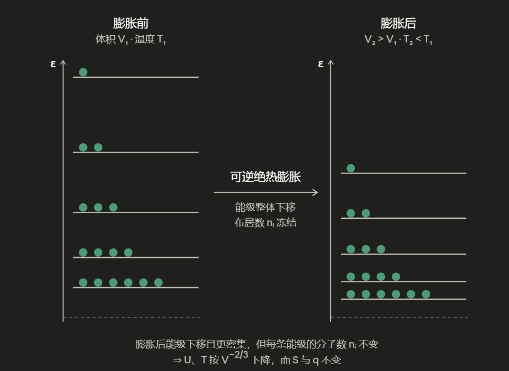

# 第四章 热力学基础

## 第一节 热现象

### 1.1 伽利略的热现象物理图像

定义温度：物体的冷热程度

气体温度计：温度正比于气体体积，$T \propto V$ $(P=const.)$

牛顿定义冰为零度，火为一百度，体温为$12$度等$12$个标度。实际线性标度只需要两个标度。摄氏温标定义大气压下，水的沸点为$100°C$，水的凝点为$0°C$。

绝对温标/理想气体状态方程：

$$T \propto V$$

$$T = A \cdot V = \frac{B}{n} \cdot V$$

$$P \propto \frac{1}{V}$$

$$T = \frac{C \cdot PV}{n} = \frac{PV}{nR}$$

其中气体常数$R=N_A·K_B$

### 1.2 拉瓦锡的化学图像

① 一定量的C在足量O₂中反应总
$$\ce{C + O_{2} -> CO_{2}}$$

焙烧浸雪的冰，意味着等量的热质粒子释放，热质粒子无重
① 是改变物质的结构（钢的形成）
② 上述结论对所有可燃物成立。
③
$$\text{广义热质} = U$$
$$\text{自由热质} = Q$$

④
$$\text{热质} \neq \text{温度}$$
$$\text{热质} \neq \text{传热过程传递的热量}$$

⑤ 孤立系统的热质守恒（heat）

### 1.3 热功当量
$$\mathrm{d}U = \mathrm{d}W + \mathrm{d}Q$$

有且仅有两种方式改变系统能量

## 第二节 热力学基本框架

### 2.1 基本思想

单一系统包括开放系统、封闭系统、孤立系统。

- 不再是质点，具有结构

- 整体认识作用及状态，环境 + 边界条件

- 状态由状态函数来描述，包括广度性质和强度性质

---

### 2.2 热力学第一定律

对于**封闭系统**，状态函数内能（$U$）的微小变化（全微分 $\mathrm{d}$）等于系统吸收的微小热量与环境对系统作的微小功（过程量，非全微分 $\delta$）之和：

$$\underbrace{\mathrm{d}U}_{\text{系统内能变化}} \xlongequal{\text{封闭系统}} \underbrace{\delta Q + \delta W}_\text{环境与系统的能量交换}$$

* $\delta Q$：传递微小热量的非全微分（过程量，与路径相关）。对于宏观过程，总热量：
  
  $$Q = \int_{\text{始态}}^{\text{终态}} \delta Q$$

* $\delta W$：微小做功的非全微分。

以体积功为例，外界对活塞的作用力为 $F$，活塞横截面积为 $S$，微小位移为 $\mathrm{d}l$：

$$F = P_{\text{外}} \cdot S$$

微小体积功：

$$\delta W = F \cdot \mathrm{d}l = P_{\text{外}} \cdot S \cdot \mathrm{d}l$$

由于系统微小体积变化 $\mathrm{d}V = -S \cdot \mathrm{d}l$（环境对系统压缩时 $\mathrm{d}V < 0$，正功），体积功：

$$\delta W = -P_{\text{外}} \mathrm{d}V$$

总功为该路径上的积分：

$$W = \int_{\text{始态}}^{\text{终态}} \delta W = \int_{V_1}^{V_2} -P_{\text{外}} \mathrm{d}V$$

---

### 2.3 可逆过程热力学

容器顶活塞上有沙子：$p^\circ = 2\text{ bar}$，$\text{Ar } 300\text{K}$

① 一次性移走沙子

原先

$$p_{\text{外}}^\circ = p^\circ = 2\text{ bar}$$

现在

$$p_{\text{外}} = \frac{1}{2} p_{\text{外}}^\circ$$

不可逆自发膨胀（$P$不是定值，$P$分布状态无非“逆序复制”）

$$dW = -p_{\text{外}} dV$$

$$W = -\int P_{\text{外}} dV = -\frac{P_{\text{外}}^\circ}{2} \cdot \Delta V = -nRT \frac{\Delta V}{2V}$$

② 一粒一粒拿沙子：准静态过程，可逆自发膨胀

准静态（$P_{\text{外}} = P + dp, dp \to 0$）：系统压强 $P$ 与环境外压 $P_{\text{外}}$ 的差值无穷小。过程进行得无限缓慢，系统无限接近于力学平衡状态。

过程可反转（$P$ 在 $P+|dp|$ 与 $P-|dp|$ 之间切换）：由于内外压差极其微小，只需对环境施加一个无穷小的改变，就能改变整个热力学过程的方向。

$$P = \frac{nRT}{V} + （dp \to 0）$$

$$P_{\text{外}} = P + dp \quad \left(\text{终，} P_{\text{外}} = \frac{P_{\text{外}}^\circ}{2}\right)$$

$$W = -\int P_{\text{外}} dV \approx -\int P dV = -\int \frac{nRT}{V} dV$$

---

## 第三节 热量计算

基于封闭系统，无相变，无化学反应

### 3.1 定容热量

$$dV \equiv 0, \quad dW_{\text{体}} \equiv 0$$

$$\therefore \delta q = dU$$

!!!TIP
    $\delta q$ 不是全微分（没有“热函数”“功函数”），写成$\delta$，与路径相关。

$$U = f(n, T, V) \quad $$

$$dU = \left(\frac{\partial U}{\partial n}\right)_{T,V} dn + \left(\frac{\partial U}{\partial V}\right)_{n,T} dV + \left(\frac{\partial U}{\partial T}\right)_{n,V} dT$$

$$\therefore dU = C_V$$

$$\Delta U = \int_{\text{初}}^{\text{终}} C_V dT$$

$$\text{đ}q_V = dU = C_V dT \quad (dn \equiv 0, dV \equiv 0, dW_{\text{非}} \equiv 0)$$

等容热效应

$$q_V = \int_{\text{初}}^{\text{终}} C_V dT$$

其中

$$C_V \equiv \left(\frac{\partial U}{\partial T}\right)_{n,V} = \left(\frac{\delta Q}{\partial T}\right)_{n,V}$$

!!!NOTE
    $C_V$是一个状态函数

---

### 3.2 定压热量

($dn \equiv 0$, $P \equiv P_{\text{外}} = const.$, $dW_{\text{非}} = 0$)

$$\text{đ}q_p = dU - dW$$

$$= dU + P dV = dU + P dV + V dP$$

$$= d(U + PV) = dH$$

焓：能量类状态函数

$$H \equiv U + PV$$

$$H = f(n, T, P)$$

$$dH = \left(\frac{\partial H}{\partial n}\right)_{T,P} dn + \left(\frac{\partial H}{\partial P}\right)_{n,T} dP + \left(\frac{\partial H}{\partial T}\right)_{n,P} dT$$

定压热容：

$$C_p \equiv \left(\frac{\partial H}{\partial T}\right)_{n,P}$$

$$\left(\frac{\partial H}{\partial T}\right)_{n,p} = \left(\frac{\partial (U+PV)}{\partial T}\right)_{n,p} = \left(\frac{\partial U}{\partial T}\right)_{n,p} + \left(\frac{\partial (PV)}{\partial T}\right)_{n,p}$$

$$\therefore dH = C_p dT $$

$$\therefore \Delta H = \int_{T_1}^{T_2} C_p dT$$若：$dn \equiv 0, dp \equiv 0, dW_{\text{非}} \equiv 0$$$q_p = \int_{T_1}^{T_2} C_p dT$$

---

### 3.3 焓 - 内能 $C_p - C_V$

焓的定义有方便的成分

孤立系统：$dU \equiv 0$,

$$dH = \cancel{dU}^0 + d(pV) \xlongequal{\text{理气}} d(nRT) = \cancel{RTdn}^0 + nRdT$$

$$U + pV = H > U$$

$$C_V \equiv \left(\frac{\partial U}{\partial T}\right)_{n,V} \quad \text{状态函数}$$

$$C_p = \left(\frac{\partial H}{\partial T}\right)_{n,p} = \left(\frac{\partial U}{\partial T}\right)_{n,p} + \left(\frac{\partial (pV)}{\partial T}\right)_{n,p}$$

不再是热能容量，还是状态函数

对理想气体：

$$C_p = C_V + 0 + \left(\frac{\partial (nRT)}{\partial T}\right)_{n,p}$$

$$\therefore C_p = C_V + nR$$

!!!NOTE
    $$C_p = \left(\frac{\partial U}{\partial T}\right)_{n,p} + \left(\frac{\partial (pV)}{\partial T}\right)_{n,p}$$

    通过全微分展开为两部分：

    $$dU = \left(\frac{\partial U}{\partial T}\right)_V dT + \left(\frac{\partial U}{\partial V}\right)_T dV$$

    边同除以 $dT$（引入恒压条件）：

    
    $$\left(\frac{\partial U}{\partial T}\right)_p = \left(\frac{\partial U}{\partial T}\right)_V + \left(\frac{\partial U}{\partial V}\right)_T \left(\frac{\partial V}{\partial T}\right)_p$$

    $\left(\frac{\partial U}{\partial V}\right)_T$ 对于理想气体，分子间不存在相互作用力，其内能只受温度影响。 $\left(\frac{\partial U}{\partial V}\right)_T = 0$。

    $$\left(\frac{\partial (pV)}{\partial T}\right)_{n,p} = \left(\frac{\partial (nRT)}{\partial T}\right)_{n,p} = nR$$

    $$\therefore C_{p,m} - C_{V,m} = R$$

---

## 第四节 绝热过程

### 4.1 绝热过程与系统温度

$$\text{đ}q \equiv 0$$

$$dU = \cancel{\text{đ}q}^0 + dW = -P_{\text{外}} dV + \cancel{dW_{\text{非}}}^0$$

$$dn \equiv 0, \quad dW_{\text{非}} \equiv 0$$

$$dU = C_V dT + \left(\frac{\partial U}{\partial V}\right)_{n,T} dV$$

理想气体：

$$\left(\frac{\partial U}{\partial V}\right)_{n,T} = 0 \quad $$

$$\therefore C_V dT = -P_{\text{外}} dV$$

绝热且只做体积功时，内能变化等于环境对系统做的功（热功转化），温度发生改变。

!!!EXAMPLE
    考虑一个可逆膨胀过程。

    $$\begin{cases}
    P_{\text{外}} = P + dP\\

    P \in (P+|dP|, P-|dP|)
    \end{cases}$$
    
    $$\therefore C_V dT = -P_{\text{外}} dV = -P dV = -\frac{nRT}{V} dV$$

    $$-\frac{C_V}{nR} \int \frac{dT}{T} = \int \frac{dV}{V}$$
    
    $$-\frac{C_V}{nR} \ln \frac{T}{T_{\text{初}}} = \ln \frac{V}{V_{\text{初}}}$$
    
    $$\frac{T}{T_{\text{初}}} = \left(\frac{V}{V_{\text{初}}}\right)^{-\frac{nR}{C_V}}$$

---

### 4.2 绝热过程的量子统计热力学分析

$$\varepsilon_{n_x, n_y, n_z} = \frac{h^2}{8m} \left( \frac{n_x^2}{L^2} + \frac{n_y^2}{L^2} + \frac{n_z^2}{L^2} \right)$$

各向同时，

$$\varepsilon_n = \frac{h^2}{8m} (n_x^2 + n_y^2 + n_z^2) \cdot V^{-2/3}$$

体积 $V$ 膨胀，所有的平动能级 $\varepsilon_n$ 都会同比例下降。

① 给定能级上的分子能量随体积膨胀而下降（能级密度上升）

② 膨胀等价于改变平动自由度的能级能隙。沿 Z 轴膨胀情况下，$\varepsilon_z \downarrow$，$T_z \downarrow$

③ 热(能)驰豫：气体内部不同平动自由度之间的能量流动

$$\because T_z < T_x = T_y$$

$$\therefore Q_x = Q_y \downarrow, Q_z \uparrow$$

导致 $T_x = T_y = T_z$

与等温膨胀过程相比较，等温膨胀过程补充了能量，能级结构变化与绝热膨胀相同。

