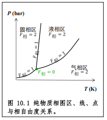
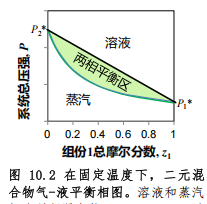
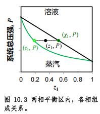
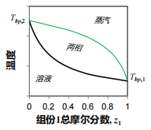
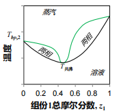
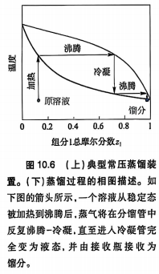
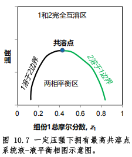
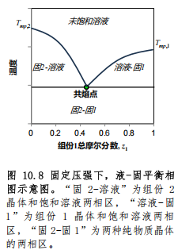

# 第10章 溶液与多相混合物

## 1 本章提要

本章的相变是混合物的相变

## 2 混合物相平衡与吉布斯相律

### 2.1 混合物相平衡与相自由度

考察相A和相B之间的组分$i$的相平衡：

$$
\mu_{i(A)}=\mu_{i(B)}=\cdots=\mu_{i(p)}
$$

$p$个相中的$C$个组分，上式一共有 $C\times(p-1)$ 个等式

### 2.2 混合物多相系统相律

- 单相混合物：
    - 含有C个组分的均相系统的摩尔分数有(C-1)个是独立的（独立的**内禀自由度**）
    - 另外两个**外源自由度**为T，P
    - 一个均相混合物（一个相）对系统相自由度最大可能贡献值

        $$
        F_{相极大}=F-1=2+(C-1)=C+1
        $$

- 多相混合物：
    - 一个$p$种混合物多相系统的 $F_{相极大}=2+p(C-1)$
    - $p$个相，每一个组分有(p-1)个限制等式
    - C个组分，限制等式--自由度减少数：C(p-1)
    - 多相混合物平衡系统的相自由度：

        $$
        F_{相}=2+p(C-1)-C(p-1)
        $$

    - 吉布斯相律：

        $$
        F_{相}=2+C-p
        $$

- 化学平衡也会限制：一个独立的化学平衡减少一个独立基本变量

用吉布斯相律确定的**最大相自由度**能够用于**判断相图的维度**

{: .center }

## 3 混合物相图

二元混合物的全相图是三维图：$T$、$P$、$z_i$

讨论两种特殊的二维相图，两者都以摩尔分数 $z_i$ 为横轴。这样的相图可看作三维全相图的一个二维截面

### 3.1 气-液平衡相图

#### 3.1.1 二元混合物的 $P-z_i$ 相图

处于相平衡的溶液和饱和蒸气的热力学浓度不相等

$$
P=\chi_1P_1^*+\chi_2P_2^*=\chi_1(P_1^*-P_2^*)+P_2^*
$$

$$
\chi_1P_1^*=\tau_1P
$$

$$
\chi_1=\frac{P-P_2^*}{P_1^*-P_2^*}
$$

$$
\tau_1=\frac{\chi_1P_1^*}{P}=\frac{P_1^*}{P}\frac{P-P_2^*}{P_1^*-P_2^*}
$$

- $\tau_1$与$\chi_1$是两相平衡的数值
- 在给定压强的平衡条件下，气-液平衡下溶液态的$\chi_1$和饱和蒸气相的$\tau_1$不可能相等。
- 气-液平衡条件下，气态和液态的边界线不重合

{: .center }

- 只要 $P_1^*\ne P_2^*$，气-液两相平衡态就不是一条线，而是一个区，两相区的溶液边界线是一条直线，气相混合物边界线是一条下凹曲线，两条边界线相交点为两个纯态

相图中第$i$个组分的摩尔分数为总摩尔分数：

$$
z_i=\frac{\sum_{j=1}^{p}n_{i(j)}}{\sum_{i=1}^{C}\sum_{j=1}^{p}n_{i(j)}}
$$

#### 3.1.2 杠杆规则

$$
n=n_{(g)}+n_{(l)}
$$

$$
z_1n=\tau_1n_{(g)}+\chi_1n_{(l)}
$$

$$
z_1n=z_1n_{(g)}+z_1n_{(l)}
$$

联立得：

$$
(z_1-\tau_1)n_{(g)}=(\chi_1-z_1)n_{(l)}
$$

$$
l_{(左)}n_{(左)}=l_{(右)}n_{(右)}
$$

{: .center }

#### 3.1.3 二元混合物的 $T-z_i$ 相图

- 第一类：混合物沸点没有极值

    {: .center }

- 第二类：共沸物-->混合物沸点有极值（极小值/极大值）（共沸点 $T_{共沸}$）

    {: .center }

#### 3.1.4 溶液蒸馏

示意图如下：

{: .center }

### 3.2 液-液相图

- 所有的不完全互溶溶液都不可能是理想溶液
- 位于两相平衡区的系统将同时拥有两种溶液

{: .center }

### 3.3 液-固相图

{: .center }

出现共熔点

### 3.4 固溶体(合金)与溶液、气态混合物比较

气体、液体、固体混合物各自的不同特性与三个相态各自的熵特性密切相关

- 气态混合物：分子间相互作用能很小，纯粹混合过程环境熵 $\Delta S_{环}$ 等于或接近零，以分子平动混合熵为主
- 溶液：液体相互作用与分子位置、定向关系不大，分情况，一般能获得额外的非理想混合熵 $\Delta_{混(非)}S$
- 固溶体：
    - ①晶体：固体相互作用对原子-分子水平的环境要求很高，混合过程需要从环境吸收大量热量，导致较大的焓变，进而导致大的环境熵减小，且位置熵很难抵消环境熵减
    - ②非晶或分子晶体：跟溶液类似，分子选择性和方向性不强固溶体相对容易形成

## 4 溶解度

### 4.1 溶解度定义

溶解度：在给定温度和压强下,一种物质在某个溶液中的溶解度等于溶液中该物质在溶液中的最大摩尔分数。

- （除液态溶质外）饱和溶液总是与溶质的另外一个相处于相平衡
- 溶解度本质上是溶解相平衡的标度
- 溶解性质(或饱和溶液溶解度)并不取决于分子间相互作用
- 二元系统相平衡有三个相自由度：T、P、$\chi_{质(饱和)}$
- 纯物质的液态和固态的活度 $\alpha_{纯液/固}\equiv1$

### 4.2 固-液溶液的溶解度

#### 4.2.1 固态溶质溶解度定律

- 只要与饱和溶液平衡的溶质态为纯态，溶解度定理就是理论框架隐含的必然结果

相平衡：（$\mu_{质}^*$ 为溶质纯态化学势，固态就是纯态）

$$
\mu_{质}^*=\mu_{质(固)}=\mu_{质}
=\mu_{质}^*+RT\ln\alpha_{质(饱和)}
$$

$$
\alpha_{质(饱和)}=\gamma_{质(饱和)}\chi_{质(饱和)}=1
$$

$$
\chi_{质(饱和)}=\frac{1}{\gamma_{质(饱和)}}
$$

#### 4.2.2 固态溶质溶解平衡的可逆过程热力学

固态溶质的“固体溶解”过程可等价于先将溶质“固态熔融”，再将液态溶质和溶剂等温等压“液态混合”

$$
\Delta_{溶解}G=\Delta_{质(熔)}G+\Delta_{液混}G
$$

- 固态熔融：

    $$
    \Delta_{质(熔)}G=n_{质}\Delta_{质(熔)}H_m-n_{质}T\Delta_{质(熔)}S_m
    $$

- 液态混合：

    $$
    \Delta_{液混}G=\Delta_{理想}G+\Delta_{液混(非)}G
    $$

    $$
    \Delta_{理想}G=n_{质(饱和)}RT\ln\chi_{质(饱和)}
    +n_{剂(饱和)}RT\ln\chi_{剂(饱和)}
    $$

    $$
    \Delta_{液混}G=\Delta_{液混}G_{质}+\Delta_{液混}G_{剂}
    $$

- 由溶解平衡（相平衡）条件：

    $$
    0=\left(\frac{\partial\Delta_{溶解}G}{\partial n_{质}}\right)_{T,P,n_{剂}}
    =(\Delta_{溶解}H_{质}-T\Delta_{溶解(非)}S_{质})
    +RT\ln\chi_{质(饱和)}
    $$

- 溶质偏摩尔溶解焓：（注意偏摩尔理想混合焓 $\Delta_{理想}H\equiv0$）

    $$
    \Delta_{溶解}H_{质}=\Delta_{质(熔)}H_m+\Delta_{液混}H_{质}
    $$

- 溶质偏摩尔非理想溶解熵（超额偏摩尔混合熵）：

    $$
    \Delta_{溶解(非)}S_{质}=\Delta_{质(熔)}S_m+\Delta_{液混(非)}S_{质}
    $$

- 联立，解出溶解度：

    $$
    \chi_{质(饱和)}=e^{\Delta_{溶解(非)}S_{质}/R}\cdot e^{-\Delta_{溶解}H_{质}/RT}
    $$

- 指数上的热力学广度性质都是固态溶质的偏摩尔混合广度性质，只与相应的组分相关
- 固态溶质的溶解度与其偏摩尔混合焓指数负相关，即随环境熵减小而减小（混合焓越大，环境熵越负，溶解度越小）
- 与溶解过程的偏摩尔非理想混合熵指数正相关，即偏摩尔非理想混合熵可补偿环境熵减少

溶解度也可由下式导出：

$$
\chi_{质(饱和)}=e^{-\Delta_{质(熔)}G_m/RT}\cdot e^{-\Delta_{液混(非)}G_{质}/RT}
$$

- $\Delta_{质(熔)}G_m$不是偏摩尔混合广度性质，而是一种特定的溶质摩尔相变广度性质
- 熔融过程不处于相平衡：$\Delta_{质(熔)}G_m>0$
- 该大于零的项驱使固态溶质溶解度小于一
- 温度偏离给定压强的熔点越高，$\Delta_{质(熔)}G_m$越大，固态溶质在给定溶剂中的溶解度偏离一就越明显

#### 4.2.3 熔融溶质偏摩尔混合吉布斯自由能接近零的溶解度

分子间相互作用频率基本匹配：$\Delta_{液混(非)}G_{质}\approx0$

- 超高频相互作用的溶质和溶剂互溶

$$
\chi_{质(饱和)}\approx e^{-\Delta_{质(熔)}G_m/RT}
=e^{\Delta_{质(熔)}S_m/R}\cdot e^{-\Delta_{质(熔)}H_m/RT}
$$

#### 4.2.4 “熔融溶质组装型”纳米簇溶液的溶解度

分子间相互作用不匹配：纳米簇溶液

溶质组装型：水-醇/有机酸

熔融溶质被组装：$\Delta_{液混}H_{质}\approx0$；$\Delta_{液混}S_{质}<0$；$\Delta_{液混(非)}G_{质}>0$

熔融溶质在被组装过程中失去分子内熵（损失构象熵）：$\Delta_{液混}S_{质}<0$

- 酚类溶解度：间>邻>苯酚>对

#### 4.2.5 “溶剂组装型”纳米簇溶液的溶解度

溶剂组装型：电解质溶液（水合离子）-->分子间相互作用构型匹配

讨论溶解前后分子间相互作用能差异（即 $\Delta_{溶解}H_m$）：

- ①$\Delta_{溶解}H_m>0$：溶解吸热，阴-阳离子匹配好于离子-水匹配
    - (i)微溶或不溶：电子极化率都明显小于水的电子极化率
    - (ii)溶解度较大：阴离子电子极化率大于水，阳离子在水附近，离子静电场不强，对水分子定向作用不足，离子-水相互作用不能补偿阴-阳离子相互作用能
- ②$\Delta_{溶解}H_m<0$：溶解放热，离子-水匹配好于阴-阳离子匹配
    - 溶解度很高：阴、阳离子电子极化率相差大

电解质的摩尔熔融焓 $\Delta_{质(熔)}H_m$ 和摩尔熔融熵 $\Delta_{质(熔)}S_m$ 相差都不是特别大，它们与溶解度相关性也不明显

- 熔融焓 $\Delta_{质(熔)}H_m$ 不是晶格能，比晶格能小！（纯态熔融溶质中，离子大致还会保留阴、阳离子相隔分散的局部有序特征）

$\Delta_{液混}S_{质}>0$；$\Delta_{质(熔)}G_m>0$；$\Delta_{液混(非)}G_{质}<0$

- 固态溶质熔融过程减小溶解度，熔融溶质与水液态混合为溶解的主要推动力($\Delta_{液混}S_{质}>0$；$\Delta_{液混(非)}G_{质}<0$)
- 熔融溶质与液态水混合形成水合离子后，水中的水合离子之间相互作用基本被水完全屏蔽，水合离子的分散不再有电性选择性，导致阴、阳离子空间位置熵在混合过程额外增加，熔融溶质偏摩尔混合熵明显增加（$\Delta_{液混}S_{质}>0$）

### 4.3 气-液溶液的溶解度

#### 4.3.1 气态溶质的溶解度定律

$$
(\mu_{质}^∘+RT\ln P_{质}^*)+RT\ln(\chi_{质(饱和)}\gamma_{质(饱和)})
=\mu_{质}^*+RT\ln\alpha_{质(饱和)}
=\mu_{质(饱和)}=\mu_{质}=\mu_{质}^∘+RT\ln P_{质}
$$

$$
\chi_{质(饱和)}=\frac{P_{质}}{P_{质}^*}\frac{1}{\gamma_{质(饱和)}}
$$

- 在给定温度下，气体溶解度随气态溶质压强的增加而增加

#### 4.3.2 气体溶于液体的可逆过程热力学

气态溶质的“气态溶解”过程可等价于先将溶质“冷凝”，再将液态溶质和溶剂等温等压“液态混合”

$$
\Delta_{溶解}G=\Delta_{质(凝)}G+\Delta_{液混}G
$$

- 冷凝：

    $$
    \Delta_{质(凝)}G=n_{质}\Delta_{质(凝)}H_m-n_{质}T\Delta_{质(凝)}S_m
    $$

- 液态混合：

    $$
    \Delta_{液混}G=\Delta_{理想}G+\Delta_{液混(非)}G
    $$

    $$
    \Delta_{理想}G=n_{质(饱和)}RT\ln\chi_{质(饱和)}
    +n_{剂(饱和)}RT\ln\chi_{剂(饱和)}
    $$

    $$
    \Delta_{液混}G=\Delta_{液混}G_{质}+\Delta_{液混}G_{剂}
    $$

$$
\chi_{质(饱和)}=e^{-\Delta_{质(凝)}G_m/RT}\cdot e^{-\Delta_{液混(非)}G_{质}/RT}
$$

$$
\chi_{质(饱和)}=e^{\Delta_{溶解(非)}S_{质}/R}\cdot e^{-\Delta_{溶解}H_{质}/RT}
$$

又由气相溶质的分压强一定小于在给定温度下其液态的饱和蒸气压：

$$
\Delta_{质(凝)}G_m=\mu_{质(液)}-\mu_{质}=RT\ln\frac{P_{质}^*}{P_{质}}>0
$$

则溶解度也可以由下式计算：

$$
\chi_{质(饱和)}=\frac{P_{质}}{P_{质}^*}\cdot e^{-\Delta_{液混(非)}G_{质}/RT}
$$

溶解度与气态溶质的分压强成正比

#### 4.3.3 气态溶质的溶解度特性

1. 若气态溶质与水有较强化学作用（如氢键），其在水中溶解度比较可观（这种分子较少）
    - $\Delta_{液混(非)}H_{质}$为较大负值，可抵消$\Delta_{质(凝)}H_m$
    - 要求其纯态分子间相互作用能较小，但与溶剂相互作用很强
2. 多数气态溶质的溶解度都很小
    - 与溶剂没有强相互作用（大多数）
    - $\Delta_{液混(非)}S_{质}$和$\Delta_{液混(非)}H_{质}$都是不太大的正值
    - 溶解度主要取决于$\Delta_{质(凝)}G_m$
    - 气态溶质的$\Delta_{质(凝)}H_m$相差不多
    - $\Delta_{质(凝)}S_m$是很大的负值（损失平动熵），很大的熵减，溶解度很小
3. 气态溶质溶解度与温度相关，温度越高,溶解度越低。
    - 与溶剂相互作用能绝对值一般小于液化溶质分子间相互作用能绝对值
    - $\Delta_{液混(非)}H_{质}$和$\Delta_{质(凝)}H_m$均为正值

### 4.4 液-液溶液的溶解度

#### 4.4.1 不能完全互溶

相互作用频率不匹配，分子构型不匹配

二元(组分1和组分2)液态系统的两个饱和溶液(液A和液B)液A的溶质为组分2,溶剂为组分1;液B的溶质为组分1,溶剂为组分2

相平衡条件：

$$
\mu_{1(液A)}=\mu_{1(液B)};\qquad\mu_{2(液A)}=\mu_{2(液B)}
$$

$$
\frac{\chi_{1(液A)}}{\chi_{1(液B)}}=\frac{\gamma_{1(液B)}}{\gamma_{1(液A)}};\qquad
\frac{\chi_{2(液A)}}{\chi_{2(液B)}}=\frac{\gamma_{2(液B)}}{\gamma_{2(液A)}}
$$

- 两种饱和溶液中的饱和浓度直接反比于该组分的活度系数
- 一个组分的活度系数越高说明该组分越“活跃”
- 一个组分在溶液中越活跃其饱和浓度越小

#### 4.4.2 极难混溶

- 溶剂为占绝对统治地位的组分，其摩尔分数非常接近1
- 溶剂分子面对的化学环境和纯溶剂几乎没有差别
- 难溶液体作为溶质的饱和溶液接近无限稀释
- 非饱和溶液也适用

二元(组分1和组分2)液态系统的两个饱和溶液(液A和液B)液A的溶质为组分2,溶剂为组分1;液B的溶质为组分1,溶剂为组分2

$$
\lim_{\chi_{1(液A)}\to1}\alpha_{1(液A)}
=\lim_{\chi_{1(液A)}\to1}(\gamma_{1(液A)}\chi_{1(液A)})=1
$$

$$
\lim_{\chi_{2(液B)}\to1}\alpha_{2(液B)}
=\lim_{\chi_{2(液B)}\to1}(\gamma_{2(液B)}\chi_{2(液B)})=1
$$

$$
\chi_{质(饱和)}=\frac{1}{\gamma_{质(饱和)}}
$$

#### 4.4.3 液-液混合系统分类

1. 理想溶液：相互作用频率和分子构型均匹配，组分间可以任意比例混合，各个组分的活度系数恒等于1
2. 实际溶液：液态组分之间可以任意比例互混，通过调整定向实现接触分子界面优化
3. 不能完全互溶：难以明确溶剂和溶质，饱和溶液不能与某个纯态组分达成平衡
4. 极难混溶：溶剂组分接近纯液态，可视为纯态平衡

## 5 活度系数

### 5.1 固-液溶液的活度系数

#### 5.1.1 饱和溶液各组分活度系数

$$
\gamma_{质(饱和)}=\frac{1}{\chi_{质(饱和)}}
=e^{-\Delta_{溶解(非)}S_{质}/R}\cdot e^{\Delta_{溶解}H_{质}/RT}
$$

$$
\gamma_{质(饱和)}=\frac{1}{\chi_{质(饱和)}}
=e^{\Delta_{质(熔)}G_m/RT}\cdot e^{\Delta_{液混(非)}G_{质}/RT}
$$

#### 5.1.2 非饱和溶液各组分活度系数

固态溶质一般不具备可测量的饱和蒸气压，其活度系数可用严格成立的吉布斯-杜安方程算得：

$$
\chi_{质}d(\ln\gamma_{质})+\chi_{剂}d(\ln\gamma_{剂})=0
$$

由于KCl和NaBr溶解后解离为两种离子，其对溶液摩尔数的贡献需要以离子为单位计，导致上式不再适用。

一价阴、阳离子的吉布斯-杜安方程将包括三项：

$$
0=X_+d(\ln\gamma_+)+X_-d(\ln\gamma_-)+X_{剂}d(\ln\gamma_{剂})
=x_{\pm}d(\ln\gamma_{\pm}^2)+x_{剂}d(\ln\gamma_{剂})
$$

- 电解质溶液无法给出阴、阳离子各自的活度系数，但可整理得单一离子活度系数之积（$\gamma_+\gamma_-=\gamma_{\pm}^2$）满足的吉布斯-杜安方程
- 溶液中阳离子的摩尔分数 $\chi_+$、阴离子的摩尔分数 $\chi_-$ 相等，写作 $\chi_{\pm}$

由上式分析得：

- 随离子浓度降低，两种电解质溶液的溶剂活度系数都增加，最终趋于一。
- 溶质的活度系数则逐渐减小，表明在稀溶液中离子活性有所降低、稳定性增加。
- 对于溶液中的离子，在其结合了足够数目的水溶剂分子后，添加更多溶剂分子对其化学环境影响不大，而只是逐步增加离子-离子之间距离。
- 总体结果，一价离子的活度系数随稀释减小，但减小幅度并不大。

对于不特别精确的计算，或者对于溶解度较小的电解质溶液，离子平均活度系数可很好地近似为常数，也就是饱和溶液的数值。

#### 5.1.3 固-液溶液系统活度系数及溶解度随温度、压强的变化

固相溶质在饱和溶液中的活度系数与压强关系不大，随温度改变：

$$
\left[\frac{\partial(\ln\chi_{质(饱和)})}{\partial T}\right]_{P,n}
=-\left[\frac{\partial(\ln\gamma_{质(饱和)})}{\partial T}\right]_{P,n}
=\frac{\Delta_{混}H_{质(饱和)}}{RT^2}
$$

- $\Delta_{溶解}H_{质}>0$，T升高，$\chi_{质(饱和)}$增加，$\gamma_{质(饱和)}$减小
- $\Delta_{溶解}H_{质}>0$，T升高，$\chi_{质(饱和)}$减小，$\gamma_{质(饱和)}$增加
- $\Delta_{溶解}H_{质}=0$（无热溶液），T升高，$\chi_{质(饱和)}$不变，$\gamma_{质(饱和)}$不变

### 5.2 液-气溶液和液-液溶液的活度系数

#### 5.2.1 气态溶质在饱和溶液中活度系数

$$
\gamma_{质(饱和)}=\frac{P_{质}}{P_{质}^*}\frac{1}{\chi_{质(饱和)}}
=e^{\Delta_{液混(非)}G_{质}/RT}
$$

气态溶质在非饱和溶液中活度系数的确定方法与固态溶质相同

#### 5.2.2 液-液极难互混饱和溶液的活度系数

二元(组分1和组分2)液态系统的两个饱和溶液（液A和液B），液A的溶质为组分2，溶剂为组分1；液B的溶质为组分1，溶剂为组分2。

$$
\gamma_{1(液A)}=\lim_{\chi_{1(液A)}\to1}\frac{P_1}{P_1^*\chi_{1(液A)}}
=\frac{P_1^*}{P_1^*}=1
$$

$$
\gamma_{1(液B)}=\lim_{\chi_{1(液A)}\to1}\frac{\chi_{1(液A)}}{\chi_{1(液B)}}\gamma_{1(液A)}
=\frac{1}{\chi_{1(液B)}}
$$

- 溶剂的活度系数等于1
- 溶质的活度系数远大于1

#### 5.2.3 三组分液-液两相系统溶质活度系数

萃取：两个互不完全混溶的溶剂，至少一个被萃取的溶质

液A是原溶液，液B为富集液

溶质在两个溶液间达成溶解平衡：

$$
\mu_{质(液A)}=\mu_{质(液B)}
$$

$$
\gamma_{质(液A)}\chi_{质(液A)}
=\gamma_{质(液A)}\chi_{质(液B)}
$$

分配系数：

$$
K_{分配}\equiv\frac{\chi_{质(液B)}}{\chi_{质(液A)}}
=\frac{\gamma_{质(液A)}}{\gamma_{质(液B)}}
$$

- 分配系数完全取决于溶质在两个溶液中的活度系数
- 萃取的实质是把一种物质从活度系数高的溶液相转移到活度系数低的溶液相
- 分配系数：被萃取溶质在两个溶液中热力学浓度之比-->等价于理想位置熵之比
- 分配系数：活度系数的反比-->代表系统非理想熵和环境熵
- 相平衡，溶质(或任意组分)在平衡的两相化学势相等-->偏摩尔混合吉布斯自由能相等-->理想位置熵、非理想系统熵、相关的环境熵相等
- 代表理想位置熵的浓度之比 = 代表其他所有熵变的活度系数之比
