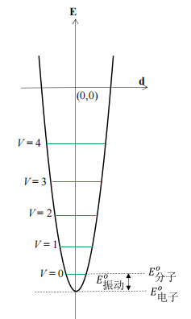
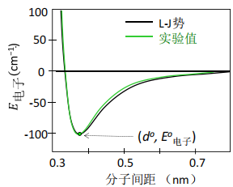
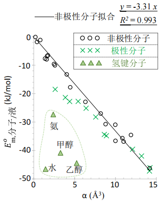

# 第7章 分子间相互作用

## 2 分子间相互作用研究

### 2.1 概论

#### 2.1.1 意义

化学反应：①分子内相互作用能与分子间相互作用能的转换 ②分子间相互作用熵：平动熵损失-->分子集体振动熵损失（且紧密接触的液态介质可以增加熵而弥补反应的熵损失）

重点关注：超多分子系统热分布带来的**热能和熵**

#### 2.1.2 图像演化

- 中性分子：电偶极
- 无永久偶极分子：电极化率-->诱导偶极

#### 2.1.3 分子间相互作用与化学键

- 分子内：涉及分子/原子间电子重新分配（改变分子结构）
- 分子间：不改变已存分配，只对已存电子分配与运动形式产生微扰（微扰分子结构）

较弱相互作用-->较小能隙-->分子在分子间相互作用的较高能级上会形成可观的热分布

- 分子间相互作用的**热能贡献大多不可忽略**
- 分子间相互作用**自由度的熵**是系统熵的一个重要贡献者
- 分子间相互作用自由度：本质上是一类量子自由度

①增加接触面积②减小接触距离-->分子间相互作用能的**绝对值**可获得相当可观的增加

### 2.2 分子间相互作用与自由度追踪

#### 2.2.1 量子统计热力学与自由度演化

确立系统完备正交量子自由度：在分子水平考察分子间相互作用过程，追踪自由度演化。

微扰带来的电磁能改变-->分子间相互作用**电子基态能**

气相：分子间相互作用能=0（分子间彼此孤立）

分子自由度：①分子内自由度：振动 ②分子整体自由度：自由平动、自由转动

#### 2.2.2 分子整体自由度演化

分子间**电磁微扰**相互作用改变：①系统的电子基态能 ②给分子的整体运动提供势阱

每个分子都处于其他分子提供的分子间相互作用势阱中（液相、固相）

自由平动/转动转化的振动自由度：多分子协同的共同振动（周期性改变相对空间位置）

分子集体振动：①固态：晶格集体振动 ②液态：类振动（流体特性，势阱不那么对称）

分子集体振动模式：整个分子作为一个刚体

从自由平动/转动转化为分子集体振动：

$$
\Delta F=3+F_{转}
$$

分子集体振动自由度-->低频振动：①振动基团折合质量大 ②势阱浅（分子间相互作用能绝对值较小） ③势阱开口大（正比于振动基团平衡间距）

分子间平衡位置的电势能-->分子间相互作用的基态能

#### 2.2.3 分子内振动自由度演化

分子内振动的转化-->液态与固态会出现质的差别

分子内振动自由度：①分子构象不变：键振动（伸缩、弯曲） ②改变构象：构象振动（旋转（柔性分子））

- 键振动：频率高于相应的构象振动-->受其他分子的影响较小，在分子间相互作用过程中变化较小
- 构象振动：处于低频区
    - 对系统热能和熵有明显贡献（一定会热激发）
    - 在晶体内不可能实现（分子运动空间远超键长范围）
- ①气相到液相：构象振动频率改变不大
- ②液态到晶态：分子内旋转被禁止

分子内振动自由度的变化：

$$
\Delta F_{振动,液}=0
$$

$$
\Delta F_{振动,固}=F_{构象}
$$

- 转化为分子集体振动的分子自由度：①分子整体自由度（平动、转动） ②分子内构象振动

### 2.3 分子间相互作用标度

#### 2.3.1 分子-分子电磁相互作用与电子基态能

气态可作为分子间电磁相互作用基态能的零点

分子间相互作用基态能的主要部分：分子间相互作用电子基态能

$$
E^0_{电子}<0
$$

- 经典电磁学处理：电子基态能、分子间相互作用势阱
- 量子统计热力学：分子间相互作用热能和熵

#### 2.3.2 分子集体振动自由度的热能和熵

只要是由分子间相互作用转化的自由度-->**运动模式**全为**振动自由度**

振动自由度-->热能、熵-->频率-->基本能隙

**(A) 分子整体自由度**

转化后的集体振动（低频振动）-->**能隙远大于**平动/转动

> 转化而来的分子集体振动的频率明显升高

$$
E^0_{振动}=\frac{1}{2}E_{能隙};\qquad E^0_{振动}>0
$$

$$
Q_{液态集体振动}=2Q_{理想气体,平/转}
$$

$$
Q_{晶态集体振动}<Q_{液态集体振动}
$$

> 自由平动/转动：只有动能贡献-->分子集体振动：**动能+势能** 晶态：集体振动频率高于液态，**能隙大热能小**（晶态提供确定的完整势阱）

平动/转动转化为集体振动：一个自由度的熵会**明显减小**，在晶态中进一步减小（其实能隙还是增大了）

> 熵对能隙的改变比热能更为敏感

**(B) 分子内构象振动**

> 只有**晶态**发生转化

$$
E^0_{振动}=\frac{1}{2}E_{能隙};\qquad E^0_{振动}>0
$$

> 转化而来的分子集体振动的频率明显升高（基本能隙>$kT$）

由**内构象振动转化**而来的集体振动**热能大大减小**，在室温附近基本对晶体热能、熵**没有贡献**

$$
E^0_{分子}=E^0_{电子}+E^0_{振动};\qquad E^0_{振动}=E_{V=0}-E^0_{电子}
$$

#### 2.3.3 分子间相互作用的实验标度

1bar条件下的理想气体作为标准参考态：

- 气态：

    $$
    E^\circ_{m,分子/气}=0
    $$

    $$
    S^\circ_{m,分子/气}=0
    $$

- 液态：

    $$
    E_{m,分子/液}=-\Delta U_{m,蒸发}=-(\Delta H_{m,蒸发}-RT)
    $$

    $$
    S_{m,分子/液}=-\Delta S_{m,蒸发}
    $$

- 固态：

    $$
    E_{m,分子/固}=-\Delta U_{m,升华}=-(\Delta H_{m,升华}-RT)
    $$

    $$
    S_{m,分子/固}=-\Delta S_{m,升华}
    $$

**分子间相互作用越强**，相互作用能和相互作用熵越负（**绝对值越大**）

分子间相互作用减少了系统能量，同时也降低了系统多样性

## 3 分子间相互作用能(1):电磁相互作用

### 3.1 电偶极矩与静电相互作用

#### 3.1.1 点电荷相互作用

$$
E=\frac{q_1q_2}{4\pi\varepsilon\varepsilon_0d}
$$

#### 3.1.2 偶极-偶极相互作用

电偶极矩（方向从负到正）：

$$
\vec\varphi=\vec r\delta
$$

**永久偶极**相互作用（偶极取向定向）：

$$
E=-\frac{\varphi_1\varphi_2}{2\pi\varepsilon\varepsilon_0d^3}
$$

**瞬间偶极**相互作用（各种不同取向之后的平均结果）：

$$
E=-\frac{B}{\varepsilon d^6}
$$

#### 3.1.3 偶极吸引+排斥的双分子模型

排斥相互作用（**泡利排斥**）：电子云重叠，若不满足成键条件，产生排斥（泡利不相容原理）

势阱：阱底能量为 $E^0_{电子}$

分子间偶极相互作用电势能 $E_{电子}$：

$$
E_{电子}=\frac{A}{d^{12}}-\frac{B}{d^6}
$$

$$
A=-E^0_{电子}(d^0)^{12};\qquad B=-2E^0_{电子}(d^0)^6
$$

$$
\frac{E_{电子}}{E^0_{电子}}=2\left(\frac{d}{d^0}\right)^{-6}-\left(\frac{d}{d^0}\right)^{-12}
$$

#### 3.1.4 溶液中分子集体振动势阱

液态分子：短程有序

液态中被考察分子的左右**两侧同时存在一个分子**，平均说来它们离被考察分子的距离相等

势能曲线拟合为抛物线：分子集体振动是简谐振动

$$
\frac{E_{电子/液}}{E^0_{电子}}
=2\left[\left(\frac{d}{d^0}\right)^{-6}+\left(\frac{2d^0-d}{d^0}\right)^{-6}\right]
-\left[\left(\frac{d}{d^0}\right)^{-12}+\left(\frac{2d^0-d}{d^0}\right)^{-12}\right]
$$

$$
E^0_{电子/液}=2E^0_{电子}
$$

- 随着温度升高，液态分子间距增加
- 分子间相互作用势阱：①取决于紧邻分子电磁相互作用 ②对称性突出 ③满足简谐振动 ④势阱很浅

### 3.2 分子电子极化率

分子极化率 $\alpha$：一个分子对外电场的响应能力（价电子云变形性）

诱导电偶极：

$$
\vec\varphi^*=\alpha\vec E
$$

极化率体积：

$$
\alpha'=\frac{\alpha}{4\pi\varepsilon_0}
$$

- 诱导偶极：外电场诱导产生，一般很小，对分子间相互作用贡献小
- 瞬间偶极：任何分子的价电子云都处在高速变换状态，相互作用很强
- 极化率：分子的固有性质，价电子云变形性，瞬间偶极相互作用的标度

极化率：①取向极化：分子转动-->外电场使永久偶极特定取向 ②形变极化：分子振动-->外电场使正负中心变化 ③电子极化：分子内价电子云变形运动-->外电场使价电子云形变（瞬间偶极）

#### 3.2.2 分子瞬间偶极与电子云变形性

瞬间偶极出现的频率与大小决定于分子内电子云变形性，定量反映为分子电子极化率

中性分子的价电子瞬间偶极矩绝大多数时候都不等于零

分子间瞬间偶极相互作用电势能：①分子电子极化率 ②分子间距

### 3.3 作为介质的分子集合体电磁相互作用

#### 3.3.1 介质的分子间相互作用的重要性

- 水：主要为永久偶极相互作用
- 有机溶剂：主要为瞬间偶极相互作用

#### 3.3.2 介质的静电介电常数

透电率 $\varepsilon$：衡量两个点电荷相互作用受介质的影响情况

- 真空的 $\varepsilon=1$

相对静电介电常数 $\varepsilon_{静电}$

$$
\varepsilon=\varepsilon_{静电}
$$

$$
\frac{\varepsilon-1}{\varepsilon+2}=\frac{N_A\rho_m}{3\varepsilon_0}\left(\alpha+\frac{\varphi^2}{3kT}\right)
$$

$$
\varepsilon\propto\rho_m,\alpha,\varphi,\frac{1}{T}
$$

液态水是最典型的高静电介电常数溶剂

#### 3.3.3 介质的折射率与光频介电常数

光频介电常数 $\varepsilon_{光频}$：

$$
\varepsilon_{光频}=n^2
$$

$$
\varepsilon_{光频}\leq\varepsilon_{静电}
$$

$$
\frac{\varepsilon_{光频}-1}{\varepsilon_{光频}+2}=\frac{N_A\rho_m}{3\varepsilon_0}\cdot\alpha
$$

$$
\varepsilon_{光频}\propto\rho_m,\alpha
$$

液态介质中，$\varepsilon_{光频}$ 对极性分子 $\varepsilon_{静电}$ 的作用可忽略不计

### 3.4 分子间相互作用频率特征与频率匹配

#### 3.4.1 分子间相互作用选律

介质分子提供的外电场：

- 离子和永久偶极：低频段（微波段）
- 瞬间偶极：光频段（超高频段）

分子间相互作用第一选律（频率匹配原理）：

一个分子（或者分子内一个片段）总是倾向于选择与自身本征电场能够形成共振的分子（或者分子片段） ①不同分子相互作用频率匹配 ②分子内部不同片段之间的相互选择

- 低频静电场：取向极化
- 高频交变电场：形变极化
- 超高频（光频）电场：电子极化

低频和超高频分子间相互作用在一个分子内彼此牵制

#### 3.4.2 分子永久偶极矩与低频相互作用

氧和氟是共价化合物中对电子云约束最强的两个负电中心原子，氟原子比氧原子还要强，具体体现为它们特别小的中性原子电子极化率。一个分子结合多个**氟原子**会大大削弱其电子云变形性。

#### 3.4.3 分子结构与分子电子云变形性

原子核对价电子的约束能力越弱，分子瞬间偶极越活跃，对分子极化率的贡献越大

有机分子：需要分成一个个基元片段，电子极化率等于各片段加和

#### 3.4.4 电子云变形性与超高频相互作用在选律中的决定性意义

液态分子间相互作用基态能：$E^0_{分子/液}=E^0_{电子/液}+E^0_{振动/液}$

$$
E^0_{m,分子/液}=-(\Delta U_{m,蒸发}-\Delta Q_{m,蒸发})
=-\Delta H_{m,蒸发}-\frac{1+F_{转}}{2}RT
$$

中性分子电子极化率是光频相互作用的定量分子标度，且为线性标度： 极化率 $\alpha$ 越大，分子间相互作用基态能 $E^0_{分子/液}$ 的绝对值越大

只要分子电子极化率不特别小，液态极性分子间相互作用的**主要贡献者**常常是**瞬间偶极**相互作用

随着分子的电子极化率增加，永久偶极相互作用被瞬间偶极压制变得越来越明显

分子电子**极化率对外电场**的响应与**分子间电场**相互作用有明显不同： ①对外电场：很小的诱导偶极 ②对频率匹配的超高频分子间相互作用：表现为即时偶极矩很大的瞬间偶极

- 非极性分子：在瞬间偶极相互作用直线上
- 极性分子：偏离直线的值为分子永久偶极矩对相互作用基态能的贡献
- 氢键分子：大大偏离，主要反映了氢键的贡献，也有较小的永久偶极贡献

## 4 分子间相互作用能(2)：分子结构与相态

### 4.1 分子集体振动与分子间相互作用能

#### 4.1.1 分子集体振动典型频率特征

#### 4.1.2 分子集体振动基态能

$$
E^0_{分子/液}=E^0_{电子/液}+E^0_{振动/液}
=-|E^0_{电子/液}|+|E^0_{振动/液}|
$$

具体计算基态能数值时，需要把三个受限平动和 $F_{转}$ 个受限转动自由度的分子集体振动基态能加和。

#### 4.1.3 分子集体振动热能及分子间相互作用热能

对于任意一个可做**高温低频近似**的分子集体振动自由度 $j$，其**摩尔振动热能**：

$$
Q_{m,j}=RT
$$

**液态**摩尔热能（自由平动/转动转化为分子集体振动）：

$$
Q_{m,液}=(3+F_{转})RT
$$

> 分子自由平动/转动转化而来的分子集体振动的**基态能不大**，但相应的**振动热能**可能很可观。

液态**分子间相互作用**摩尔热能（液态摩尔热能的一半）：

$$
Q_{m,分子/液}=Q_{m,液}-Q_{m,气}=\frac{3+F_{转}}{2}RT
$$

> 即一个分子集体振动自由度对**分子间相互作用**摩尔热能的贡献可近似为 $\frac{1}{2}RT$（也就是比气态多的摩尔热能）

**晶态分子**：

- 平动/转动转化：热能贡献于气态分子相当，分子间相互作用热能的贡献接近零
- 分子内构象振动转化：能隙大，对热能几乎无贡献，分子间相互作用热能等于气态分子对应自由度贡献的热能的负值

### 4.2 分子间相互作用分类

#### 4.2.1 离子-离子静电相互作用能

#### 4.2.2 离子-永久偶极相互作用能

离子-永久偶极相互作用能也与相对空间取向有关

$$
E=\frac{q\varphi_1}{4\pi\varepsilon\varepsilon_0d^2}
$$

水合离子：在水溶液中，以离子为中心、围绕数层水分子，形成有确定大小且相对稳定的离子-水簇状结构称为水合离子

- 离子晶体摩尔解离能 $\Delta U^∘_{解离}>0$
- 离子摩尔水合能 $\Delta U^∘_{水合}<0$

水合能绝对值平均看稍大于晶体解离能，这才是离子晶体在水中拥有很大溶解度、且可能少量释放能量的主要原因

$$
\frac{r_{水合}}{r_{晶格}}=\frac{6\pi}{7\sqrt{3}\alpha}>1
$$

水合作用随离子电子极化率快速衰减源于离子的瞬间偶极对净电荷电场的干扰

#### 4.2.3 永久偶极-永久偶极相互作用与 F 原子效应

考察永久偶极-永久偶极相互作用应该聚焦于小原子分子

主要的负电中心原子是 F 和 O

F 原子效应与分子是否极性无关

F 原子对分子的电子极化率有明显的压制作用，对分子瞬间偶极的压制作用源于对价电子云的极强约束作用

氟原子对分子瞬间偶极的压制作用有明显的局域性，即对小分子量分子影响更大

从分子间相互作用频率匹配角度看，全氟烷烃与常见极性溶剂和非极性溶剂都不匹配（永久偶极、瞬间偶极都很小）

#### 4.2.4 氢键与分子电子极化率

能够形成氢键的分子表现超出瞬间偶极相互作用的分子间相互作用基态能

氢键相互作用摩尔基态能相比于摩尔键能很小

#### 4.2.5 分子间瞬间偶极相互作用能

瞬间偶极相互作用-->色散相互作用（伦敦相互作用）

**(A) 原子-分子尺寸与电子极化率**

多原子中性共价分子的电子极化率（或瞬间偶极矩）需要且可以分片段加和，分子电子极化率间接地决定于其几何尺寸

**(B) 分子间相互作用第二选律：接触构型匹配**

分子间相互作用第二选律：瞬间偶极相互作用能在接触面构型匹配的分子间达到最大。

## 5 分子间相互作用熵

分子间相互作用：宏观物质系统的聚集状态转变

超多分子系统聚集状态的变化决定于熵：系统内熵+环境熵

### 5.1 分子间相互作用熵标度方法

#### 5.1.1 气态分子相互作用熵设为零

分子间相互作用诱导的三种可能自由度演化都导致基本能隙明显上升

以理想气态为分子间相互作用熵的零点，凝聚态分子间相互作用熵恒为负值

#### 5.1.2 液态中分子相互作用熵

相平衡条件下标准液态分子间相互作用熵：

$$
S^∘_{m,分子/液}=-\Delta_{tr}S^∘_{m(bp)}=-\frac{\Delta_{tr}H^∘_{m(bp)}}{T_{bp}}
$$

特鲁顿规则：

$$
S^∘_{m,分子/液}=-\frac{\Delta_{tr}H^∘_{m(bp)}}{T_{bp}}
=-98.5\ \mathrm{J\cdot mol^{-1}\cdot K^{-1}}
$$

分子间相互作用诱导气液相变遵守依数性（与物质的化学性质没有那么密切）

相比于气态平动自由度转化的熵改变，转动的熵改变相对较小可忽略

$$
S^∘_{m,分子/液}=-\Delta_{tr}S^∘_{m(bp)}=S_{m,平动}-S_{m,集体振动}
$$

#### 5.1.3 固态中分子相互作用熵

分子晶体才与分子间相互作用熵密切相关

分子内振动所需自由空间：

- ①明显小于分子间距：几乎不改变系统熵
- ②达到或者超过晶体内分子间距：其振动频率将发生剧烈变化，对晶态分子间相互作用熵做出重要贡献

### 5.2 分子结构与分子间相互作用熵

分子间相互作用熵直接标度分子在转化后的分子集体振动（或晶格整体振动）自由度能级上的分布。

#### 5.2.1 单原子分子

单原子分子模型对球形分子和离子化合物也适用（注意熔融过程1mol晶体释放2mol离子）

只有由自由平动转化而来的类振动和晶格振动

标准相平衡条件下，$\Delta_{tr}S^∘_{m(bp)}$ 实际上与标准沸点大致正相关

单原子分子的标准相平衡熔融熵也接近一个常数，约为 $11.5\ \mathrm{J\cdot mol^{-1}\cdot K^{-1}}$。

#### 5.2.2 直链柔性分子

- 液态分子间相互作用熵 $\Delta_{tr}S^∘_{m(bp)}$ 近似与分子结构无关（主要源于分子平动自由度演化，且其值随标准沸点增加稍有上升）
- 固态分子间相互作用熵 $\Delta_{tr}S^∘_{m(mp)}$ 对分子结构过于敏感（强烈的结构相关性）

碳氢长链的 C-C 内旋转和 C-C-C 骨架变形振动在熔融过程中被激活，而在晶态中则被转化为晶格集体振动。前者对系统熵有很大贡献，后者在室温或更低温度几乎对系统熵没有贡献。

每一个单键内旋转自由度所带来的熵变：

$$
\Delta_{tr}S^∘_{m,单片段}
=\left[\frac{Rh\nu}{RT(e^{h\nu/kT}-1)}+R\ln\frac{1}{1-e^{-h\nu/kT}}\right]_{固}^{液}
=11.8\ \mathrm{J\cdot mol^{-1}\cdot K^{-1}}
$$

$\Delta_{tr}S^∘_{m(mp)}$ 数据在小分子水平偏离较大： 在标准熔点附近，小分子烷烃的一些构象自由度就可能已经被激活（构象旋转不需要太多空间）-->导致熵较小

奇数碳偏离直线： 中等碳数的奇数碳正烷烃的晶格堆砌无法像偶数碳那样规整，导致其熔融过程中熵增加明显小于基于偶数碳的预期。

#### 5.2.3 不同构型的柔性分子

不同构型分子的分子间相互作用熵对相态特别敏感

比较液态和固态分子间相互作用熵：

- $\Delta_{tr}S^∘_{m(bp)}$ 几乎没有差别：分子构型不影响液态分子间相互作用熵
- $\Delta_{tr}S^∘_{m(mp)}$ 每组数据随构型变化而发生巨大变化：直链烷烃在熔融后会释放低频构象分子内振动，产生很大的熔融熵
