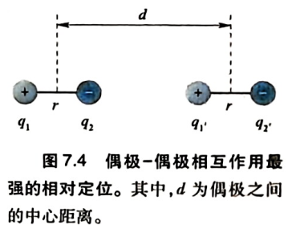
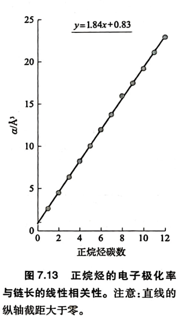
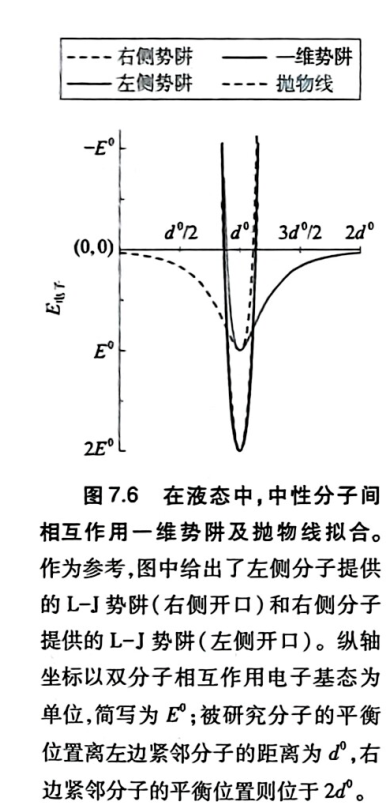
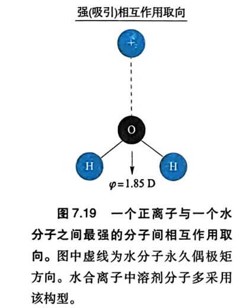
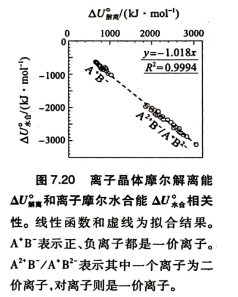
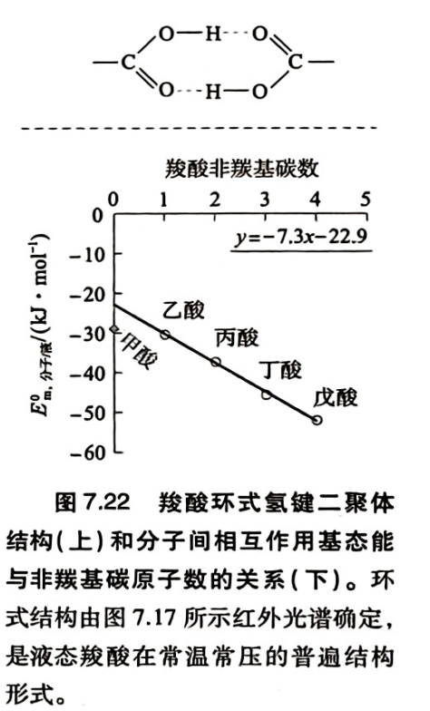
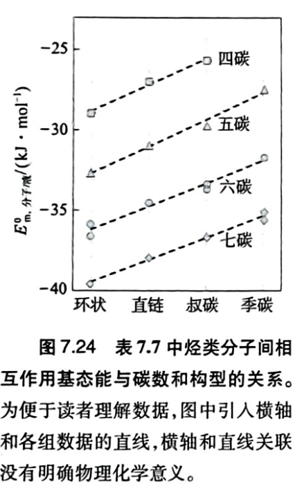
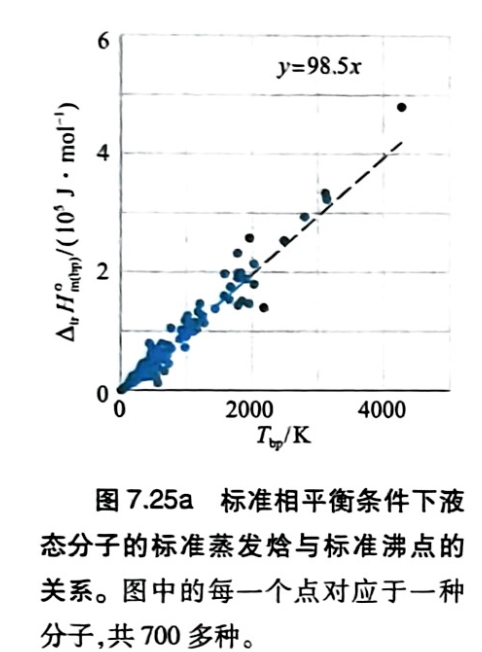
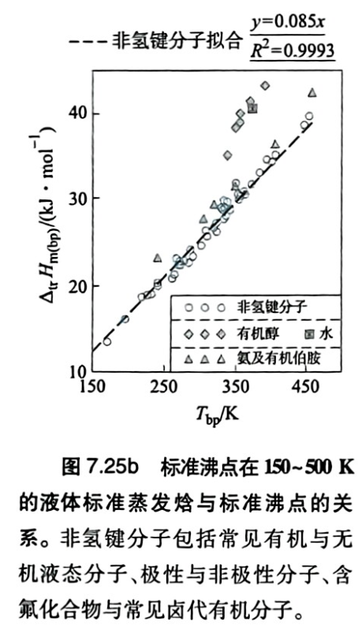

# 第7章 分子间相互作用

## 第一节 分子与分子间相互作用

### 1.1 分子是化学的核心概念

阿伏伽德罗提出分子概念，双原子分子单质$O_2$, $N_2$。

- 分子是少数原子稳定结合的团簇，分子内相互作用$>>$分子间相互作用。

- 分子是基本粒子。

---

### 1.2 分子间相互作用的特点

- 普遍性

- 与分子内相互作用同属电磁相互作用

- 分子间相互作用细小、超多。无法解析出正交的自由度。

!!!NOTE
    定核近似：核自由度（平动、转动、振动）和电子自由度正交

---

### 1.3 分子间相互作用历史

范德华力：两分子之间的电磁相互作用。不强调能量，热能，熵

- 极性分子：永久偶极-永久偶极
  
- 永久偶极-诱导偶极（Debye 诱导力）

- 瞬间偶极-瞬间偶极（London 色散力）

---

### 1.4 研究思路

① 借鉴分子在电磁场中行为的参数

② 确定分子间相互作用的零点：**理想气体**

$$E_{电子/\text{气}} \equiv 0$$

$$S_{m,\text{气}} \equiv 0$$

③ 自由度

| 气体 | 液体 | 固体 |
| :-------: | :-------: | :-------: |
| 平动 | **类振动**（分子间相互作用提供势阱，浅势阱，小能隙） | 集体振动（**声子**） |
| 转动 | 类振动（同上） | 集体振动（**声子**） |
| 振动（键振动，构象振动（内旋转）） | 不变 | 冻结构象（构象振动成为集体振动），键振动不变 |
| 成键电子自由度 | 不变 | 不变 |

---

## 第二节 分子间相互作用能（1）：电磁能

### 2.1 点电荷相互作用

$$\text{NaCl(s)} \rightarrow \text{Na}^+(\text{aq}) + \text{Cl}^-(\text{aq})$$

$$
E=\frac{q_1q_2}{4\pi\varepsilon\varepsilon_0d}
$$

$$
E\propto \frac1d,\quad E\propto \frac1\varepsilon
$$

$$
\varepsilon_\text{水}=80,\varepsilon_\text{苯}=2\sim3
$$

---

### 2.2  中性分子:偶极与偶极相互作用

电偶极矩（方向从负到正）：

$$
\vec\varphi=\vec rq
$$

$1 Debye$：相距 $0.1nm$ 的一对电荷中心的带电量为 $0.208e$ 

!!!EXAMPLE
    HCl: $1.11 D$

{: .center width="300"}

$$
E = \frac{q_1 q_2}{4\pi\varepsilon\varepsilon_0} \left( \frac{1}{d} - \frac{1}{d-r} - \frac{1}{d+r} + \frac{1}{d} \right)
$$

泰勒展开（$d\gg r$ 几何级数展开）：

$$
\begin{aligned}
\frac{1}{d} &= \frac{1}{d}
\end{aligned}
$$

$$
\begin{aligned}
-\frac{1}{d-r} &= -\frac{1}{d} - \frac{r}{d^2} - \frac{r^2}{d^3} - \frac{r^3}{d^4} - \cdots
\end{aligned}
$$

$$
\begin{aligned}
-\frac{1}{d+r} &= -\frac{1}{d} + \frac{r}{d^2} - \frac{r^2}{d^3} + \frac{r^3}{d^4} - \cdots
\end{aligned}
$$

$$
\begin{aligned}
\frac{1}{d} &= \frac{1}{d}
\end{aligned}
$$

**偶极相互作用能**（分子取向如图固定）：

$$
E = -\frac{(q_1 r)(q_2 r)}{2\pi\varepsilon\varepsilon_0 d^3}
= -\frac{\varphi_1 \varphi_2}{2\pi\varepsilon\varepsilon_0 d^3}
\quad (d>r)
$$

除非在具有永久偶极的分子晶体中，偶极一偶极之间相对定向混乱，统计平均后的结果：

$$
E = -\frac{B}{d^6} \quad (B>0)
$$

$B$ 为常数

---

### 2.3 电子极化率与诱导偶极

- 取向极化：分子本身具有永久偶极在电场中取向随电场方向

- 形变极化：分子振动带来正负电中心不再重叠

- **电子极化**：电子云变性，出现正（原子核）负（电子）电中心

偶极作用能量降低

$$
\Delta E = -\alpha\,\dfrac{\bar{E}^{\,2}}{2}
$$

**诱导偶极**

$$
\vec{\varphi}^{*} = \alpha\,\vec{E}
$$

- $α$：电子极化率，（电子极化中）衡量**价电子云变形性**，分子的本征性质

- $\vec{\varphi}^{*}$：诱导偶极，非常小

中性原子同主族从上到下，$α$增大；同周期从左到右，核电荷增加，$α$减小。

!!!EXAMPLE
    $F$ 的$α$ 极小。

正离子$α$ 大大减小，带电量越多，$α$ 越小；负离子$α$ 增大，带电量越多，$α$ 越大

!!!EXAMPLE
    常见负离子中$F^-$ 的$α$ 最小。

!!!NOTE
    **诱导偶极相互作用能推导**

    一个位于距离 $d$ 处的偶极矩 $φ₁$，在邻居分子中心处产生的电场强度

    $$E_{\text{场}}=\frac{\varphi_1}{4\pi\varepsilon_0 d^3}$$

    分子被极化，产生诱导偶极矩，其大小：

    $$\varphi_2=\alpha\,E_{\text{场}}=\alpha\cdot\frac{\varphi_1}{4\pi\varepsilon_0 d^3}$$

    相互作用能为

    $$E_{\text{诱导}}=-\frac{1}{2}\alpha\,E_{\text{场}}^2$$

    $$E_{\text{诱导}}=-\frac{1}{2}\alpha\left(\frac{\varphi_1}{4\pi\varepsilon_0 d^3}\right)^2
    =-\frac{\alpha\,\varphi_1^2}{2(4\pi\varepsilon_0)^2\,d^6}$$
    
    令常数

    $$B=\frac{\alpha\,\varphi_1^2}{2(4\pi\varepsilon_0)^2}$$

    $$\boxed{\,E=-\frac{B}{\varepsilon\,d^6}\,}$$

---

### 2.4 瞬间偶极

**$α$ 价电子云变形**性决定瞬间偶极。

- 超高频，$10^{15} Hz$
  
- 为分子的**本征性质**

!!!CAUTION
    瞬间偶极不是本征性质，除电子极化率意外，还与外电场有关。

- $r<d$    
  

对于长链分子电子极化率随原子数近乎线性增加，意味着长链分子分析瞬间偶极可以做**片段化处理**

{: .center width="270"}

偶极相互作用能（两分子）：

$$
    E = -\frac{B}{d^6} \quad (B>0)$$

!!!NOTE
    关于各种偶极相互作用能：

    ①

    $$
    E = -\frac{\varphi_1 \varphi_2}{2\pi\varepsilon\varepsilon_0 d^3}
    \quad (d>r)
    $$

    某一瞬间像之前取向固定的两分子上存在偶极矩 $φ₁、φ₂$，它们之间的静电作用就如上式

    ②

    $$
    E = -\frac{B}{d^6} \quad (B>0)
    $$

    可观测的分子间吸引势能，三种范德华力表达式相同。但是永久偶极-永久偶极的 $B$ 含 $1/T$，永久偶极-诱导偶极 的 $B$ 含极化率 α，诱导偶极-诱导偶极的 $B$ 是固定常数（**本征的量子涨落性质**）。

---

### 2.5 偶极吸引与排斥相互作用的双分子模型

{: .center width="290"}

分子间偶极相互作用电势能**L-J势**：

$$
E_{电子}=\frac{A}{d^{12}}-\frac{B}{d^6}
$$

$$
A=-E^0_{电子}(d^0)^{12};\qquad B=-2E^0_{电子}(d^0)^6
$$

---

### 2.6 液体分子相互作用势能曲线

考虑一维情况：

{: .center width="250"}

$$E_{\text{电子/液}}=E_{\text{电子/液}}^{0}\exp\left[-55E_{\text{电子/液}}^{0}\left(\frac{d-d^{0}}{d^{0}}\right)^{2}\right] $$

$$E_{\text{电子/液}}^{0}=2E^{0} $$

该势阱接近完美抛物线势能曲线，意味着分子集体振动是**简谐振动**。

{: .center width="270"}

液体中摩尔分子的热运动能量：

$$Q_{m,\text{分子/液}}=\frac{3+F_{\text{转}}}{2}\,RT=Q_{m,\text{液}}-Q_{m,\text{气}}$$

!!!NOTE
    - 气相中，$3+F_{\text{转}}$ 为**自由平动 + 自由转动**，按能量均分只有动能：
    
    $$Q_{m,\text{气}}=\frac{3+F_{\text{转}}}{2}RT$$
  
    - 液相中，这$\Delta F=3+F_{\text{转}}$个自由度变成类**振动**，每个自由度能量 $RT$
  
    - $Q_{m,\text{液}}-Q_{m,\text{气}}$ 把气体原本就有的动能扣掉，剩下的是这 $\Delta F$ 个自由度由平动 / 转动变成振动后多出来的振动势能—— 也就是 "分子集体振动" 相对于气相自由运动，额外多出的热能部分。

---

### 2.7 作为介质的分子集体电磁相互作用性质

- 水：**永久偶极作用**较强，瞬间偶极作用极弱
  
- 有机溶剂：不论永久偶极大小，**瞬间偶极作用**都很强

#### 2.7.1 介质的静电介电常数

静电（低频）介电常数（透电率）$\varepsilon$：衡量两个点电荷相互作用受介质的屏蔽情况

- 真空的 $\varepsilon=1$

| 分子 | 偶极矩 $φ$ | 静态介电常数 $ε$ |
|:---:|:---:|:---:|
| $H₂O$ | $1.83 D$ | $80.1$ |
| 丙酮 | $2.88 D$ | $21.01$ |
| 1,2-二氯苯 | $2.5 D$ | $10.12$ |

$$
\frac{\varepsilon-1}{\varepsilon+2}=\frac{4\pi N_A \rho_m}{3}\left(\alpha+\frac{\varphi^2}{3kT}\right)
$$

- $\rho_m$： 摩尔密度（单位体积分子数），摩尔体积的倒数

- $\varepsilon$：
    - $φ$为主导，但非极性分子只有$\alpha$的贡献

    - $\varepsilon \propto \rho_m = \dfrac{1}{V_m}$（$V_m$ 为摩尔体积）

液态水是最典型的**高静电介电常数溶剂**

---

#### 2.7.2 介质的折射率与光频介电常数

**光频**(高频 $10^{15}Hz$ )**介电常数**满足：

$$ε_{光频} = n^2$$

其中$n$ 为折射率

---

### 2.8 分子间相互作用第一选律

**一个分子或分子片段倾向于选择频率匹配的分子或片段**

---

### 2.9 分子极化率的统治作用

**液态分子相互作用基态能**

{: .center }

- $Ar,N_2,Cl_2$非极性分子：
  

$$E^0_{m,分子/液}=-3.31\alpha$$

- 极性分子：小分子部分有一定贡献，$\alpha$ 大的分子几乎完全压制极性相互作用
  
!!!EXAMPLE
    | 分子 | 偶极矩 $φ$ |$E^0_{m,分子/液}$|
    |:---:|:---:|:---:|
    | 1,2-二氯苯 | $2.5 D$ |$-47.19 $ $\mathrm{kJ/mol}$|
    | 1,3-二氯苯 | $1.72 D$ | $-46.04$  $\mathrm{kJ/mol}$|
    | 1,4-二氯苯 | $0 D$ |$-46.22$ $\mathrm{kJ/mol}$|

    三个分子在图像上位置接近，均处于接近直线位置。

- 氢键形成分子（分子同时包括氢键给体和受体）

---

## 第三节 分子间相互作用的分类研究

### 3.1 离子-离子相互作用

离子晶体中用[**马德龙常数**](https://pkchemlab.github.io/Notes/solid-state-physics/chapter-5/)计算结合能。

$$E\propto \frac{1}{d}$$

- 离子键 $M^{+}X^{-}\sim 700 - 1000\mathrm{kJ/mol}$

- 共价单键 $X-Y \sim 100 - 500\mathrm{kJ/mol}$

---

### 3.2 离子-永久偶极相互作用

{: .center }

离子和偶极相互作用能：

$$
E = \frac{q q_1}{4\pi \varepsilon \varepsilon_0 \left(d-\frac{r}{2}\right)} + \frac{q q_{1'}}{4\pi \varepsilon \varepsilon_0 \left(d+\frac{r}{2}\right)}
$$

当$\frac{r}{2}<<d$ 时做泰勒展开：

$$
\frac{q q_1}{4\pi \varepsilon \varepsilon_0 \left(d - \frac{r}{2}\right)}
= \frac{q q_1}{4\pi \varepsilon \varepsilon_0}
\left( \frac{1}{d} + \frac{r}{2d^2} + \frac{r^2}{4d^3} + \cdots \right)
$$

$$
\frac{q q_{1'}}{4\pi \varepsilon \varepsilon_0 \left(d + \frac{r}{2}\right)}
= \frac{q_1 q_{1'}}{4\pi \varepsilon \varepsilon_0}
\left( \frac{1}{d} - \frac{r}{2d^2} + \frac{r^2}{4d^3} + \cdots \right)
$$

$$
\boxed{E = \frac{q \varphi_1}{4\pi \varepsilon \varepsilon_0 d^2}}
$$

- 衰减速度快于离子-离子，但远慢于偶极-偶极
  
- 离子-水相互作用很**强**，如下与离子解离能相等甚至稍大

{: .center }

- $r_{晶格}<r_{水合}$，形成稳定水合离子。增大程度与晶格半径负相关。

$$
\frac{r_{水合}}{r_{晶格}}= \frac{6\pi}{7\sqrt[3]{\alpha}}>1
$$

水合作用随电子极化率衰减源于离子的瞬间偶极对净电荷电场的干扰（永久偶极相应时间在微秒尺度，**无法匹配**瞬间偶极超高频调制的静电场）。水合半径大意味着该离子强**烈吸引、结合大量极性水分子**

!!!EXAMPLE
    同周期$Na^+$、$Mg^{2+}$ 的水合半径$Mg^{2+}$大；

    同周期$F^-$、$O^{2-}$ 的水合半径$F^-$大；

    同族水合半径$Li^{+}$、$F^-$最大；

---

### 3.3 永久偶极-永久偶极相互作用

瞬间偶极对于永久偶极压制作用明显，含有较大原子（如氯、硫及长周期原子）的永久偶极可以不考虑。**小分子构成的小原子**较明显。

| 物质 | $α$ | $E°_{理论}$ | $E°_{实际}$ | 永久偶极贡献 |
|:---:|:---:|:---:|:---:|:---:|
| $S=C=S$| $8.8$ | $−29.1$ | $−30.7$ |—  |
| 环己烷 | $11$ | $−36.4$ | $−35.9$ | — |
| $HCl$ | $2.63$ | $−8.7$ | $−18.5$ | $53$ %  |
| $H₂S$ | $3.87$ |$-12.8$ | $-21.4$ |$40$ %  |
|$CH_3-O-CH_3$|$5.43$|$18$|$-25.6$|$30$ %|
|$CHCl_2-CH_3$|$8.64$|$-28.9$|$-34.3$|$16$ %|
|1,2-二氯苯|$14.17$|$-46.9$|$-47.2$|—|
|1,2-二氟苯|$9.8$|$-32.4$|$-38.3$|$15$ %|

**氟原子效应**

| 物质 | $α$ |
|:---:|:---:|
| $CH_3-CH_2-CH_3$ | $6.33$ | 
| $CH_3-CH_2-F$ | $4.96$ |
|$CH_3-CH_3$ | $4.6$ |

| 物质 | $α$ |
|:---:|:---:|
| 1,2-二氟苯 | $9.8$ | 
| 邻二甲苯 | $14.5$ |
|苯 | $10$ |

氟原子前线轨道深，吸引价电子向自己靠拢，对于**电子极化率和高频相互作用压制强烈**。

---

### 3.4 氢键

给体（$X$）：$N,O,F$

- 小原子，价电子轨道相对于$H$偏低

- 电子极化率小，可以很好地约束与$H$的成键电子

受体：$X-H$

下面是两种计算氢键作用能的方法。

#### 3.4.1 线性法

{: .center }

如图羧酸二聚体，随着$R-$碳链不断增长，$\alpha$ 趋向于线性增加，根据$E^0_{m,分子/液}=-3.31\alpha$ 知分子间相互作用能最终也近似线性增加，与能量轴的截距即体现**非瞬间偶极的贡献**。

$$E^0_{m,分子/液}=11.5 \mathrm{kJ/mol}$$

包含了**氢键和永久偶极作用**

---

#### 3.4.2 扣除法

| 物质 | $φ(D)$ | $α$ | $E^0_{m,分子/液}$ $\mathrm{kJ/mol}$ | 氢键+永久偶极贡献 |
|:------:|:-------------------:|:------------:|:-------------------:|:---------:|
| $CH₃CH₂OH$ | $1.69$ | $5.26$ | $−44.4$ | $-27$|
| $CH₃—O—CH₃$ | $1.3$ | $5.43$ | $−25.64$ | $—7.7$ |

根据
    $$
    E = -\frac{\varphi_1 \varphi_2}{2\pi\varepsilon\varepsilon_0 d^3}
    \quad (d>r)
    $$

**永久偶极作用能大小正比于$φ^2$**

乙醇永久偶极

$$=-7.7(\frac{1.69}{1.3})^2=-13 \mathrm{kJ/mol}$$

乙醇的氢键贡献

$$=-27-（-13）=-14 \mathrm{kJ/mol}$$

$$
\therefore E_{m,\text{键}}^{\circ} \approx 7 \sim 8\ \mathrm{kJ/mol}
$$

$$
E_{m,O-H\text{键}}^{\circ} \approx 5 \mathrm{kJ/mol} \quad \text{考虑永久偶极定向与距离}
$$

**氢键并不是很强**

### 2.6 瞬间偶极相互作用与第二选律

$London$ 公式

$$E = \frac{2I_1I_2\alpha_1\alpha_2}{3(I_1+I_2)} \cdot \frac{1}{d^6}$$

$I$ 为电离能，基于定态描述。极化率的二次方实验结果。$\frac{1}{d^6}$与先前一致。

作用能同时受电子极化率与**距离（接触形式）**影响

{: .center }

**第二选律：接触构型匹配**

---

## 第四节 分子间相互作用熵

### 4.1 液态相互作用熵

$$
S^∘_{m,分子/理想气体}=0
$$

气液转换

$$
S^∘_{m,分子/液}=-\Delta_{tr}S^∘_{m(bp)}=-\frac{\Delta_{tr}H^∘_{m(bp)}}{T_{bp}}
$$

- $tr$: $transtion$
  
- $bp$: $boiling\quad point$

特鲁顿规则：

$$
S^∘_{m,分子/液}=-\frac{\Delta_{tr}H^∘_{m(bp)}}{T_{bp}}
=-86\ \mathrm{J\cdot mol^{-1}\cdot K^{-1}}
$$

由气体（平动主要贡献）到液体（类振动主要贡献），熵有很大改变

{: .center }

室温附近常见液体

{: .center }

---

### 4.2 固体分子的相互作用熵

- 晶体排列熵

- 构象振动熵

