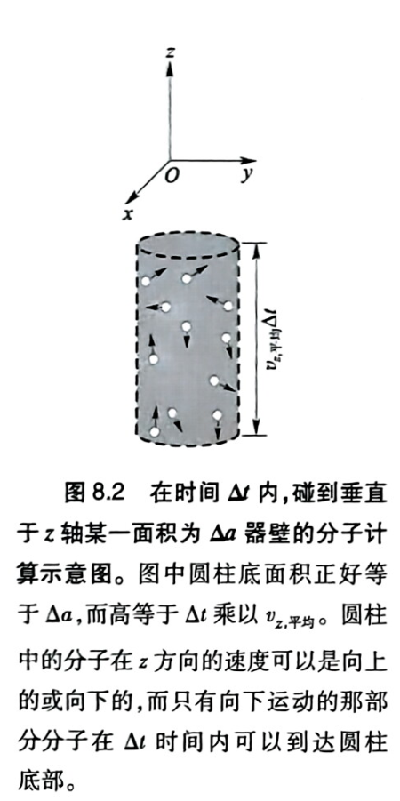

# 第8章 纯物质的体相性质

## 第一节 经典气体理论

### 1.1 定性模型

- $r_{分子}<<d_{分子}$

- 无分子间相互作用，弹性碰撞

- 气体分子处于无休止运动

---

### 1.2 定量模型

{: .center }

根据牛顿定律：

$$
F=\frac{\Delta(m\vec{v})}{\Delta t}
$$

单个分子碰撞器壁产生的压强：

$$
P_1=\frac{F_x}{a}=\frac{2m\overline{v}_x}{\Delta t\cdot a}
$$

在 $\Delta t$ 时间内，撞击面积 $a$ 的分子数为：

$$
N_{\text{撞}}=\frac{1}{2}\big(\overline{v}_x\Delta t\cdot a\big)\cdot \frac{nN_{\text{A}}}{V}
$$

总压强等于单个分子压强乘以撞击分子数：

$$
\therefore P = P_1 \cdot N_{\text{撞}}
$$

$$
P=\frac{N_{\text{A}}m\overline{v}_x^2}{V}\cdot n
$$

$$
\therefore PV = n\cdot \big(N_{\text{A}}m\overline{v}_x^2\big)=n\cdot 2E_{\text{k(平)}}
$$

与理想气体状态方程对比

$$
E_{\text{k(平)}}=\frac{1}{2} RT = E_{\text{k(1)}} = E_{\text{k(总)}}
$$

**能量均分定理**：每一个能量二阶项热能贡献为 $\frac{1}{2}RT$

---

## 第二节 气体的量子统计热力学

### 2.1 理想气体状态方程

$$
PV=nRT
$$

---

### 2.3 气体的量子统计热力学

#### 2.3.1 从配分函数到理想气体状态方程

$$
P=-\left(\frac{\partial A}{\partial V}\right)_{T,n}
=nRT\left[\frac{\partial(\ln f_{\text{总}})}{\partial V}\right]_{T,n}
=nRT\left[\frac{\partial(\ln f_{\text{平动}})}{\partial V}\right]_{T,n}
=nRT\left[\frac{\partial(\ln V)}{\partial V}\right]_{T,n}
=\frac{nRT}{V}
$$

#### 2.3.2 气体摩尔热容

$$
C_{P,m}=C_{V,m}+R
$$

- 单原子分子：各个平动自由度贡献 $\frac{1}{2}R$ 的摩尔热容
- 有机分子：低频振动模式对气态定压摩尔热容有贡献
    - 每个**单键片段**贡献2.5个充分热布局的振动自由度
- **杂原子**取代：$C_{P,m}$ **高于**取代前的CH分子（取代导致振动频率减小）

#### 2.3.3 气体摩尔熵

标准摩尔**平动**熵：

$$
S_{m(气)}^\circ=109+\frac{3R}{2}\ln M
$$

标准摩尔**转动**熵：平均每个转动自由度贡献 $(7\sim)8\ \mathrm{J\cdot mol^{-1}\cdot K^{-1}}$

**构象振动熵**：柔性分子**每个片段构象振动**对应4~5个小分子转动自由度

- **杂原子**取代：三类标准摩尔熵**均增加**（平动、转动、振动能隙都明显减小）

**摩尔熵**相比**摩尔热容**对自由度基本能隙**更敏感**

#### 2.3.4 气体化学势与实际气体

理想气体：

$$
\mu=\mu^\circ+RT\ln P
$$

实际气体（气体逸度 $\alpha$；逸度系数 $\gamma$）：

$$
\mu=\mu^\circ+RT\ln\alpha
$$

$$
\alpha=\gamma P
$$

## 3 纯物质相变的可逆过程热力学

### 3.1 相变过程的可逆热力学

#### 3.1.1 相平衡与相平衡条件

沸腾：液体的蒸气压等于外压强

相：系统某个宏观部分的化学和物理性质连续且平滑

推导：$(dT=0,dP=0;d\xi=dn_1=-dn_2)$

$$
dG=-S\,dT+V\,dP+\mu_1dn_1+\mu_2dn_2
$$

$$
\left(\frac{\partial G}{\partial\xi}\right)_{T,P}
=\mu_1\left(\frac{\partial n_1}{\partial\xi}\right)_{T,P}
+\mu_2\left(\frac{\partial n_2}{\partial\xi}\right)_{T,P}
=\mu_1-\mu_2
$$

相平衡条件（定温定压，物质在相-相之间交换的摩尔数 $\xi$）：

- 封闭两相处于平衡态：

    $$
    \left(\frac{\partial G}{\partial\xi}\right)_{T,P}=0
    $$

    $$
    \mu_1=\mu_2
    $$

- 从平衡态偏离：

    $$
    \left(\frac{\partial G}{\partial\xi}\right)_{T,P}d\xi=(\mu_1-\mu_2)d\xi=dG>0
    $$

#### 3.1.2 相变自发方向

- 自发不可逆相变：从高到低
- 可逆相变：$\mu_1=\mu_2+d\mu$

#### 3.1.3 可逆相变热力学参量

摩尔相变吉布斯自由能：

$$
\Delta_{tr}G_m\equiv G_{m,1}-G_{m,2}=\mu_1-\mu_2
$$

摩尔相变焓：

$$
\Delta_{tr}H_m\equiv H_{m,1}-H_{m,2}
$$

相平衡：

$$
\Delta_{tr}G_{m(平衡)}=\Delta_{tr}H_{m(平衡)}-T\Delta_{tr}S_{m(平衡)}=0
$$

相变的G、H、S均为状态函数，随温度的变化：

$$
\Delta_{tr}H_m(T_2)=\Delta_{tr}H_m(T_1)+\int_{T_1}^{T_2}\Delta C_{P,m}\,dT
\approx\Delta_{tr}H_m(T_1)+\Delta C_{P,m}\cdot\Delta T
$$

$$
\Delta_{tr}S_m(T_2)=\Delta_{tr}S_m(T_1)+\int_{T_1}^{T_2}\frac{\Delta C_{P,m}}{T}\,dT
\approx\Delta_{tr}S_m(T_1)+\Delta C_{P,m}\cdot\ln\frac{T_1}{T_2}
$$

### 3.2 纯物质相图

$$
\left(\frac{\partial\mu}{\partial T}\right)_{P,n}
=\left(\frac{\partial G_m}{\partial T}\right)_{P,n}
=-S_m
$$

由相平衡 $\mu_1=\mu_2$，可得两相边界斜率（克拉伯龙方程）：

$$
\frac{dP}{dT}=\frac{\Delta_{tr}S_{m(平衡)}}{\Delta_{tr}V_{m(平衡)}}
=\frac{\Delta_{tr}H_{m(平衡)}}{T_{平衡}\Delta_{tr}V_{m(平衡)}}
$$

对气-液相变，可变化为（$P^*$：饱和蒸气压）：

$$
\frac{dP^*}{dT}=\frac{\Delta_{tr}H_{m(平衡)}}{T_{平衡}\Delta_{tr}V_{m(平衡)}}
=\frac{P^*\Delta_{tr}H_{m(平衡)}}{R(T_{平衡})^2}
$$

### 3.3 沸点、熔点与临界点

#### 3.3.1 标准沸点与分子结构

由相变过程中 $\Delta_{tr}G_{m(平衡)}=0$，得

$$
T_{bp}=\frac{\Delta_{tr}H_{m(bp)}}{\Delta_{tr}S_{m(bp)}}
=\frac{E_{m,分子/液}}{R-\Delta_{tr}S_{m(bp)}}
=\frac{E^0_{m,分子/液}}{-\frac{1+F_{转}}{2}R-\Delta_{tr}S_{m(bp)}}
$$

**非氢键多原子分子**（$\Delta_{tr}S^\circ_{m(bp)}=84.4\ \mathrm{J\cdot mol^{-1}\cdot K^{-1}}$）：

$$
T_{bp}(K)=-10.0E^0_{m,分子/液}(\mathrm{kJ\cdot mol^{-1}})
$$

**氢键分子**的 $\Delta_{tr}S^\circ_{m(bp)}$ 会明显大于 $84.4\ \mathrm{J\cdot mol^{-1}\cdot K^{-1}}$

#### 3.3.2 标准熔点与分子结构

标准熔点：

$$
T_{mp}=\frac{\Delta_{tr}H_{m(mp)}}{\Delta_{tr}S_{m(mp)}}
=\frac{E_{m,分子/液}-E_{m,分子/固}}
{\Delta_{tr}S_{(类振动)}+\Delta_{tr}S_{(定向)}+\Delta_{tr}S_{(分子内振动)}}
$$

- $\Delta_{tr}S_{(类振动)}$：两种类振动自由度的摩尔熵在液态与晶态的差别
- $\Delta_{tr}S_{(定向)}$：从晶态变成液态所造成的分子摩尔空间取向熵改变
- $\Delta_{tr}S_{(分子内振动)}$：熔融过程中发生明显运动模式改变的分子内振动自由度的摩尔变化
- 接近球形的四面体分子：

    $$
    T_{mp}\approx-100\times(E_{m,分子/液}-E_{m,分子/固})(K)
    $$

- 随着碳原子数增加：
    - 蒸发过程的标准摩尔蒸发熵改变不大，满足特鲁顿规则
    - 熔融过程大量激发分子内旋转等构象熵，其熔融熵随碳原子数增加快速增加
- 随碳原子数增加，正烷烃的标准熔点增加速率应该大大慢于标准沸点的增加速率。但图8.17揭示，标准熔点增加速率只是稍慢于标准沸点的增加速率。
- 熔融过程在释放大量的构象熵的同时，通过热布居分子内构象振动自由度而大大增加了液态的热能，两个效应部分相抵消

## 4 纯物质的凝聚态

### 4.1 凝聚态纯物质的化学势

液态：（$\mu^*$：**纯液态化学势=饱和蒸气化学势**；$P^*$：饱和蒸气压）

$$
\mu_{液}=\mu^*=\mu^\circ+RT\ln P^*
$$

固态：

$$
\mu_{固}=\mu^\circ+RT\ln P^*
$$

### 4.2 液态的量子统计热力学性质

#### 4.2.1 液态定压热容与自由度转化

分子内振动不活跃的**液态热容原理**：

$$
C_{P,m(液)}=1.9(C_{P,m(气)}-R)
$$

#### 4.2.2 液态标准定压热容与分子间相互作用基态能

由：

$$
Q_{m(液)}=Q_{m(气)}+\frac{3+F_{转}}{2}RT
$$

得：

$$
C_{V,m(液)}=C_{V,m(气)}+\frac{3+F_{转}}{2}R
$$

且由：

$$
C_{P,m(液)}=C_{V,m(液)}+\frac{V_mT(\alpha_P)^2}{\pi_T}
$$

热膨胀系数 $\alpha_P\equiv\frac{1}{V_m}\left(\frac{\partial V_m}{\partial T}\right)_P$，定温压缩系数 $\pi_T\equiv-\frac{1}{V_m}\left(\frac{\partial V_m}{\partial P}\right)_T$

非氢键分子的**液态热容原理**：

$$
C_{P,m(液)}=C_{V,m(气)}+\frac{3+F_{转}}{2}R+\frac{V_mT(\alpha_P)^2}{\pi_T}
$$

氢键分子：

$$
C_{P,m(液)}=C_{V,m(气)}+C_{V,m(氢键)}+\frac{3+F_{转}}{2}R+\frac{V_mT(\alpha_P)^2}{\pi_T}
$$

#### 4.2.3 液态单位体积比热

体积比热：单位体积定压热容

$$
\nu=\frac{C_P}{V}=\frac{C_{P,m}}{V_m}
$$

对化学过程影响最大的是体积比热，液态介质是化学反应非常强有力的推动剂（反应空间无法散热）

#### 4.2.4 液态熵补偿

液态介质能够有效地捕获反应产生的热量

#### 4.2.6 液态体积

- 凝聚态体积：分子间相互作用
- 气态体积：系统分子的集体行为：系统的多样性或熵
    - 气体体积反映的不是物质本身的相互作用性质，取决于环境提供的**边界条件**（容器大小）

### 4.3 固态的量子统计热力学性质简论

#### 4.3.1 固态分子图像

- 含N个原子的晶体：
    - 3个平动自由度
    - 3个转动自由度
    - **振动自由度无限接近3N。**
- 讨论晶体性质，晶体的振动自由度一般就当作 3N，而完全忽略平动和转动自由度

#### 4.3.2 固态定压热容

固体中核运动的量子自由度全部是**振动自由度**

$$
C_{P,m(固)}=\left(\frac{\partial U_{m(固)}}{\partial T}\right)_P(+PV_m\alpha_P)
=\sum_{j=1}^{3A}\frac{k(j/kT)^2}{(e^{j/2kT}-e^{-j/2kT})^2}
+\left(\frac{\partial E^0_{m,分子/固}}{\partial T}\right)_P
$$

- 第一项：分子在所有**振动自由度摩尔热容**的总值（极限值为 $3R$）
- 第二项：分子间相互作用基态能对温度的依赖性，反映固体中分子间距随温度的变化（$>0$）

$$
\left(\frac{\partial E^0_{m,分子/固}}{\partial T}\right)_P
=-\frac{1}{3}\alpha_PE^0_{m,分子/固}
$$

**(A) 单原子或单原子离子构成的固体**

只有分子集体振动自由度

**(B) 含局域共价键的分子晶体**

除平动转化的集体振动外，还应加上转动转化

#### 4.3.3 固态熵

$$
S_{m(固)}(T)=\int_0^T\frac{C_{P,m(固)}}{T}\,dT
=\int_0^T\frac{C_{V,m(固)}}{T}\,dT
+\int_0^T\frac{(\partial E^0_{m,分子/固}/\partial T)_P}{T}\,dT
$$

- 第一项：固态每个**振动自由度的摩尔熵**
- 第二项：分子间电磁相互作用带来的摩尔熵
