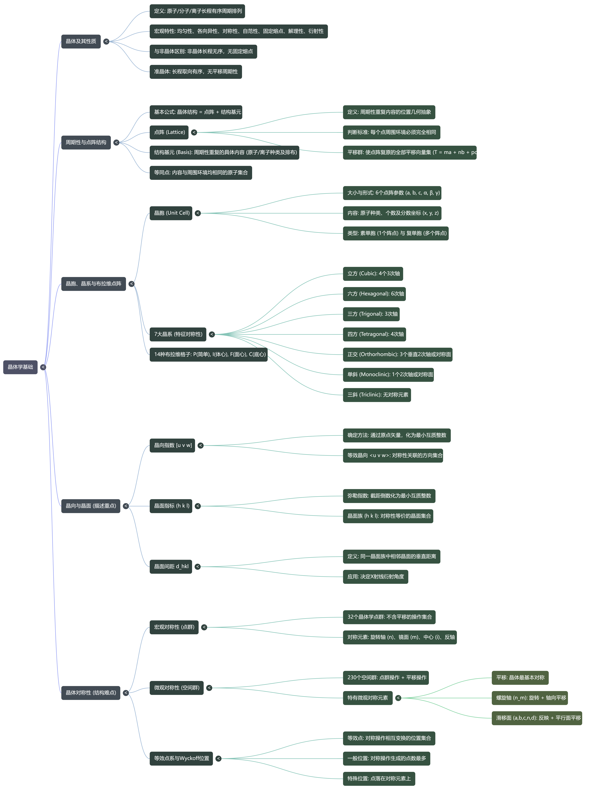
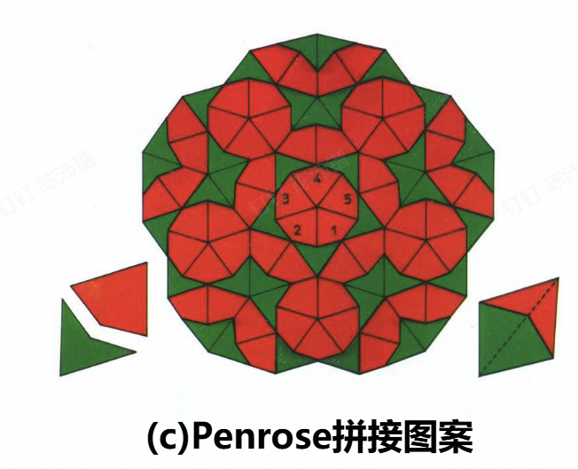
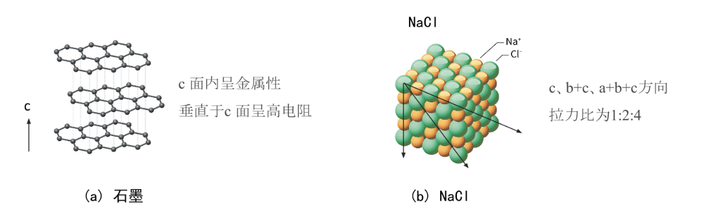
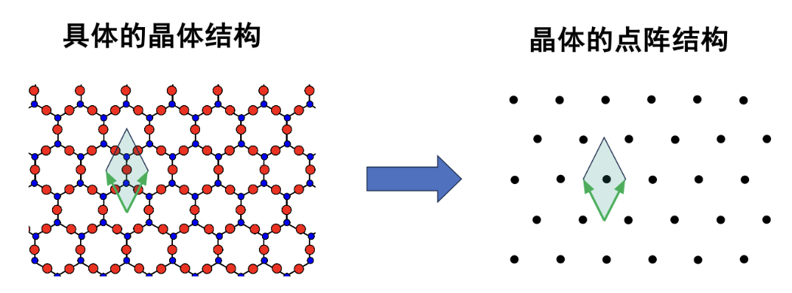
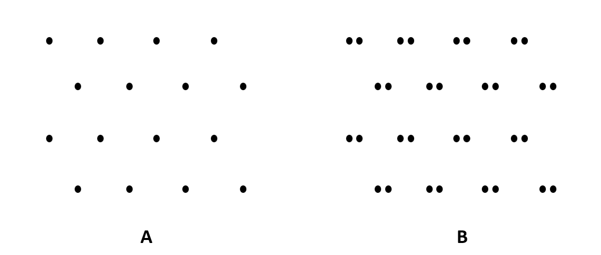
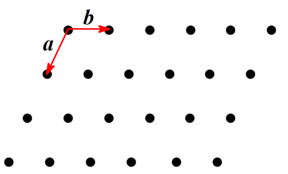
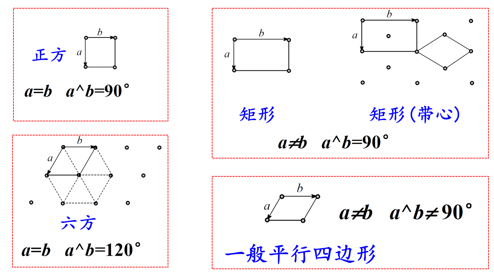

# Chapter 1：晶体学基础

## 1.1 晶体及其性质

$$
\text{固体物质 (按结构分类)}
\begin{cases}
  \begin{array}{l}
    \textbf{晶体} \\
    \text{内部原子、离子或分子在空间中按照某种规律周期性地排列（长程有序）} \\
  \end{array}
  \begin{cases}
    \text{单晶体} \\
    \text{多晶体}
  \end{cases} \\
  \\
  \begin{array}{l}
    \textbf{非晶体} \\
    \text{非晶态物质内部的原子、分子排列无序，不具有周期性（长程无序），通常也称为玻璃体、无定型物。} \\
  \end{array} \\
  \\
  \begin{array}{l}
    \textbf{准晶体} \\
    \text{有长程取向性，而无严格的周期性（平移对称性）。}
  \end{array}
\end{cases}
$$

非晶体中原子排列无长程周期性，但保留了原子排列的短程序：即近邻原子的数目和种类、近邻原子之间的距离(键长)、近邻原子配置的几何方位(键角)

准晶体具有长程的取向序，但没有长程的平移对称序，可以用Penrose拼接图案显示其结构特点。如图，所有菱形的边缘走向，被严格限制在 5 个固定的方向上，即为取向序。准晶体具有与晶体相似的长程有序的原子排列，但是准晶体不具备晶体的平移对称性。

晶体的性质：

均匀性；

各向异性：不同的方向上晶体中原子排列情况不同

对称性：晶体在某几个特定方向上可以异向同性，这种相同的性质在不同的方向上有规律地重复出现，称为晶体的对称性。

自限性/自范性： 晶体自发形成具有凸多面体外形的性质
满足欧拉公式：晶面+顶点=晶棱+2
F+V=E+2

固定的熔点

其他性质： 具有解理性（沿确定方位的晶面劈裂）、能对X射线产生衍射、属于同一品种的晶体晶面夹角守恒等

## 1.2 晶体的周期性与点阵结构

### 晶体结构 = 点阵 + 结构基元

结构基元： 重复出现的具体内容（原子、分子的种类、数量及排列方式）

点阵 ： 重复出现内容的位置关系（将结构基元抽象为一个几何点阵点）

重复周期的大小与方向：平移矢量

当把结构基元抽象为点阵点时，这个点可以是结构基元的重心，也可以是结构基元中的任意一个原子。由它们抽象得到的周期性的排列方式完全相同。

### 点阵的定义与判断标准
点阵是对周期性排列物体的数学抽象表达，平移群是它的代数描述。

点阵是一组无限的点，连接其中任意两点可得一向量，按此向量平移能使整个体系复原

判断一组点是否为点阵：
每个点的周围环境必须完全相同
任意两个点连线对应的平移应使整体复原
点阵是无限延拓的周期点集
点阵点是等价位置，点阵点不是具体原子种类

上图中：A是点阵，B不是。A满足点阵定义，而B组相邻2个点的周围环境不等价

### 晶体点阵的类型、描述方式和点阵格子

① 直线点阵(one-dimensional lattice)

基本周期：相邻两点间的距离 a 叫基本周期。
平移群：点阵的代数形式，能使点阵复原的全部平移向量集称为平移群。

一维直线点阵平移群的代数描述：
T = m·a  （m=0, ±1, ±2, ….）
a 为直线点阵格子的基矢

② 平面点阵(two-dimensional lattice)

平面点阵中，可以找到两个独立的不平行的基本向量。

**平面点阵平移群的代数描述：**

$$T_{mn} = m \cdot \mathbf{a} + n \cdot \mathbf{b}$$

$$(m, n = 0, \pm 1, \pm 2, \dots)$$

**$a, b$ 为平面点阵格子的基矢**

**平面格子**：沿二个方向将全部点阵点连结起来，即得到平面格子。整个平面点阵可视为无数个这样的平行四边形格子并置而成。

**素格子**：摊到**一个**点阵点的单位，网格中最小的平行四边形
**复格子**：摊到**一个以上**点阵点的单位

**正当单位**：①具有较**规则形状**的、②**对称性高**，③在满足对称性高前提下，**面积较小**的平行四边形。

平面点阵的正当单位可有**四种形状，五种型式**：

图中 $a, b$ 为平面点阵格子的基矢（可以完全描述点阵的排列规律，大小和方向）

Q：试证明平面正方点阵不存在带心正方点阵形式。

