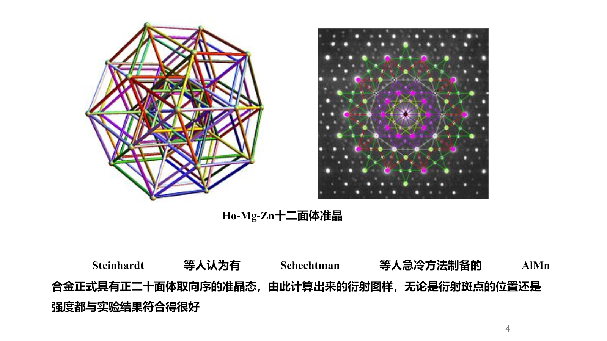
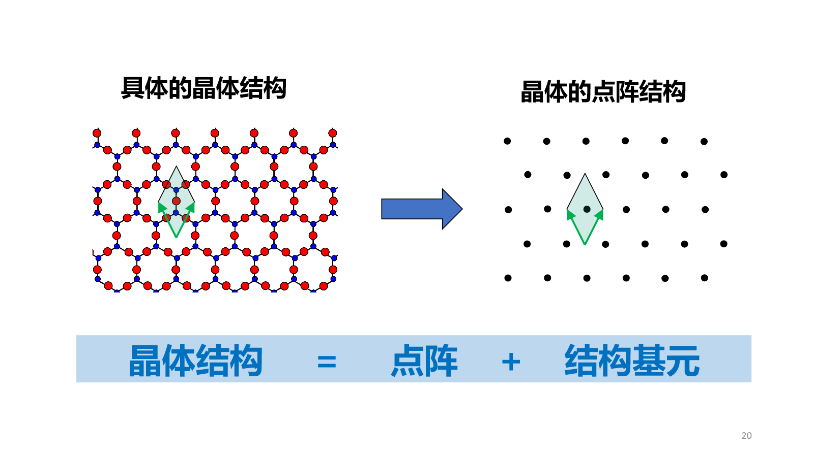
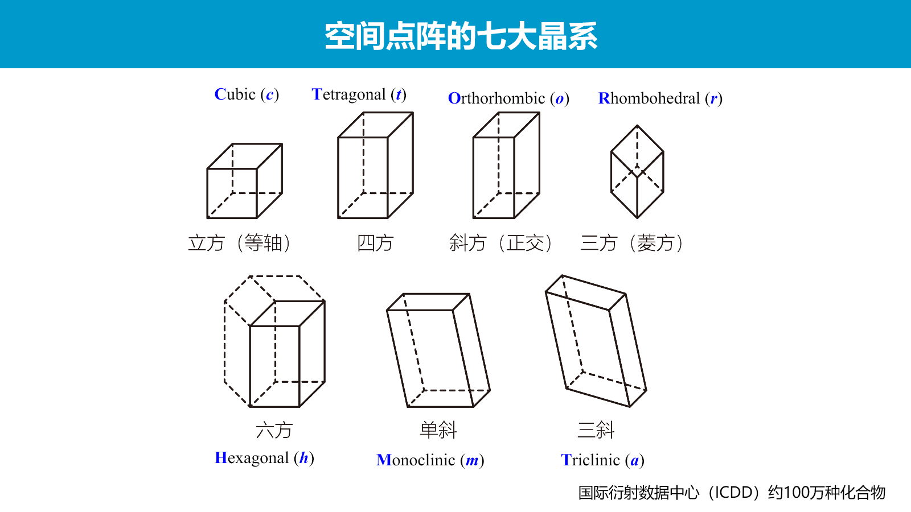
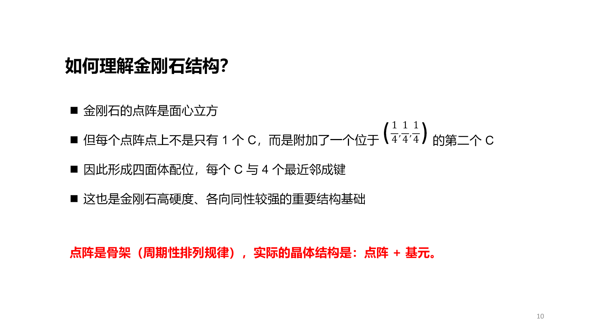
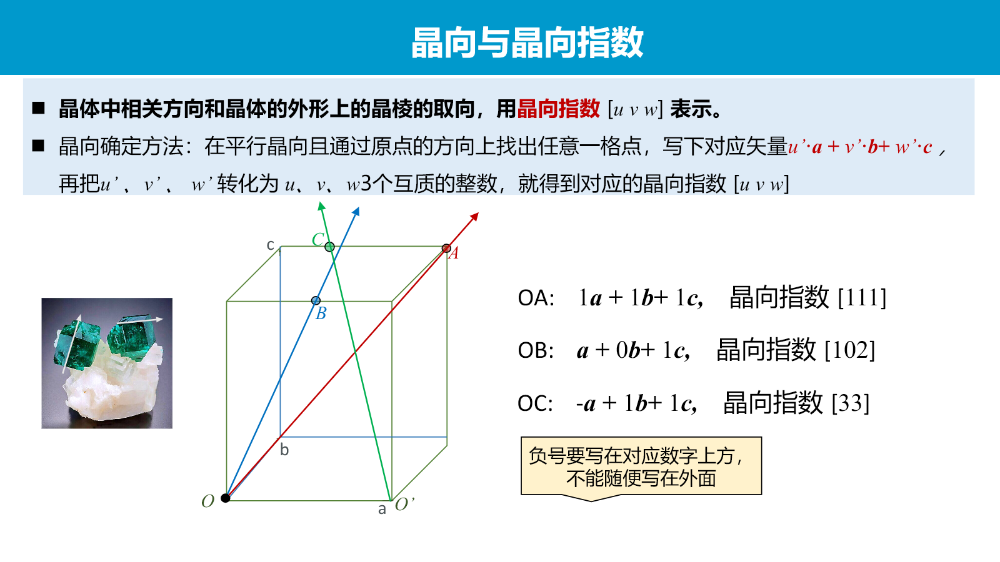
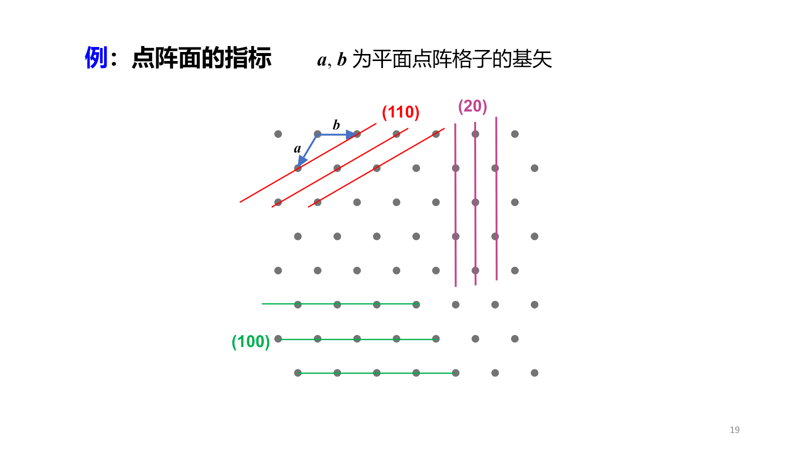
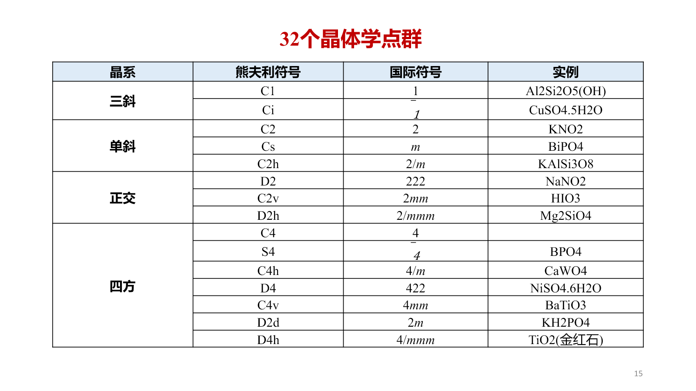
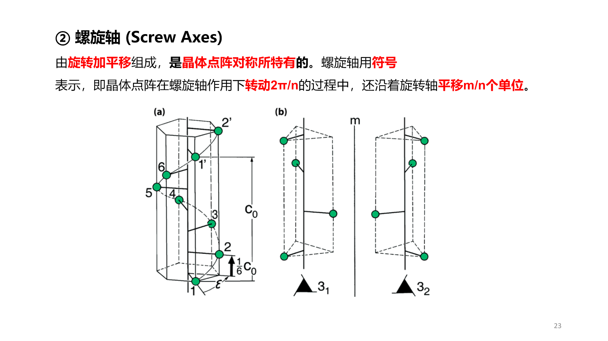
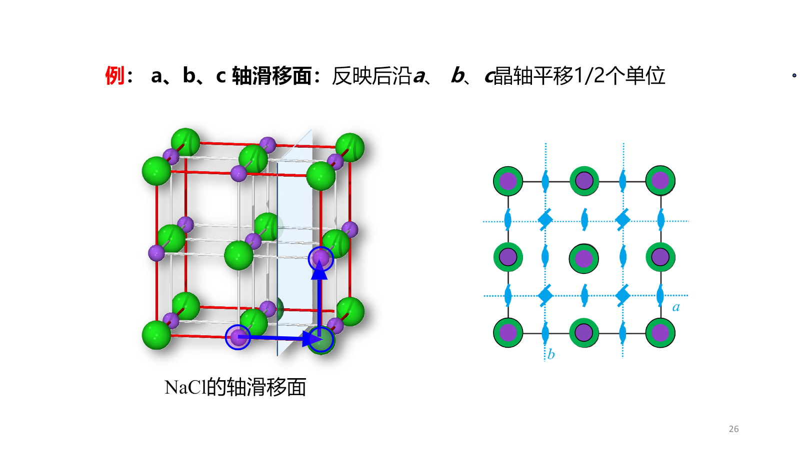

# Chapter 1：晶体学基础

本章的主线是：**周期性结构 → 点阵描述 → 晶胞、晶向与晶面 → 晶体对称性**。点阵负责描述重复方式，结构基元负责描述重复内容；二者结合才是实际晶体结构。

## 1.1 晶体、非晶体与准晶体

### 1.1.1 三类固体的结构特征

- **晶体**：组成粒子在空间中具有长程平移周期性。
- **非晶体**：不具有长程周期性，但近邻配位数、键长和键角等仍可保持短程有序。
- **准晶体**：具有长程有序性和尖锐衍射峰，但不存在严格平移周期，可以出现周期晶体不允许的五重等旋转对称性。

晶体的典型宏观性质包括均匀性、各向异性、对称性、自范性、固定熔点、解理性和 X 射线衍射。其共同微观来源是粒子的周期性排列。

准晶的 Penrose 拼接可用有限种结构单元产生非周期长程有序；它说明“有序”并不等同于“周期”。

{: .center }

## 1.2 点阵与结构基元

### 1.2.1 晶体结构的分解

$$
\text{晶体结构}=\text{点阵}+\text{结构基元}
$$

- **结构基元**：在每个点阵点上重复出现的原子、离子或分子集合，包含种类、数目和相对位置。
- **点阵**：把结构基元抽象为几何点后得到的无限周期点集；每个点阵点的周围环境完全相同。

点阵点不是某一种具体原子。只要每个结构基元都选取同一等价位置作为点阵点，所得到的点阵相同。

{: .center }

### 1.2.2 平移群

一维点阵的平移矢量为

$$
\mathbf T_m=m\mathbf a,\qquad m\in\mathbb Z
$$

二维点阵为

$$
\mathbf T_{mn}=m\mathbf a+n\mathbf b
$$

三维空间点阵为

$$
\mathbf T_{uvw}=u\mathbf a+v\mathbf b+w\mathbf c,qquad u,v,w\in\mathbb Z
$$

若对任意点阵点按任意允许的 $\mathbf T$ 平移，整个点集与原点集重合，则这些平移构成点阵的平移群。

### 1.2.3 素单位、复单位与正当单位

- **素单位**只摊到一个点阵点，体积最小。
- **复单位**摊到一个以上点阵点。
- **正当单位**优先反映点阵对称性，在保持较高对称性的前提下取较小体积，因此不一定是素单位。

二维点阵只有 5 种 Bravais 格子；三维空间点阵只有 7 种晶系、14 种 Bravais 格子。晶系由点阵的度量关系和对称性确定，而 Bravais 格子还区分简单、底心、体心和面心等点阵型式。

{: .center }

## 1.3 晶胞与分数坐标

晶胞是用于描述晶体结构的重复单元。晶胞参数为三条边长 $a,b,c$ 和三个夹角

$$
\alpha=\angle(\mathbf b,\mathbf c),\quad
\beta=\angle(\mathbf a,\mathbf c),\quad
\gamma=\angle(\mathbf a,\mathbf b)
$$

晶胞中一点的位置写成

$$
\mathbf r=x\mathbf a+y\mathbf b+z\mathbf c
$$

其中 $(x,y,z)$ 为分数坐标。相差整数平移的坐标表示同一类等价位置，例如 $(1,0,0)$ 与 $(0,0,0)$ 通过一个晶格矢量相连。

晶胞中原子数按共享比例计算：顶点原子计 $1/8$，棱心计 $1/4$，面心计 $1/2$，体内原子计 1。

分析晶体结构时依次回答：

1. Bravais 点阵是什么；
2. 结构基元包含哪些原子及其分数坐标；
3. 最近邻配位关系和对称性是什么。

金刚石可描述为面心立方点阵加二原子基元

$$
(0,0,0),\qquad \left(\frac14,\frac14,\frac14\right)
$$

也可看作两个沿体对角线相对位移 $(1/4,1/4,1/4)$ 的面心立方子点阵。

{: .center }

## 1.4 晶向与晶面

### 1.4.1 晶向指数

通过原点并平行于目标方向取一点，其位置矢量为

$$
\mathbf r=u'\mathbf a+v'\mathbf b+w'\mathbf c
$$

把 $u',v',w'$ 化为最小互质整数 $u,v,w$，得到晶向指数 $[uvw]$。负指数写成上划线，例如 $[\bar110]$。

- $[uvw]$ 表示一个具体晶向；
- $\langle uvw\rangle$ 表示由晶体对称性联系的一族等效晶向。

{: .center }

### 1.4.2 晶面指数

设晶面在三条晶轴上的截距依次为 $p a,q b,r c$。取截数的倒数并化为最小互质整数：

$$
(hkl)\propto\left(\frac1p,\frac1q,\frac1r\right)
$$

得到 Miller 指数 $(hkl)$。若晶面平行于某晶轴，对应截距为无穷大，因此相应指数为 0。负截距用上划线表示。

- $(hkl)$ 表示一族相互平行、等间距的晶面；
- $\{hkl\}$ 表示由对称性联系的一族等效晶面；
- 同一晶面族中距原点最近的晶面在三轴上的截距分别为 $a/h,b/k,c/l$。

{: .center }

### 1.4.3 晶面间距

引入倒易基矢

$$
\mathbf b_1=2\pi\frac{\mathbf a_2\times\mathbf a_3}{\Omega},\quad
\mathbf b_2=2\pi\frac{\mathbf a_3\times\mathbf a_1}{\Omega},\quad
\mathbf b_3=2\pi\frac{\mathbf a_1\times\mathbf a_2}{\Omega}
$$

其中

$$
\Omega=\mathbf a_1\cdot(\mathbf a_2\times\mathbf a_3)
$$

$(hkl)$ 晶面族的法向倒易格矢为

$$
\mathbf G_{hkl}=h\mathbf b_1+k\mathbf b_2+l\mathbf b_3
$$

相邻晶面的相位相差 $2\pi$，所以

$$
d_{hkl}=\frac{2\pi}{|\mathbf G_{hkl}|}
$$

正交晶系中

$$
\frac1{d_{hkl}^2}=\frac{h^2}{a^2}+\frac{k^2}{b^2}+\frac{l^2}{c^2}
$$

立方晶系进一步化为

$$
d_{hkl}=\frac{a}{\sqrt{h^2+k^2+l^2}}
$$

## 1.5 晶体对称性

### 1.5.1 宏观对称性与点群

点群由至少保持一点不动的对称操作组成。晶体宏观对称元素包括：

- $n$ 重旋转轴；
- 镜面 $m$；
- 反演中心 $i$；
- 旋转反演轴 $\bar n$。

由于平移周期性的限制，晶体只允许 1、2、3、4、6 重旋转轴。证明如下：旋转操作在二维点阵基矢上的表示必须是整数矩阵 $M$，且保持面积，故 $\det M=1$。二维旋转矩阵的迹为 $2\cos\theta$，又因为整数矩阵的迹是整数，故

$$
2\cos\theta\in\{-2,-1,0,1,2\}
$$

于是

$$
\theta=180^\circ,120^\circ,90^\circ,60^\circ,0^\circ
$$

对应 $n=2,3,4,6,1$。周期晶体因此不允许五重旋转轴。

三维晶体共有 32 个晶体学点群。Hermann–Mauguin 国际符号按各晶系的特征方向依次列出对称元素，比 Schönflies 符号更直接地反映晶体方向。

{: .center }

### 1.5.2 微观对称性与空间群

晶体内部还允许含平移分量的对称操作。点群操作与平移群结合形成空间群，三维晶体共有 230 个空间群。

晶体特有的两类微观对称元素是：

- **螺旋轴** $n_m$：绕轴旋转 $2\pi/n$，再沿轴平移晶格周期的 $m/n$；
- **滑移面**：先关于平面反射，再沿平面内方向平移半个或四分之一个晶格周期。常见记号有 $a,b,c,n,d$。

{: .center }

{: .center }

空间群符号先给出 Bravais 点阵类型，再给出特征方向上的对称元素。例如 $P2_1/c$ 表示简单单斜点阵，包含 $2_1$ 螺旋轴和 $c$ 滑移面等操作。

### 1.5.3 等效位置与 Wyckoff 位置

给定空间群中，一个点经全部空间群操作生成的一组点称为**等效位置**。具有相同位置对称性的一类等效位置构成 Wyckoff 位置。

一般位置的稳定子只含恒等操作，重数最高；特殊位置位于某个旋转轴、镜面或反演中心上，保留更多对称操作，因此重数较低。空间群、Wyckoff 位置和各位置上的原子种类共同构成晶体结构的完整对称性描述。

## 1.6 本章逻辑链

$$
\text{长程周期性}
\Rightarrow \text{平移群与点阵}
\Rightarrow \text{晶胞、晶向、晶面}
\Rightarrow \text{点群与空间群}
$$

点阵与结构基元回答“什么内容怎样重复”；晶向、晶面和倒易格矢回答“如何描述方向与周期”；点群和空间群回答“哪些变换使结构保持不变”。这些概念共同为下一章的倒易空间和 X 射线衍射建立基础。
