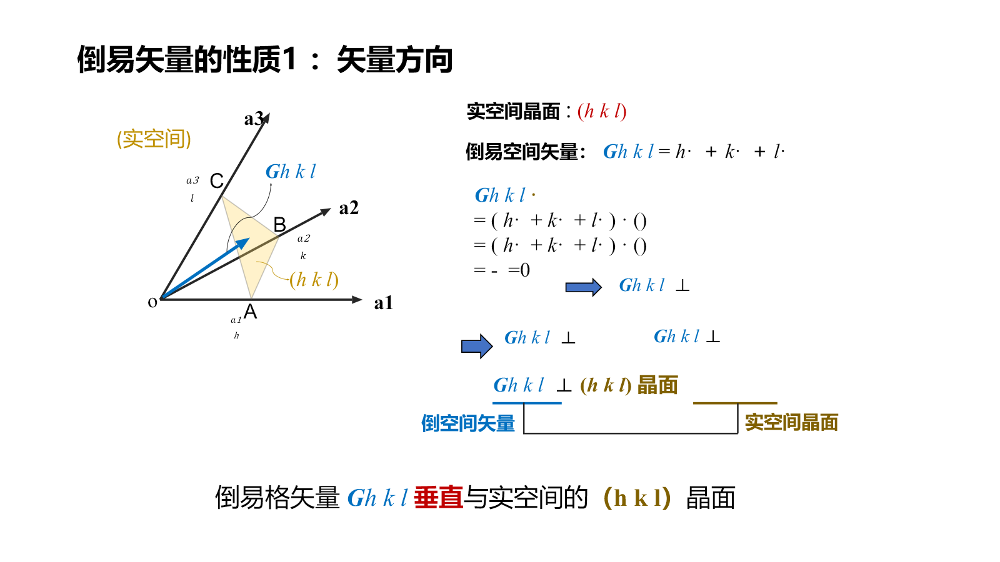
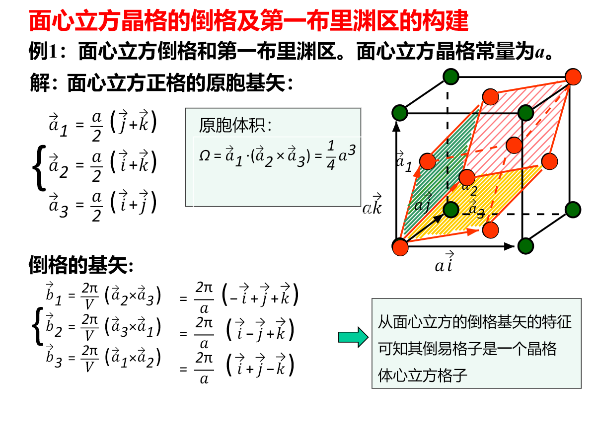
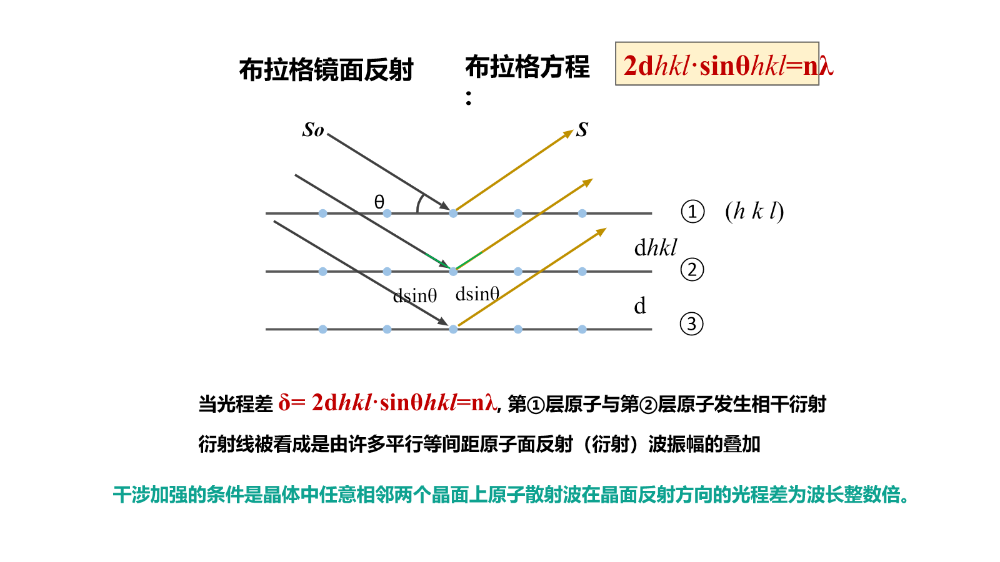
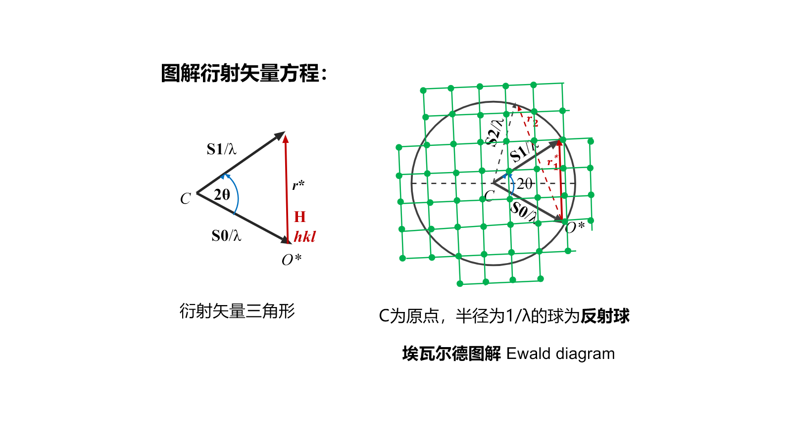
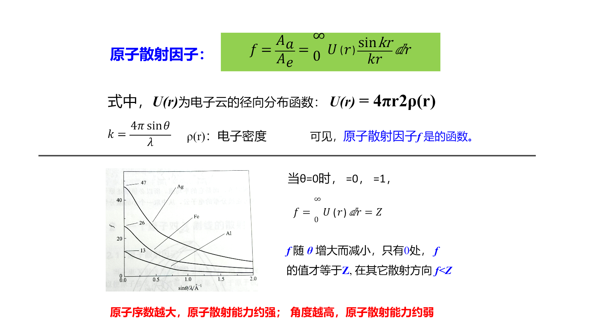
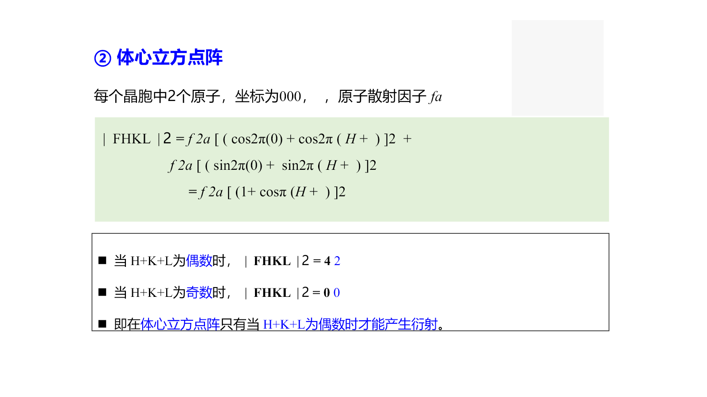
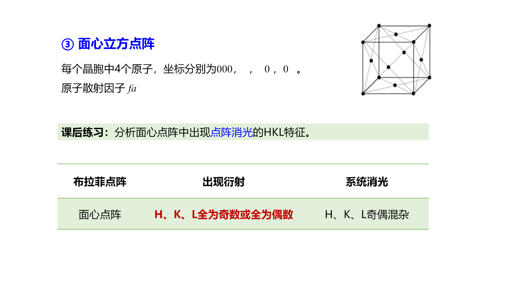

# Chapter 2：晶体的 X 射线衍射

本章的逻辑链是：**实空间周期性 → 倒易点阵 → 衍射条件 → 结构因子 → 衍射图样 → 结构信息**。衍射峰的位置主要由晶胞参数决定，峰强主要由晶胞内原子的种类和位置决定，峰宽还包含晶粒尺寸和微应变信息。

## 2.1 倒易点阵

### 2.1.1 为什么引入倒易空间

衍射图样不是原子位置的直接照片，而是晶体周期性在波矢空间中的表现。实空间中的一族晶面需要同时描述其方向和间距；倒易格矢正好把这两项信息编码为一个矢量：

- $\mathbf G_{hkl}$ 的方向垂直于 $(hkl)$ 晶面；
- $|\mathbf G_{hkl}|$ 与晶面间距 $d_{hkl}$ 成反比。

### 2.1.2 倒易基矢

实空间基矢为 $\mathbf a_1,\mathbf a_2,\mathbf a_3$，原胞体积为

$$
\Omega=\mathbf a_1\cdot(\mathbf a_2\times\mathbf a_3)
$$

倒易基矢定义为

$$
\mathbf b_1=2\pi\frac{\mathbf a_2\times\mathbf a_3}{\Omega},\qquad
\mathbf b_2=2\pi\frac{\mathbf a_3\times\mathbf a_1}{\Omega},\qquad
\mathbf b_3=2\pi\frac{\mathbf a_1\times\mathbf a_2}{\Omega}
$$

因此

$$
\mathbf a_i\cdot\mathbf b_j=2\pi\delta_{ij}
$$

任意倒易格矢为

$$
\mathbf G_{hkl}=h\mathbf b_1+k\mathbf b_2+l\mathbf b_3
$$

{: .center }

### 2.1.3 倒易格矢的方向与模长

对 $(hkl)$ 晶面内任意平移矢量 $\mathbf t$，都有

$$
\mathbf G_{hkl}\cdot\mathbf t=0
$$

故 $\mathbf G_{hkl}$ 垂直于该晶面。沿法向跨过一个晶面间距时相位增加 $2\pi$，所以

$$
|\mathbf G_{hkl}|d_{hkl}=2\pi
$$

即

$$
d_{hkl}=\frac{2\pi}{|\mathbf G_{hkl}|}
$$

这使几何晶面问题可以转化为倒易空间中的矢量问题。

### 2.1.4 立方点阵的倒易关系与第一 Brillouin 区

- 简单立方的倒格仍为简单立方，倒易晶格常数为 $2\pi/a$；
- 面心立方的倒格是体心立方；
- 体心立方的倒格是面心立方。

第一 Brillouin 区是倒易空间中以原点为中心的 Wigner–Seitz 原胞，即所有比其他倒易格点更接近原点的点的集合。它既是衍射几何的自然区域，也是能带中不等价波矢的基本区域。

{: .center }

## 2.2 X 射线与晶体散射

X 射线波长约为 $10^{-10}\ \mathrm m$，与晶面间距同量级，因此晶体可作为三维衍射光栅。设入射和散射波矢分别为

$$
\mathbf k_0=\frac{2\pi}{\lambda}\mathbf s_0,qquad
\mathbf k=\frac{2\pi}{\lambda}\mathbf s
$$

弹性散射满足

$$
|\mathbf k|=|\mathbf k_0|=\frac{2\pi}{\lambda}
$$

定义散射矢量

$$
\mathbf q=\mathbf k-\mathbf k_0
$$

衍射只在 $\mathbf q$ 与某个倒易格矢相等时发生。

## 2.3 衍射几何条件

### 2.3.1 Laue 方程

相隔晶格矢量 $\mathbf R$ 的两个格点产生的散射波相位差为

$$
\Delta\varphi=(\mathbf k-\mathbf k_0)\cdot\mathbf R
$$

对所有晶格矢量都相干增强，要求 $\Delta\varphi=2\pi m$。分别取 $\mathbf R=\mathbf a_1,\mathbf a_2,\mathbf a_3$，得到

$$
\begin{aligned}
\mathbf q\cdot\mathbf a_1&=2\pi h\\
\mathbf q\cdot\mathbf a_2&=2\pi k\\
\mathbf q\cdot\mathbf a_3&=2\pi l
\end{aligned}
$$

等价地写成衍射矢量方程

$$
\boxed{\mathbf k-\mathbf k_0=\mathbf G_{hkl}}
$$

### 2.3.2 Bragg 方程

把晶体看作平行晶面族，相邻晶面散射波的光程差为

$$
\Delta L=2d_{hkl}\sin\theta
$$

相长干涉条件为 $\Delta L=n\lambda$，所以

$$
\boxed{2d_{hkl}\sin\theta=n\lambda}
$$

{: .center }

Bragg 方程的关键含义：

- 给定 $\lambda$ 时，衍射角决定晶面间距；
- 只有 $\lambda\le 2d_{hkl}$ 时才可能衍射；
- 通常把 $n$ 级衍射改写成 $(nh,nk,nl)$ 晶面的一阶衍射。

### 2.3.3 三种表述的等价性

由 Ewald 几何

$$
|\mathbf q|=2|\mathbf k_0|\sin\theta
=\frac{4\pi}{\lambda}\sin\theta
$$

而

$$
|\mathbf G_{hkl}|=\frac{2\pi n}{d_{hkl}}
$$

令 $\mathbf q=\mathbf G_{hkl}$ 即得到 Bragg 方程。因此 Laue 方程、衍射矢量方程和 Bragg 方程是同一相干条件在代数、倒易空间和晶面几何中的三种表达。

### 2.3.4 Ewald 作图

以入射波矢末端为球心、$2\pi/\lambda$ 为半径作球。倒易格点落在球面上时，连接原点与该格点的矢量即满足

$$
\mathbf k-\mathbf k_0=\mathbf G
$$

{: .center }

单晶转动法通过转动倒易点阵使更多格点与 Ewald 球相交；粉末中各晶粒取向随机，同一 $|\mathbf G|$ 的倒易点形成球壳，与 Ewald 球相交后形成 Debye–Scherrer 圆锥。

## 2.4 衍射强度

衍射几何决定“在哪些方向出现峰”，衍射强度决定“峰有多强”。强度的层次依次是：单电子散射 → 原子散射 → 晶胞内相干叠加 → 有限晶体中晶胞间相干叠加。

### 2.4.1 电子与原子散射

经典 Thomson 散射中，电子受电场驱动加速并辐射同频电磁波。单电子散射强度包含偏振和几何因子。

原子由空间分布的电子云组成，各处电子的散射存在相位差。原子散射振幅与单电子散射振幅之比定义为原子散射因子

$$
f(\mathbf q)=\int\rho_e(\mathbf r)e^{i\mathbf q\cdot\mathbf r}\,\mathrm d^3r
$$

在前向散射极限 $\mathbf q=0$ 时

$$
f(0)=Z
$$

散射角增大时，电子云不同部分相消增强，$f$ 通常减小。接近原子吸收边时还需加入反常色散修正

$$
f=f_0+f'+if''
$$

{: .center }

### 2.4.2 晶胞结构因子

晶胞中第 $j$ 个原子的分数坐标为 $(x_j,y_j,z_j)$，原子散射因子为 $f_j$。晶胞的复散射振幅为

$$
\boxed{F_{hkl}=\sum_j f_j
e^{2\pi i(hx_j+ky_j+lz_j)}}
$$

对应强度

$$
I_{hkl}\propto |F_{hkl}|^2
$$

结构因子表明：峰强同时取决于原子种类 $f_j$ 和原子位置 $(x_j,y_j,z_j)$。

### 2.4.3 点阵消光

简单点阵只有一个阵点，不产生点阵消光。

体心点阵的阵点为 $(0,0,0)$ 和 $(1/2,1/2,1/2)$：

$$
F_{hkl}=f\left[1+(-1)^{h+k+l}\right]
$$

故 $h+k+l$ 为偶数时允许，为奇数时消光。

面心点阵的四个阵点给出

$$
F_{hkl}=f\left[1+(-1)^{h+k}+(-1)^{h+l}+(-1)^{k+l}\right]
$$

只有 $h,k,l$ 全奇或全偶时允许衍射。

{: .center }

{: .center }

### 2.4.4 结构基元引起的消光

金刚石结构是在面心点阵上附加

$$
(0,0,0),\qquad\left(\frac14,\frac14,\frac14\right)
$$

二原子基元，因此

$$
F_{hkl}^{\mathrm{diamond}}
=F_{hkl}^{\mathrm{fcc}}
\left[1+e^{\frac{\pi i}{2}(h+k+l)}\right]
$$

在面心点阵选择定则之外，当 $h,k,l$ 全偶且 $h+k+l=4n+2$ 时还会消光。这说明相同 Bravais 点阵可以因结构基元不同而具有不同衍射强度。

### 2.4.5 有限晶体干涉函数

沿某方向有 $N$ 个等间距晶胞，相邻晶胞散射相位差为 $\varphi$。振幅为等比级数

$$
A=A_1\sum_{m=0}^{N-1}e^{im\varphi}
=A_1e^{i(N-1)\varphi/2}
\frac{\sin(N\varphi/2)}{\sin(\varphi/2)}
$$

因此

$$
I\propto\left[\frac{\sin(N\varphi/2)}{\sin(\varphi/2)}\right]^2
$$

$N$ 越大，主峰越尖锐；晶粒变小会使峰展宽。

Scherrer 方程为

$$
\boxed{D=\frac{K\lambda}{\beta\cos\theta}}
$$

其中 $D$ 为相干晶粒尺寸，$K$ 为形状因子，$\beta$ 是扣除仪器宽化后的峰宽（弧度）。若微应变也造成明显展宽，不能把全部峰宽都归因于晶粒尺寸。

## 2.5 从衍射图样获得结构信息

### 2.5.1 峰位：晶胞参数与指标化

立方晶系中

$$
d_{hkl}=\frac{a}{\sqrt{h^2+k^2+l^2}}
$$

与 Bragg 方程联立得到

$$
\sin^2\theta_{hkl}=\frac{\lambda^2}{4a^2}(h^2+k^2+l^2)
$$

因此同一立方物相的峰序可按 $h^2+k^2+l^2$ 指标化，并结合 bcc、fcc 的消光规则判断点阵类型。高角度峰对晶格常数更敏感，适合精修晶胞参数。

### 2.5.2 峰强：原子种类与位置

整组峰强由 $|F_{hkl}|^2$ 控制。改变占位、化学有序度或原子种类会改变结构因子，因此超结构峰可以区分有序与无序固溶体，反常散射还能提高相近元素的区分能力。

### 2.5.3 峰宽和峰形：尺度与缺陷

- 有限晶粒尺寸产生约与 $1/D$ 成正比的展宽；
- 微应变使不同晶面间距出现分布，展宽通常随 $\tan\theta$ 增大；
- 仪器函数也会展宽峰形，定量分析前必须校正。

物相鉴定依赖整组峰位和峰强的组合，而不是把单个峰简单对应到某个结构单元。

## 2.6 本章逻辑链

$$
\text{晶体周期性}
\Rightarrow \mathbf G_{hkl}
\Rightarrow \mathbf k-\mathbf k_0=\mathbf G_{hkl}
\Rightarrow 2d\sin\theta=n\lambda
$$

$$
\text{晶胞原子分布}
\Rightarrow F_{hkl}
\Rightarrow I_{hkl}\propto|F_{hkl}|^2
$$

前一条链决定峰位，后一条链决定峰强；有限尺寸、应变和仪器函数进一步决定峰宽与峰形。
