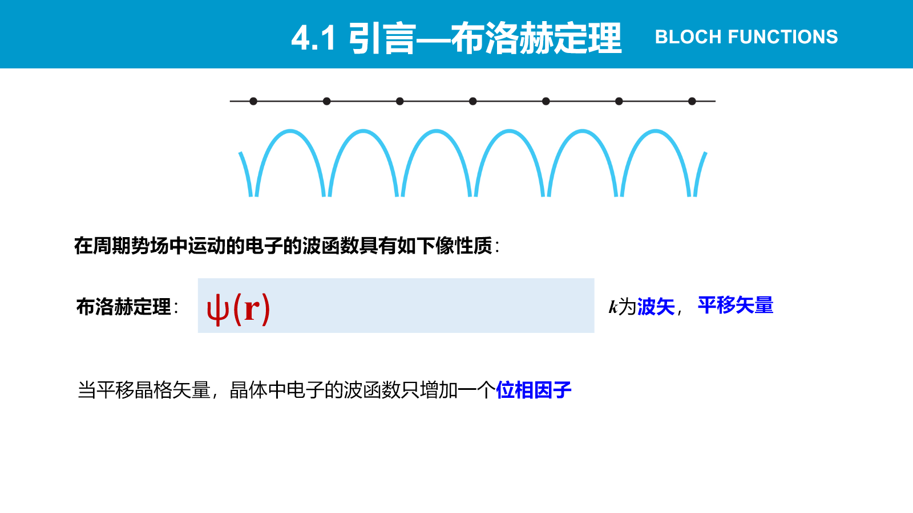
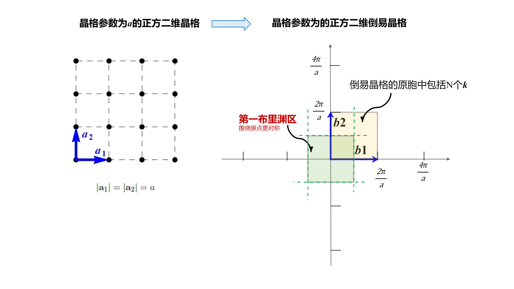
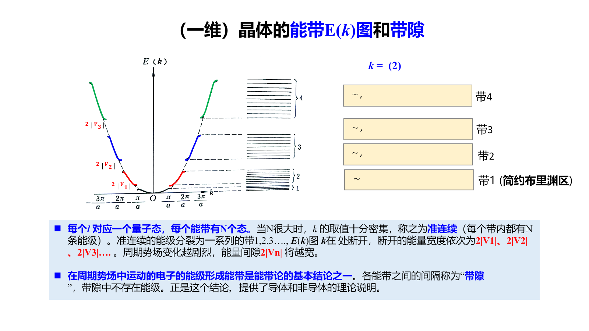
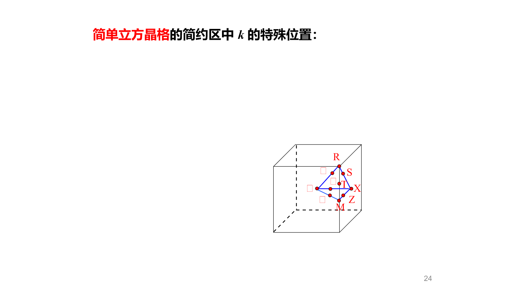
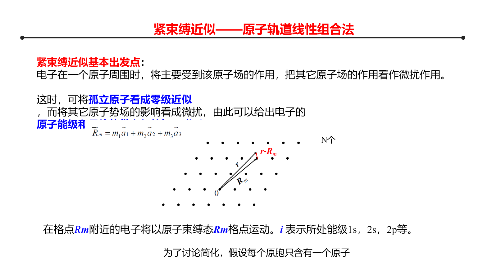
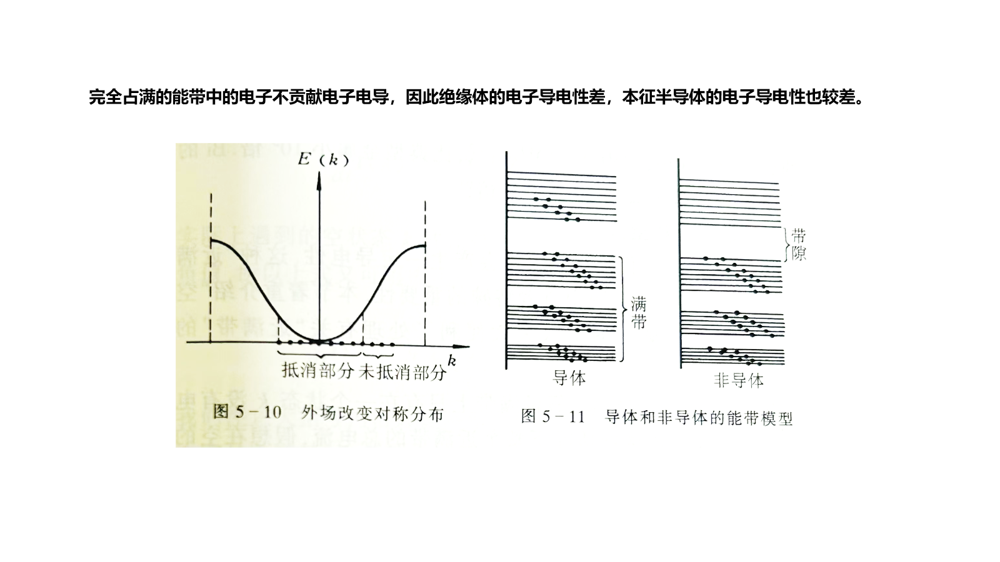
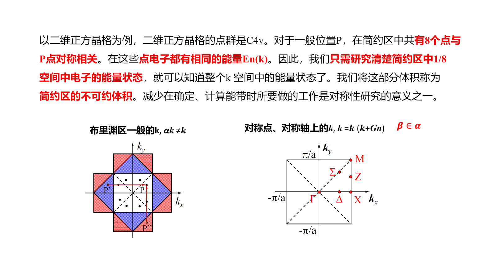
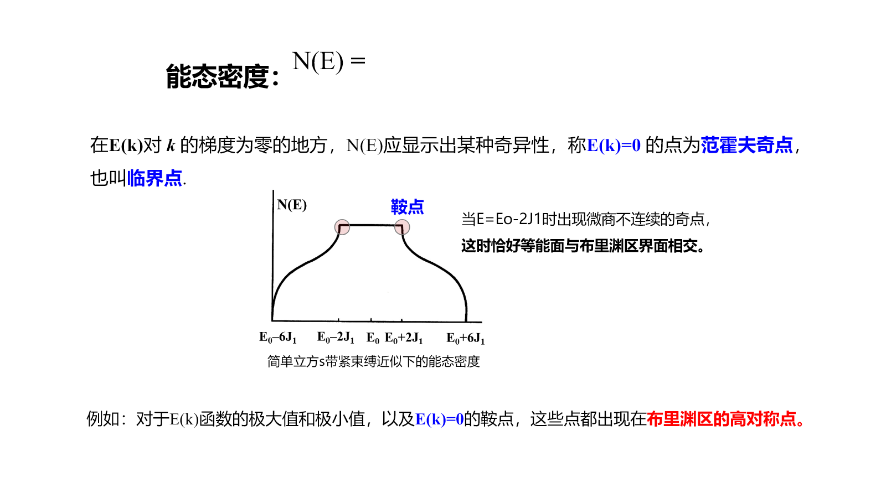
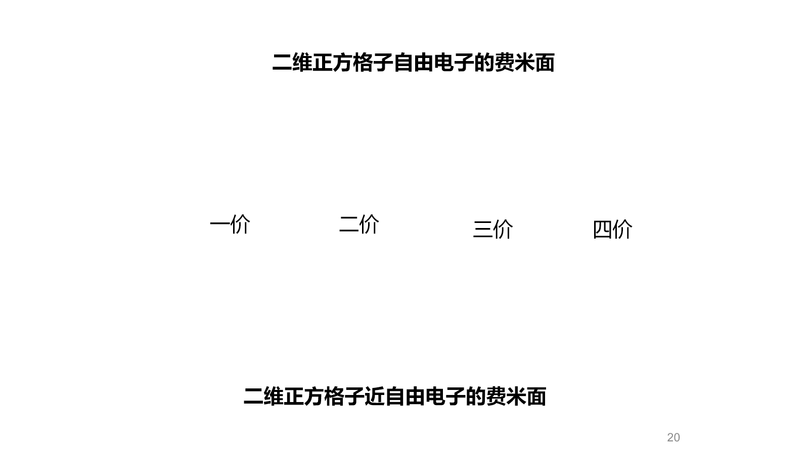

# Chapter 3：固体能带理论基础

本章从晶体的平移周期性出发，建立**布洛赫态 → Brillouin 区 → 能带与带隙 → 能态密度与费米面**的逻辑链。近自由电子近似适合从自由电子出发理解弱周期势，紧束缚近似适合从孤立原子轨道出发理解强局域电子；二者描述的是同一能带问题的两个极限。

## 3.1 周期势场与布洛赫定理

### 3.1.1 单电子近似

在 Born–Oppenheimer 近似下先固定离子实，把每个电子视为在离子实周期势、其他电子平均势和交换作用共同形成的等效势场中独立运动：

$$
\hat H=-\frac{\hbar^2}{2m}\nabla^2+V(\mathbf r)
$$

理想晶体满足

$$
V(\mathbf r+\mathbf R)=V(\mathbf r)
$$

其中 $\mathbf R$ 是任意晶格矢量。

### 3.1.2 布洛赫定理的推导

周期性使平移算符与哈密顿算符对易：

$$
[\hat H,\hat T_{\mathbf R}]=0
$$

故可取共同本征态

$$
\hat T_{\mathbf R}\psi(\mathbf r)
=\psi(\mathbf r+\mathbf R)
=\lambda(\mathbf R)\psi(\mathbf r)
$$

平移群满足

$$
\hat T_{\mathbf R_1}\hat T_{\mathbf R_2}
=\hat T_{\mathbf R_1+\mathbf R_2}
$$

所以本征值必须满足

$$
\lambda(\mathbf R_1+\mathbf R_2)
=\lambda(\mathbf R_1)\lambda(\mathbf R_2)
$$

又因为平移保持归一化，$|\lambda|=1$，可写成

$$
\lambda(\mathbf R)=e^{i\mathbf k\cdot\mathbf R}
$$

于是得到布洛赫条件

$$
\psi_{n\mathbf k}(\mathbf r+\mathbf R)
=e^{i\mathbf k\cdot\mathbf R}\psi_{n\mathbf k}(\mathbf r)
$$

令

$$
u_{n\mathbf k}(\mathbf r)=e^{-i\mathbf k\cdot\mathbf r}\psi_{n\mathbf k}(\mathbf r)
$$

可验证 $u_{n\mathbf k}(\mathbf r+\mathbf R)=u_{n\mathbf k}(\mathbf r)$，因此

$$
\boxed{\psi_{n\mathbf k}(\mathbf r)
=e^{i\mathbf k\cdot\mathbf r}u_{n\mathbf k}(\mathbf r)}
$$

布洛赫波不是完全自由的平面波，而是被晶格周期函数调制的平面波。量子数 $n$ 标记能带，$\mathbf k$ 标记同一能带中的不同平移本征态。

{: .center }

## 3.2 波矢、周期性边界条件与 Brillouin 区

设晶体沿三个基矢方向分别含 $N_1,N_2,N_3$ 个原胞，并采用 Born–von Kármán 周期边界条件：

$$
\psi(\mathbf r+N_i\mathbf a_i)=\psi(\mathbf r)
$$

结合布洛赫条件，得到

$$
e^{iN_i\mathbf k\cdot\mathbf a_i}=1
$$

故允许波矢为

$$
\mathbf k=\frac{m_1}{N_1}\mathbf b_1+\frac{m_2}{N_2}\mathbf b_2+\frac{m_3}{N_3}\mathbf b_3
$$

第一 Brillouin 区内共有

$$
N=N_1N_2N_3
$$

个离散 $\mathbf k$ 点。宏观晶体中 $N$ 极大，$\mathbf k$ 点可视为准连续。由于

$$
E_n(\mathbf k+\mathbf G)=E_n(\mathbf k)
$$

相差倒易格矢的波矢等价，只需研究第一 Brillouin 区。

{: .center }

## 3.3 近自由电子近似

### 3.3.1 非简并区域

把周期势写成 Fourier 级数

$$
V(\mathbf r)=\sum_{\mathbf G}V_{\mathbf G}e^{i\mathbf G\cdot\mathbf r}
$$

零级近似为自由电子

$$
E_{\mathbf k}^{0}=\frac{\hbar^2k^2}{2m},qquad
\psi_{\mathbf k}^{0}=\frac1{\sqrt V}e^{i\mathbf k\cdot\mathbf r}
$$

周期势只耦合相差一个倒易格矢的平面波，因为

$$
\langle\mathbf k'|V|\mathbf k\rangle
=V_{\mathbf G},qquad \mathbf k'-\mathbf k=\mathbf G
$$

远离简并点时，周期势只对自由电子抛物线产生小修正。

### 3.3.2 Brillouin 区边界与带隙

在区边界附近，$|\mathbf k\rangle$ 与 $|\mathbf k-\mathbf G\rangle$ 能量相近，必须作简并微扰。两态近似的矩阵为

$$
\begin{pmatrix}
E_{\mathbf k}^{0} & V_{\mathbf G}\\
V_{\mathbf G}^{*} & E_{\mathbf k-\mathbf G}^{0}
\end{pmatrix}
\begin{pmatrix}c_1\\c_2\end{pmatrix}
=E\begin{pmatrix}c_1\\c_2\end{pmatrix}
$$

本征能量为

$$
E_{\pm}=\frac{E_{\mathbf k}^{0}+E_{\mathbf k-\mathbf G}^{0}}2
\pm\sqrt{\left(\frac{E_{\mathbf k}^{0}-E_{\mathbf k-\mathbf G}^{0}}2\right)^2+|V_{\mathbf G}|^2}
$$

区边界处两自由电子能量相等，故

$$
\boxed{E_g=E_+-E_-=2|V_{\mathbf G}|}
$$

周期势使原本相交的自由电子能级发生避免交叉并打开禁带。其物理图像是：满足 Bragg 条件的电子波形成两个驻波，一个在离子实附近概率密度大，另一个在离子实之间概率密度大；二者势能不同，简并被解除。

{: .center }

### 3.3.3 三维能带

三维中每个 Brillouin 区对应一支能带。通常沿高对称路径绘制 $E_n(\mathbf k)$，例如立方晶格中的 $\Gamma$、$X$、$L$ 等点。能带图只是高对称线上的截面，不代表完整三维色散。

{: .center }

## 3.4 紧束缚近似

### 3.4.1 Bloch 轨道线性组合

当电子主要局域在原子附近时，以孤立原子轨道 $\phi_i(\mathbf r-\mathbf R_n)$ 为基，构造满足布洛赫条件的线性组合

$$
\psi_{i\mathbf k}(\mathbf r)
=\frac1{\sqrt N}\sum_n
e^{i\mathbf k\cdot\mathbf R_n}
\phi_i(\mathbf r-\mathbf R_n)
$$

电子在相邻格点间的重叠和跃迁使孤立原子能级展宽为能带。

### 3.4.2 一维最近邻模型

只保留在位能 $\alpha$ 和最近邻跃迁积分 $\beta$，一维原子链给出

$$
\boxed{E(k)=\alpha+2\beta\cos(ka)}
$$

带宽为

$$
W=4|\beta|
$$

轨道越扩展、相邻原子距离越短，重叠越强，$|\beta|$ 越大，能带越宽。因此内层轨道通常形成窄带，价层轨道形成较宽能带。

{: .center }

### 3.4.3 多原子基元与轨道杂化

若原胞含多个原子，应先考虑原胞内轨道组合，再用这些局域轨道构造 Bloch 和。不同原子轨道能量接近且对称性相容时会发生杂化，形成成键带与反键带；因此原子能级与晶体能带并不总是一一对应。

## 3.5 能带占据与导电性

第一 Brillouin 区内每条非自旋劈裂能带含 $N$ 个 $\mathbf k$ 态；计入两种自旋后最多容纳 $2N$ 个电子。

- **部分占满的能带**：邻近存在空态，弱电场即可改变电子占据，表现为金属。
- **全满能带**：对每个 $\mathbf k$ 都有 $-\mathbf k$ 占据，群速度贡献相互抵消，不产生净电流。
- **绝缘体和本征半导体**：价带全满、导带全空；二者区别主要在带隙大小。

材料是否导电不能只数价电子，还要判断能带简并、不同能带是否重叠以及实际占据情况。

{: .center }

## 3.6 能带对称性

### 3.6.1 倒易平移与时间反演

倒易平移周期性给出

$$
E_n(\mathbf k+\mathbf G)=E_n(\mathbf k)
$$

无磁场、无磁序且忽略破坏时间反演的作用时

$$
E_n(\mathbf k)=E_n(-\mathbf k)
$$

晶体点群操作 $g$ 还给出

$$
E_n(g\mathbf k)=E_n(\mathbf k)
$$

因此只需计算第一 Brillouin 区中的不可约部分。高对称点和高对称线上，波矢的小群较大，能带可按不可约表示分类；只有对称性相同的能带通常才会避免交叉。

{: .center }

### 3.6.2 有效质量

电子群速度为

$$
\mathbf v_n(\mathbf k)=\frac1\hbar\nabla_{\mathbf k}E_n(\mathbf k)
$$

在一维中，有效质量满足

$$
\frac1{m^*}=\frac1{\hbar^2}\frac{\mathrm d^2E}{\mathrm dk^2}
$$

带底曲率为正，电子有效质量通常为正；带顶曲率为负，改用带正电的空穴描述更方便。

## 3.7 能态密度

能态密度定义为单位能量间隔内的量子态数：

$$
g(E)=\sum_n\int_{\mathrm{BZ}}\frac{V\,\mathrm d^3k}{4\pi^3}
\delta[E-E_n(\mathbf k)]
$$

计入自旋后，自由电子能量不超过 $E$ 的状态数为

$$
\frac{N(E)}V=\frac1{3\pi^2}
\left(\frac{2m}{\hbar^2}\right)^{3/2}E^{3/2}
$$

求导得到三维自由电子能态密度

$$
\boxed{\frac{g(E)}V=\frac1{2\pi^2}
\left(\frac{2m}{\hbar^2}\right)^{3/2}\sqrt E}
$$

一般能带中，$g(E)$ 可写成等能面上的积分

$$
g(E)\propto\sum_n\int_{E_n(\mathbf k)=E}
\frac{\mathrm dS}{|\nabla_{\mathbf k}E_n|}
$$

当 $\nabla_{\mathbf k}E=0$ 时可能出现 van Hove 奇点。

{: .center }

## 3.8 费米能与费米面

在 $T=0$ 时，电子从低到高填充量子态。自由电子的占据区域是费米球：

$$
k_F=(3\pi^2n)^{1/3}
$$

$$
E_F=\frac{\hbar^2k_F^2}{2m}
$$

一般晶体中，费米面定义为

$$
E_n(\mathbf k)=E_F
$$

在第一 Brillouin 区中的等能面。它的形状由周期势对自由电子球面的畸变决定，并控制低温电子热容、电导、磁响应等性质。

{: .center }

只有当某条能带被部分占据时才存在费米面。理想绝缘体和本征半导体在 $T=0$ 时的化学势位于带隙中，没有穿过能带的费米面。

## 3.9 本章逻辑链

$$
V(\mathbf r+\mathbf R)=V(\mathbf r)
\Rightarrow \psi_{n\mathbf k}=e^{i\mathbf k\cdot\mathbf r}u_{n\mathbf k}
\Rightarrow E_n(\mathbf k)
$$

$$
E_n(\mathbf k)
\Rightarrow \text{能带占据、带隙、}g(E)\text{ 和费米面}
\Rightarrow \text{电学与光学性质}
$$
