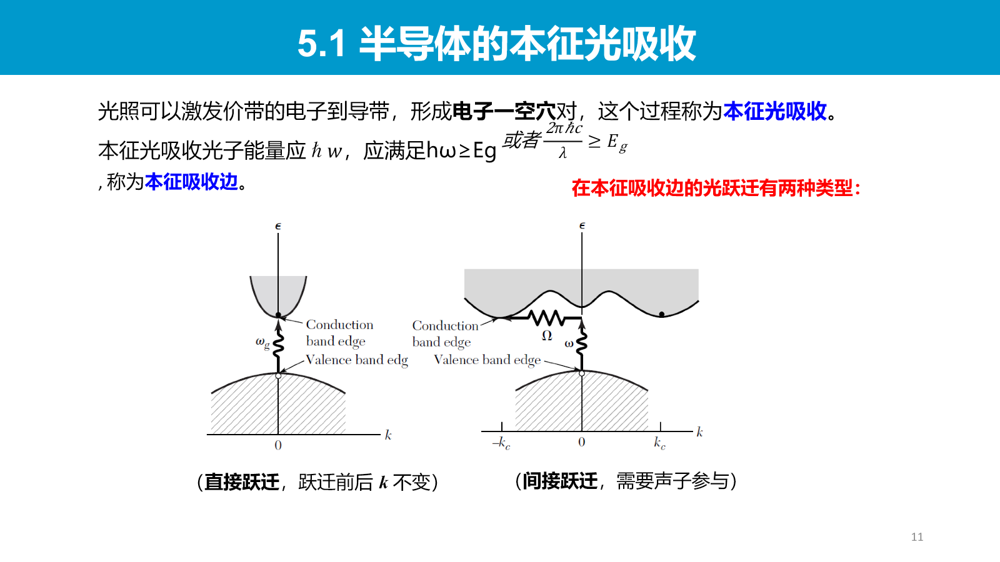
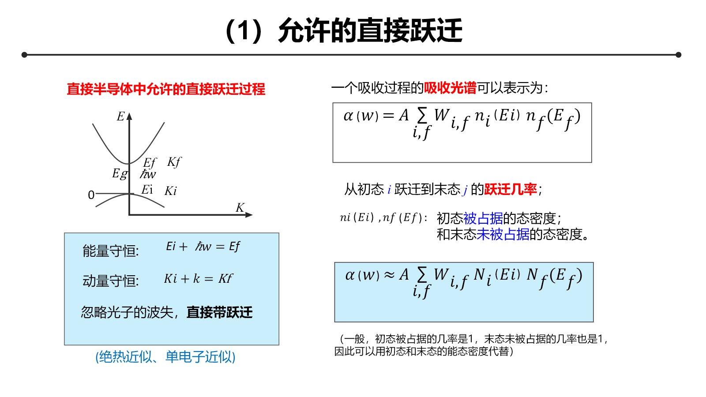
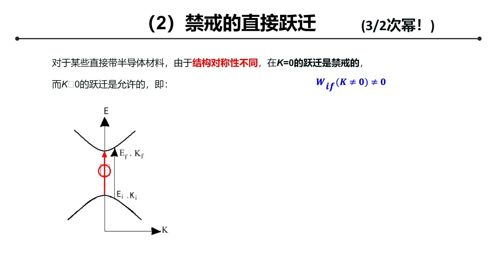
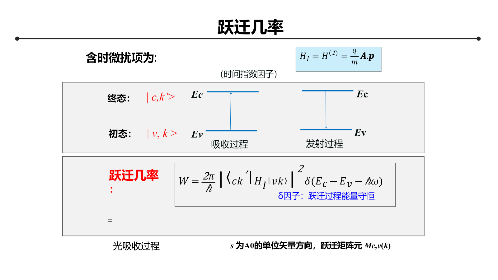
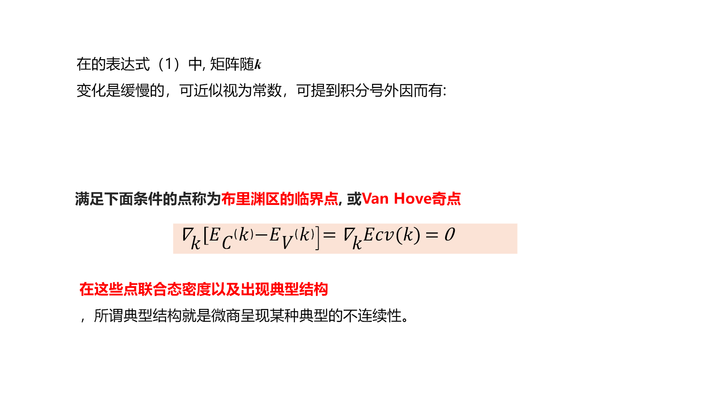
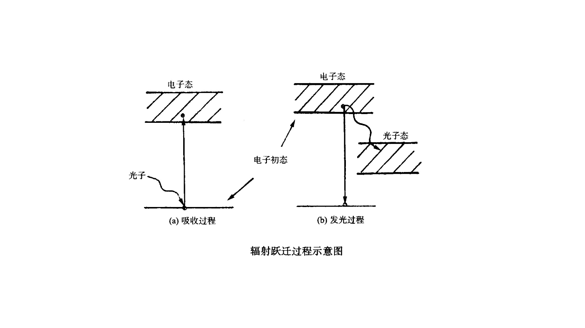
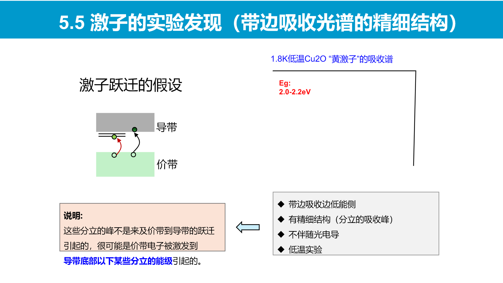
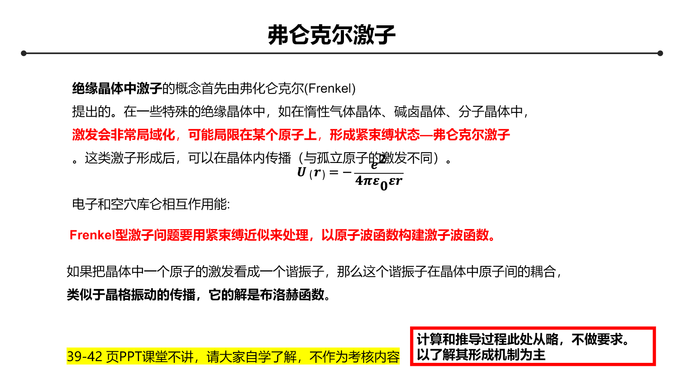
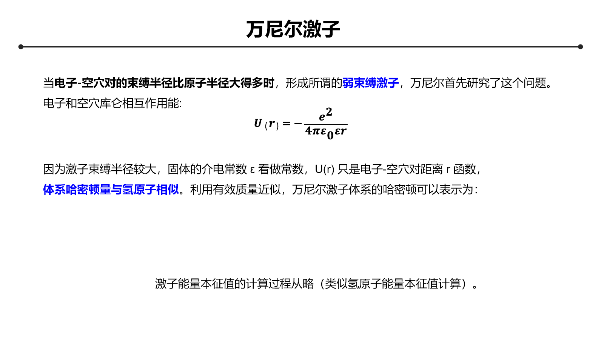

# Chapter 4：固体光谱基础

固体光谱把上一章的能带结构转化为可观测信号。主线是：**能带与态密度 → 光学跃迁选择定则 → 吸收边 → 载流子弛豫与复合 → 激子精细结构**。

## 4.1 半导体的基本能带结构

半导体在 $T=0$ 时价带全满、导带全空，二者由带隙 $E_g$ 分隔。有限温度、光激发或掺杂可以在导带产生电子，并在价带留下空穴。

带边附近常用有效质量近似：

$$
E_c(\mathbf k)\approx E_c(\mathbf k_c)
+\frac{\hbar^2|\mathbf k-\mathbf k_c|^2}{2m_e^*}
$$

$$
E_v(\mathbf k)\approx E_v(\mathbf k_v)
-\frac{\hbar^2|\mathbf k-\mathbf k_v|^2}{2m_h^*}
$$

- **直接带隙**：导带底与价带顶位于同一波矢，$\mathbf k_c=\mathbf k_v$；
- **间接带隙**：二者位于不同波矢，$\mathbf k_c\ne\mathbf k_v$。

光子动量相对于 Brillouin 区尺度很小，因此单光子跃迁近似满足 $\Delta\mathbf k=0$。直接带隙允许电子只吸收光子完成带间跃迁；间接带隙还需要声子补偿晶格动量。

{: .center }

## 4.2 固体的本征光吸收

### 4.2.1 吸收系数与跃迁速率

光强沿传播方向满足 Beer–Lambert 关系

$$
I(z)=I_0e^{-\alpha z}
$$

吸收系数 $\alpha(\omega)$ 由所有满足能量守恒和选择定则的跃迁共同决定。其基本结构可写成

$$
\alpha(\omega)\propto
\frac{|M_{cv}|^2}{\omega}J_{cv}(\hbar\omega)
$$

其中 $M_{cv}$ 是跃迁矩阵元，$J_{cv}$ 是价带—导带联合态密度。前者决定跃迁是否允许，后者决定有多少初末态组合参与。

### 4.2.2 允许直接跃迁

把价带顶作为能量零点，并令

$$
E_c(k)=E_g+\frac{\hbar^2k^2}{2m_e^*},\qquad
E_v(k)=-\frac{\hbar^2k^2}{2m_h^*}
$$

因为 $\Delta\mathbf k=0$，同一 $\mathbf k$ 处的能量差为

$$
\hbar\omega=E_c(k)-E_v(k)
=E_g+\frac{\hbar^2k^2}{2\mu}
$$

约化有效质量满足

$$
\frac1\mu=\frac1{m_e^*}+\frac1{m_h^*}
$$

由上式得到

$$
k=\frac{\sqrt{2\mu(\hbar\omega-E_g)}}{\hbar}
$$

三维 $k$ 空间中半径小于 $k$ 的状态数正比于 $k^3$，对能量求导得到联合态密度

$$
J_{cv}(\hbar\omega)
=\frac1{2\pi^2}
\left(\frac{2\mu}{\hbar^2}\right)^{3/2}
\sqrt{\hbar\omega-E_g}
$$

若允许跃迁的矩阵元在带边近似为常数，则

$$
\boxed{\alpha(\omega)\propto
\frac{\sqrt{\hbar\omega-E_g}}{\hbar\omega}},qquad
\hbar\omega\ge E_g
$$

实验中常用 Tauc 形式

$$
(\alpha\hbar\omega)^2\propto\hbar\omega-E_g
$$

由线性外推估计允许直接带隙。

{: .center }

### 4.2.3 禁戒直接跃迁

若带边处因宇称或其他对称性使 $M_{cv}=0$，最低阶非零矩阵元随 $k$ 增大。常见三维抛物线近似给出

$$
\alpha(\omega)\propto
\frac{(\hbar\omega-E_g)^{3/2}}{\hbar\omega}
$$

因此“能量允许”并不保证跃迁强；还必须满足波函数对称性所决定的选择定则。

### 4.2.4 声子参与的间接跃迁

间接跃迁同时满足

$$
\mathbf k_c-\mathbf k_v\approx\pm\mathbf q+\mathbf G
$$

其中 $\mathbf q$ 为声子波矢，$\mathbf G$ 为倒易格矢。声子发射与吸收两条通道分别给出

$$
\alpha_{\mathrm{em}}\propto(N_q+1)
(\hbar\omega-E_g-\hbar\Omega_q)^2
$$

$$
\alpha_{\mathrm{abs}}\propto N_q
(\hbar\omega-E_g+\hbar\Omega_q)^2
$$

声子平均占据数为

$$
N_q=\frac1{e^{\hbar\Omega_q/k_BT}-1}
$$

间接吸收需要二阶过程，通常弱于允许直接吸收，并具有更明显的温度依赖。

{: .center }

## 4.3 带间跃迁的量子力学描述

### 4.3.1 光与电子的相互作用

采用最小耦合替换 $\mathbf p\to\mathbf p+e\mathbf A$，忽略 $A^2$ 项后，光场微扰可写成

$$
\hat H'\approx\frac{e}{m}\mathbf A\cdot\hat{\mathbf p}
$$

Fermi 黄金规则给出跃迁速率

$$
\boxed{W_{i\to f}=\frac{2\pi}{\hbar}
|\langle f|\hat H'|i\rangle|^2
\delta(E_f-E_i-\hbar\omega)}
$$

$\delta$ 函数保证能量守恒，矩阵元给出偏振依赖和选择定则。对所有占据初态与空末态求和，才能得到宏观吸收功率和吸收系数。

{: .center }

### 4.3.2 联合态密度与 van Hove 奇点

一般能带的联合态密度为

$$
J_{cv}(E)=\int_{\mathrm{BZ}}\frac{\mathrm d^3k}{(2\pi)^3}
\delta[E_c(\mathbf k)-E_v(\mathbf k)-E]
$$

把体积分改写为等能差曲面积分：

$$
J_{cv}(E)=\int_{E_c-E_v=E}
\frac{\mathrm dS}{(2\pi)^3
|\nabla_{\mathbf k}(E_c-E_v)|}
$$

当

$$
\nabla_{\mathbf k}[E_c(\mathbf k)-E_v(\mathbf k)]=0
$$

时，联合态密度可能出现非解析结构，即光谱中的 van Hove 奇点。固体吸收谱中的峰不一定对应单个局域能级，也可能来自能带临界点处的大联合态密度。

{: .center }

## 4.4 光生载流子的弛豫与复合

光吸收首先产生非平衡电子—空穴对，随后可能经历：

1. **载流子—载流子散射**：重新分配能量和动量；
2. **声子弛豫**：电子和空穴向导带底、价带顶热化；
3. **陷阱俘获**：缺陷或表面态把载流子局域化；
4. **辐射复合**：发射光子；
5. **多声子非辐射复合**：能量传给晶格；
6. **Auger 复合**：电子—空穴复合能量传给第三个载流子。

直接带隙材料的带边辐射复合可同时满足能量与动量守恒，发光通常较强；间接带隙材料还需声子参与，辐射速率较低。

在准热平衡近似下，光致发光谱不仅受发射矩阵元控制，还受电子与空穴的占据以及光子态密度影响；因此 PL 峰位、线宽和强度不能简单等同于吸收谱。

{: .center }

## 4.5 激子

### 4.5.1 激子的形成

光激发产生的导带电子与价带空穴通过库仑作用相互吸引，可形成电中性的束缚态——激子。激子峰通常位于带隙以下，其与连续吸收边的能量差给出束缚能。

{: .center }

### 4.5.2 Frenkel 激子

Frenkel 激子具有较强局域性，电子和空穴主要位于同一结构单元，半径与晶格常数同量级，束缚能较大。局域激发通过相邻单元间的共振耦合传播，形成激子能带。一维最近邻模型可写成

$$
E(K)=E_0+2J\cos(Ka)
$$

适用于分子晶体和局域性较强的绝缘体。

{: .center }

### 4.5.3 Wannier–Mott 激子

Wannier 激子半径远大于晶格常数，电子和空穴可用有效质量描述。二者相对运动势能为

$$
U(r)=-\frac{e^2}{4\pi\varepsilon_0\varepsilon_r r}
$$

它与介电屏蔽下的氢原子同构。约化质量

$$
\mu=\frac{m_e^*m_h^*}{m_e^*+m_h^*}
$$

束缚能与有效 Bohr 半径为

$$
E_B=\frac{\mu e^4}
{2(4\pi\varepsilon_0\varepsilon_r)^2\hbar^2}
$$

$$
a_B^*=\frac{4\pi\varepsilon_0\varepsilon_r\hbar^2}{\mu e^2}
$$

激子能级为

$$
\boxed{E_n=E_g-\frac{E_B}{n^2}},\qquad n=1,2,3,\ldots
$$

较大的介电常数削弱库仑吸引，较小的约化质量增大激子半径；二者都会降低束缚能。

{: .center }

## 4.6 本章逻辑链

$$
E_n(\mathbf k),\ g(E)
\Rightarrow J_{cv}(E),\ M_{cv}
\Rightarrow \alpha(\omega)
$$

$$
\text{光生电子—空穴对}
\Rightarrow \text{弛豫、俘获与复合}
\Rightarrow \text{吸收和发光光谱}
$$

带隙决定吸收阈值，联合态密度塑造谱形，跃迁矩阵元决定选择定则，声子与缺陷决定动量补偿和非辐射过程，电子—空穴库仑作用则在带边产生激子结构。
