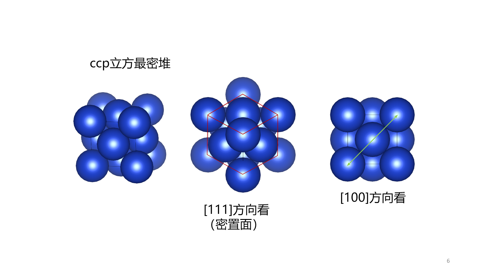
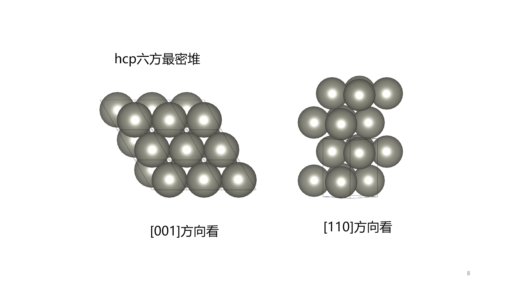
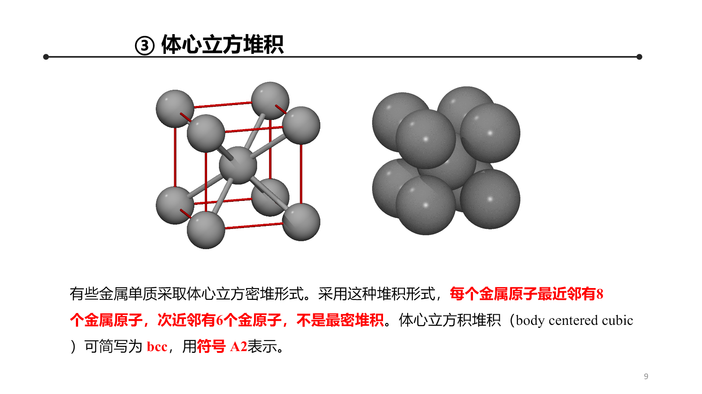
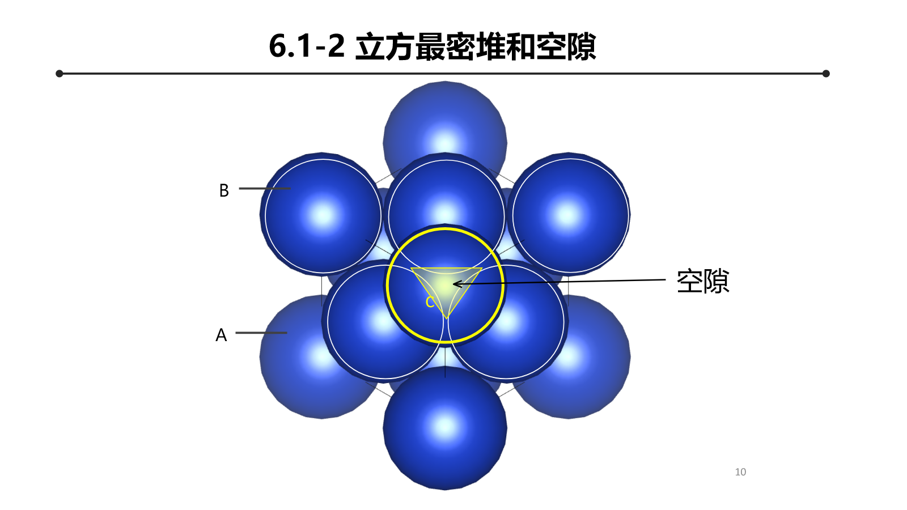
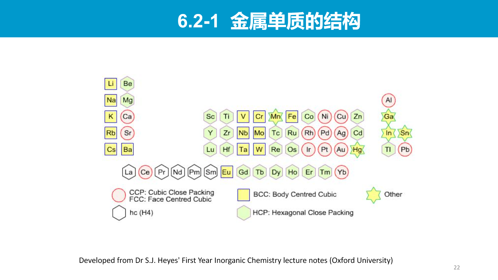
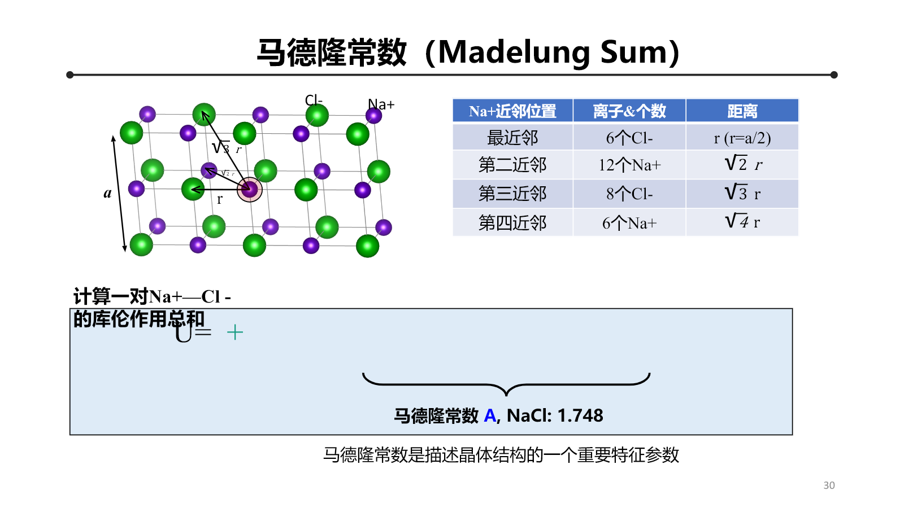
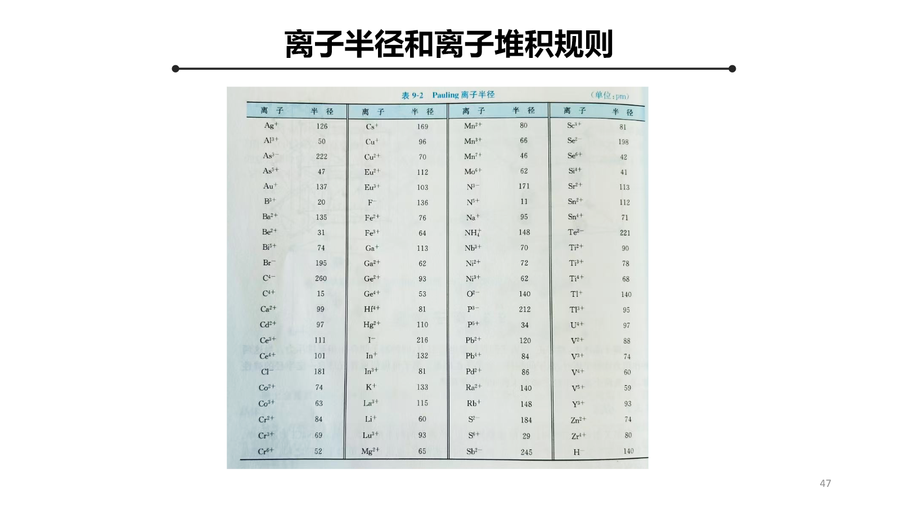
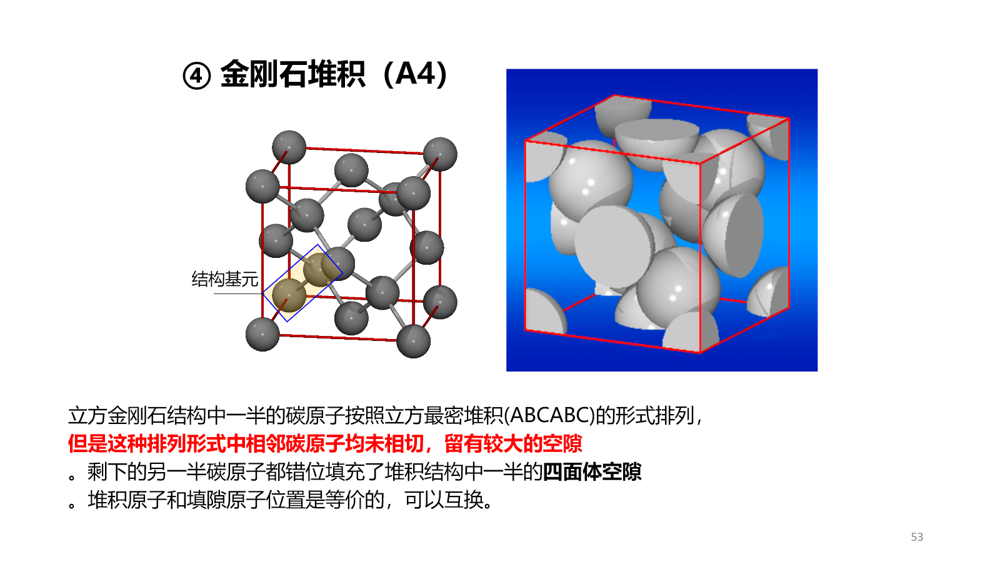

# Chapter 5：金属晶体和离子晶体

本章从几何堆积出发，建立**堆积方式与空隙 → 配位结构 → 金属键或离子键 → 晶体稳定性**的关系。几何模型决定可能的配位方式，电子结构和静电能决定哪一种结构真正稳定。

## 5.1 等径球堆积

### 5.1.1 二维最密层

等径球在平面上的最密排列是三角网格，每个球有 6 个最近邻。第二层球放入第一层的三角形凹穴，记第一层为 A，第二层为 B；第三层有两种不等价选择：

- 回到 A 位，形成 $ABAB\cdots$；
- 占据新的 C 位，形成 $ABCABC\cdots$。

### 5.1.2 立方最密堆积

$ABCABC\cdots$ 对应立方最密堆积（ccp），其 Bravais 点阵为面心立方（fcc）。每个球有 12 个最近邻，配位数为 12。

常规 fcc 晶胞含 4 个球，球在面对角线上相切：

$$
4R=\sqrt2a
$$

空间占有率

$$
\eta_{\mathrm{fcc}}
=\frac{4\times\frac43\pi R^3}{a^3}
=\frac{\pi}{3\sqrt2}
\approx0.7405
$$

{: .center }

### 5.1.3 六方最密堆积

$ABAB\cdots$ 对应六方最密堆积（hcp），每个球同样有 12 个最近邻。理想 hcp 的几何关系为

$$
\frac ca=\sqrt{\frac83}\approx1.633
$$

常规六方晶胞含 6 个球，晶胞体积为

$$
V=\frac{3\sqrt3}{2}a^2c
$$

代入 $a=2R$ 和理想 $c/a$，得到

$$
\eta_{\mathrm{hcp}}=\frac{\pi}{3\sqrt2}\approx0.7405
$$

因此 ccp 与 hcp 的局域配位数和占有率相同，区别在密堆层的堆垛顺序。

{: .center }

### 5.1.4 体心立方堆积

bcc 不是最密堆积。常规晶胞含 2 个球，球在体对角线上相切：

$$
4R=\sqrt3a
$$

故

$$
\eta_{\mathrm{bcc}}
=\frac{2\times\frac43\pi R^3}{a^3}
=\frac{\pi\sqrt3}{8}
\approx0.6802
$$

bcc 中每个原子有 8 个最近邻。

{: .center }

## 5.2 密堆积空隙

### 5.2.1 空隙数目

由 $N$ 个球构成的最密堆积中：

- 八面体空隙数为 $N$；
- 四面体空隙数为 $2N$。

在 ccp 常规晶胞中有 4 个八面体空隙和 8 个四面体空隙。八面体空隙由 6 个球包围，四面体空隙由 4 个球包围。

{: .center }

### 5.2.2 空隙半径

设母球半径为 $r_-$，最大填隙球半径为 $r_+$。

八面体空隙在正方形面对角线上满足

$$
2(r_-+r_+)=2\sqrt2r_-
$$

因此

$$
\boxed{\frac{r_+}{r_-}=\sqrt2-1\approx0.414}
$$

四面体空隙中，正四面体中心到顶点的距离为 $\sqrt6a/4$，且边长 $a=2r_-$：

$$
r_-+r_+=\frac{\sqrt6}{4}(2r_-)
$$

所以

$$
\boxed{\frac{r_+}{r_-}=\sqrt{\frac32}-1\approx0.225}
$$

这些临界值是硬球几何的结果，用来估计离子可能占据的空隙，但真实结构还受键的方向性、极化和电子结构影响。

## 5.3 金属晶体

### 5.3.1 常见结构

金属单质最常见的三类结构是 fcc、hcp 和 bcc。fcc、hcp 的配位数为 12，bcc 为 8。不同温度或压力下，同一金属可能发生结构相变，说明稳定结构由自由能而不是单纯占有率决定。

{: .center }

### 5.3.2 金属键的两种互补图像

- **离子实—电子气图像**：价电子在整个晶体中离域，屏蔽正离子实之间的排斥并提供内聚；
- **能带图像**：大量原子轨道组合形成能带，部分占满或互相重叠的能带提供可移动载流子。

金属键没有严格方向性，因此金属常采用高配位堆积结构，并具有良好塑性与导电性。但具体结构仍由不同轨道形成的能带能量、电子数和离子实排斥共同决定。

### 5.3.3 合金与金属化合物

- **置换固溶体**：溶质原子替代母体晶格位置，通常要求原子尺寸和化学性质相近；
- **间隙固溶体**：较小原子占据金属点阵空隙；
- **有序合金**：不同元素偏好确定子点阵，出现超结构周期和超结构衍射峰；
- **金属间化合物**：具有相对固定组成和新的有序结构，不能简单看作随机固溶体。

## 5.4 离子晶体的结合能

### 5.4.1 Coulomb 能与 Madelung 常数

离子晶体中某离子与所有其他离子的静电作用之和写成

$$
U_C(r)=-\frac{A z_+z_-e^2}{4\pi\varepsilon_0r}
$$

$A$ 是仅由晶体几何结构决定的 Madelung 常数，$z_+,z_-$ 是离子价数的绝对值。以一维交替离子链为例：

$$
A=2\left(1-\frac12+\frac13-\frac14+\cdots\right)=2\ln2
$$

三维晶体的求和是条件收敛的，必须按保持电中性的方式取极限；不能任意改变求和顺序。

{: .center }

### 5.4.2 Born–Landé 方程

仅有 Coulomb 吸引会使正负离子无限接近，必须加入电子云重叠产生的短程排斥：

$$
U(r)=-\frac{A z_+z_-e^2}{4\pi\varepsilon_0r}+\frac{B}{r^n}
$$

平衡距离 $r_0$ 满足

$$
\left.\frac{\mathrm dU}{\mathrm dr}\right|_{r_0}=0
$$

即

$$
\frac{A z_+z_-e^2}{4\pi\varepsilon_0r_0^2}
=\frac{nB}{r_0^{n+1}}
$$

从而

$$
B=\frac{A z_+z_-e^2}{4\pi\varepsilon_0n}r_0^{n-1}
$$

代回总能量：

$$
U(r_0)=-\frac{A z_+z_-e^2}{4\pi\varepsilon_0r_0}
\left(1-\frac1n\right)
$$

摩尔晶格能为

$$
\boxed{U_L=-\frac{N_AA z_+z_-e^2}{4\pi\varepsilon_0r_0}
\left(1-\frac1n\right)}
$$

离子电荷越高、平衡距离越短、Madelung 常数越大，晶格能绝对值通常越大。

### 5.4.3 晶格能与结构稳定性

比较不同结构时不能只比较 Madelung 常数，因为平衡距离、排斥指数和极化能也随结构变化。稳定结构对应给定温压下最低的 Gibbs 自由能；Born–Landé 模型主要描述静电与短程排斥的零温能量部分。

## 5.5 典型二元离子晶体结构

把较大阴离子近似为堆积骨架、较小阳离子占据空隙，可以统一理解许多 $AB$ 或 $AB_2$ 结构。

| 结构类型 | 阴离子骨架与填隙方式 | 阳离子配位数 | 阴离子配位数 |
| --- | --- | ---: | ---: |
| NaCl | 阴离子 ccp，阳离子占全部八面体空隙 | 6 | 6 |
| CsCl | 简单立方相互穿插；不是最密堆积填隙结构 | 8 | 8 |
| 闪锌矿 ZnS | 阴离子 ccp，阳离子占一半四面体空隙 | 4 | 4 |
| 纤锌矿 ZnS | 阴离子 hcp，阳离子占一半四面体空隙 | 4 | 4 |
| CaF$_2$ | Ca 构成 fcc，F 占全部四面体位置 | 8 | 4 |
| 反萤石 A$_2$B | 阴离子构成 fcc，阳离子占全部四面体空隙 | 4 | 8 |

CsCl 的常规立方晶胞中虽然看见角点与体心两种离子，但其 Bravais 点阵是简单立方加二原子基元，不是 bcc Bravais 点阵，因为角点与体心位置的化学环境不同。

## 5.6 半径比规则与离子极化

### 5.6.1 半径比规则

硬球模型给出保持给定配位多面体而不使同号离子相碰的临界半径比：

| 配位数 | 配位多面体 | 临界 $r_+/r_-$ |
| ---: | --- | ---: |
| 4 | 四面体 | $\sqrt{3/2}-1\approx0.225$ |
| 6 | 八面体 | $\sqrt2-1\approx0.414$ |
| 8 | 立方体 | $\sqrt3-1\approx0.732$ |

半径比规则只能作为几何趋势。离子并非不可变形硬球，配位数还受共价性、极化、压力和电子结构影响。

{: .center }

### 5.6.2 离子极化

电场使离子电子云产生诱导偶极矩

$$
\boldsymbol\mu_{\mathrm{ind}}=\alpha\mathbf E
$$

- 小而高电荷的阳离子具有强极化能力；
- 大而高电荷的阴离子电子云较易极化；
- 极化增强会提高键的共价性，使结构偏离理想硬球—点电荷模型。

因此离子半径、半径比与静电模型必须和极化及轨道杂化共同使用。

## 5.7 其他固相结合方式

真实晶体常同时包含多种相互作用：共价网络、分子间作用、氢键和离子—共价混合键等。

金刚石结构可视为一半碳原子形成 fcc 骨架，另一半占据一半四面体位置；但其稳定性来自定向 $sp^3$ 共价键，而不是硬球密堆积。

{: .center }

## 5.8 本章逻辑链

$$
\text{球堆积与空隙}
\Rightarrow \text{配位数和候选结构}
$$

$$
\text{电子离域或离子静电作用}
\Rightarrow \text{结合能}
\Rightarrow \text{实际稳定结构}
$$

几何堆积给出结构可能性，能带占据、Coulomb 能、短程排斥、极化与共价杂化共同决定最终结构和性质。
