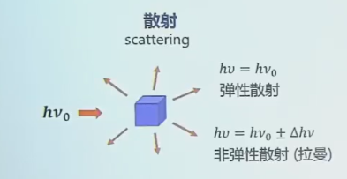
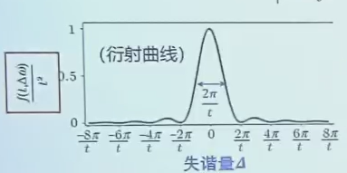
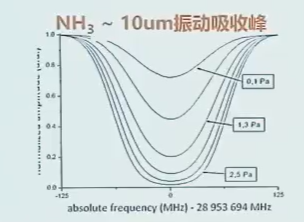
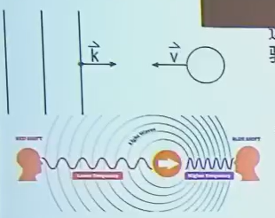

# Chapter 1：光与分子的相互作用 
 
## 1.1 光

### 1.1.1 波粒二象性

由麦克斯韦方程组可得到平面波：

$$
\begin{aligned}
E = E_0\cos(\mathbf{k}\cdot\mathbf{r}-\omega t+\phi)
\end{aligned}
$$

$$
\begin{aligned}
B = B_0\cos(\mathbf{k}\cdot\mathbf{r}-\omega t+\phi)
\end{aligned}
$$

$$
\begin{aligned}
\frac{E_0}{B_0}=c_0
\end{aligned}
$$

---

### 1.1.2 复指数表示

$$
\begin{aligned}
\mathrm{Re}\!\left[E_0 e^{i(\mathbf{k}\cdot\mathbf{r}-\omega t+\phi)}\right]
\end{aligned}
$$

等价于：

$$
\begin{aligned}
E_0\frac{e^{i(\mathbf{k}\cdot\mathbf{r}-\omega t+\phi)}+e^{-i(\mathbf{k}\cdot\mathbf{r}-\omega t+\phi)}}{2}
\end{aligned}
$$

---

### 1.1.3 物理量

- \(E\)（V/m）：电场强度  
  - 方向：**偏振方向**

- \(B\)（T）：磁场强度  

- 波矢 \(\mathbf{k}\)（rad·m\(^{-1}\)）：方向即为波的传播方向

$$
\begin{aligned}
|\mathbf{k}| = k = \frac{2\pi}{\lambda}
\end{aligned}
$$

- 波数（cm\(^{-1}\)）  

$$
\begin{aligned}
\tilde{\nu}=\frac{1}{\lambda}
\end{aligned}
$$

- 频率 \(\nu\)（Hz）  

$$
\begin{aligned}
\nu=\frac{1}{\tau}
\end{aligned}
$$

- 角频率 \(\omega\)（rad/s）  

$$
\begin{aligned}
\omega=\frac{2\pi}{\tau}=2\pi\nu
\end{aligned}
$$

- \(\phi\)：初始相位（rad）

---

### 1.1.4 光子

$$
\begin{aligned}
E=h\nu
\end{aligned}
$$

>\(\lambda=400\,\mathrm{nm}\) 
$$
\begin{aligned}
E=\frac{hc}{\lambda}\approx 3.10\,\mathrm{eV}
\end{aligned}
$$

---

## 1.2 黑体辐射

在一定温度 **\(T\)** 的腔体内，壁发射和吸收的电磁波达到平衡

### 1.2.1 能量密度与强度

- **腔内总辐射能量密度**：\(\rho\)（J·m\(^{-3}\)）

考虑频率分布：

$$
\begin{aligned}
\rho=\int \rho_\nu\, d\nu
\end{aligned}
$$

- \(\rho_\nu\)：**光谱能量密度**（J·m\(^{-3}\)·Hz\(^{-1}\)）  

小孔辐射 → 可视作光源。

- 小孔处辐射 **功率强度（能流密度）**：\(I\)（W·m\(^{-2}\)）

考虑频率分布：

$$
\begin{aligned}
I=\int I_\nu\, d\nu
\end{aligned}
$$

- \(I_\nu\)：**光谱功率强度**（W·m\(^{-2}\)·Hz\(^{-1}\)）

---

### 1.2.2 与电场强度的关系

>设真空中的平面电磁波沿传播方向前进：
$$
\begin{aligned}
E(t)=E_0\cos(\mathbf{k}\cdot\mathbf{r}-\omega t+\phi)
\end{aligned}
$$
电磁场的瞬时能量密度：
$$
\begin{aligned}
u(t)=\frac{1}{2}\varepsilon_0E^2(t)+\frac{1}{2\mu_0}B^2(t)
\end{aligned}
$$
对真空平面波：
$$
\begin{aligned}
B(t)=\frac{E(t)}{c},\qquad c^2=\frac{1}{\varepsilon_0\mu_0}
\end{aligned}
$$
因此：
$$
\begin{aligned}
\frac{1}{2\mu_0}B^2
=\frac{1}{2\mu_0}\frac{E^2}{c^2}
=\frac{1}{2}\varepsilon_0E^2
\end{aligned}
$$
总能量密度：
$$
\begin{aligned}
u(t)=\varepsilon_0E^2(t)
\end{aligned}
$$
时间平均：
$$
\begin{aligned}
\langle \cos^2(\cdots)\rangle=\frac{1}{2}
\Rightarrow
\langle E^2(t)\rangle=\frac{E_0^2}{2}
\end{aligned}
$$
$$
\begin{aligned}
\langle u\rangle=\varepsilon_0\langle E^2\rangle
=\frac{1}{2}\varepsilon_0E_0^2
\end{aligned}
$$
电磁波以速度 \(c\) 传播，强度为：
$$
\begin{aligned}
I=(\text{能量密度})\times c
\Rightarrow
I=\langle u\rangle c=\frac{1}{2}\varepsilon_0 c E_0^2
\end{aligned}
$$

---

### 1.2.3 普朗克黑体辐射定律

稳定状态下，按频率的能量密度：

$$
\begin{aligned}
\rho_\nu(\nu)=\left(\frac{8\pi h\nu^3}{c^3}\right)\frac{1}{e^{h\nu/(k_B T)}-1}
\end{aligned}
$$

量子化假设：

$$
\begin{aligned}
E=n h\nu,\quad n=1,2,\dots
\end{aligned}
$$

- 玻尔兹曼常数  

$$
\begin{aligned}
k_B = 1.380\,6488\times10^{-23}\ \mathrm{J\,K^{-1}}
\end{aligned}
$$

- 普朗克常数  

$$
\begin{aligned}
h = 6.626\times10^{-34}\ \mathrm{J\,s}
\end{aligned}
$$

---

### 1.2.4 宇宙微波背景

宇宙诞生早期释放的光，被宇宙膨胀拉伸成的微波黑体辐射，频谱类似黑体辐射（约 \(2.7\,\mathrm{K}\)）

---

## 1.3 光与二能级分子的相互作用

### 1.3.1 过程概念

- 吸收  
- 发射  
  1) **受激发射（stimulated emission）**  
     新光子与入射光子：频率相同、相位相同、传播方向相同、偏振相同 → **相干**  

  2) **自发发射（spontaneous emission）**  
     发射方向、相位、偏振随机  

- 非弹性散射反映分子振动信息  

---

### 1.3.2 半经典近似

- 分子：量子化能级  
- 光：经典电磁波  
-->研究：偶                       极分子在周期振荡且能量匹配的电场中的响应

---

### 1.3.3 含时薛定谔方程

$$
\begin{aligned}
H\Psi(t)=i\hbar\,\frac{\partial \Psi(t)}{\partial t}
\end{aligned}
$$

若势能 \(V\) 不含时：

$$
\begin{aligned}
\Psi(\mathbf r,t)=\psi(\mathbf r)\,e^{-\,iEt/\hbar}
\end{aligned}
$$

$$
\begin{aligned}
H\psi = E\psi
\end{aligned}
$$

---

### 1.3.4 二能级系统 + 含时微扰

外电磁场（光）作为含时微扰：

- 非微扰本征态  

$$
\begin{aligned}
E_1,\ |\varphi_1\rangle
\qquad
E_0,\ |\varphi_0\rangle
\end{aligned}
$$

总哈密顿量：

$$
\begin{aligned}
\hat H=\hat H^{0}+\hat H'(t)
\end{aligned}
$$

非微扰本征方程：

$$
\begin{aligned}
\hat H^{0}\,|\varphi_n\rangle=E_n\,|\varphi_n\rangle
\end{aligned}
$$

微扰项（电偶极相互作用）：

$$
\begin{aligned}
\hat H'(t)=\hat V(t)= -\hat{\mu}\cdot \mathbf E(\mathbf r,t)
\approx -\mu E_0\cos(\omega t)
\end{aligned}
$$

假设与近似：

- 电场偏振方向与偶极方向平行  
- 分子尺度远小于波长：电场可视作常数  
- **偶极近似**：电场诱导极化

**波函数展开**，用非微扰本征态作完备基：

$$
\begin{aligned}
\Psi(t)=a_0(t)\,\varphi_0\,e^{-iE_0t/\hbar}+a_1(t)\,\varphi_1\,e^{-iE_1t/\hbar}
\end{aligned}
$$

代入含时薛定谔方程并投影：
$$
\begin{aligned}
(\hat H^{0}+\hat H')\Psi(t)=i\hbar\frac{\partial \Psi(t)}{\partial t}
\end{aligned}
$$

\(\hat H^{0}\) 两边抵消后,投影(左乘) \(\varphi_0\) 和 \(\varphi_1\)得到耦合方程：

$$
\begin{aligned}
a_0\left\langle\varphi_0\vert \hat H' \vert\varphi_0\right\rangle
+a_1\left\langle\varphi_0\vert \hat H' \vert\varphi_1\right\rangle e^{-i(E_1-E_0)t/\hbar}=
i\hbar\,\frac{da_0}{dt}
\end{aligned}
$$

$$
\begin{aligned}
a_0\left\langle\varphi_1\vert \hat H' \vert\varphi_0\right\rangle e^{i(E_1-E_0)t/\hbar}
+a_1\left\langle\varphi_1\vert \hat H' \vert\varphi_1\right\rangle=
i\hbar\,\frac{da_1}{dt}
\end{aligned}
$$

由于偶极算符为奇宇称（与奇宇称的位置算符相关），常见情况下对角项为零：

$$
\begin{aligned}
\left\langle \varphi_0 \middle| \hat H' \middle| \varphi_0 \right\rangle=
\left\langle \varphi_1 \middle| \hat H' \middle| \varphi_1 \right\rangle=0
\end{aligned}
$$

定义能级差对应的本征角频率：

$$
\begin{aligned}
\omega_{10}=\frac{E_1-E_0}{\hbar}
\end{aligned}
$$

定义两能级跃迁偶极矩（耦合强弱）:
$$
\begin{aligned}
\mu_{01}=\left\langle \varphi_0 \middle| \mu \middle| \varphi_1 \right\rangle,
\qquad
\mu_{10}=\left\langle \varphi_1 \middle| \mu \middle| \varphi_0 \right\rangle
\end{aligned}
$$

得到耦合微分方程：

$$
\begin{aligned}
\frac{da_0}{dt}=\frac{i}{\hbar}a_1\,E_0\,\mu_{01}\,e^{-i\omega_{10}t}\cos(\omega t)
\end{aligned}
$$

$$
\begin{aligned}
\frac{da_1}{dt}=\frac{i}{\hbar}a_0\,E_0\,\mu_{10}\,e^{i\omega_{10}t}\cos(\omega t)
\end{aligned}
$$

定义**Rabi 频率**：

$$
\begin{aligned}
\omega_R=\frac{E_0\mu_{10}}{\hbar}
\end{aligned}
$$

由：
$$
\begin{aligned}
\cos(\omega t)=\frac{1}{2}\left(e^{i\omega t}+e^{-i\omega t}\right)
\end{aligned}
$$

代入耦合方程，忽略高频项 \(e^{\pm i(\omega_{10}+\omega)t}\) 后（旋转波近似）：
$$
\begin{aligned}
\frac{d a_0}{d t} &\approx \frac{i a_1 \omega_R}{2}\, e^{-i(\omega_{10}-\omega)t}, 
\frac{d a_1}{d t} &\approx \frac{i a_0 \omega_R}{2}\, e^{i(\omega_{10}-\omega)t}.
\end{aligned}
$$

>为什么旋转波近似：
>
>旋转波:把余弦驱动看成两个反向旋转的指数波
$$
\begin{aligned}
\dot a(t) &\sim e^{i\Omega t}
\Rightarrow\quad
\\
a(t) &\sim \int_0^t e^{i\Omega t'}\,dt'
= \frac{e^{i\Omega t}-1}{i\Omega}
\end{aligned}
$$
若 \(\Omega\) 大，积分结果小，对系统影响小

完全共振时：

$$
\begin{aligned}
\omega_{10}=\omega
\Rightarrow
\frac{da_0}{dt}=\frac{i\omega_R}{2}\,a_1,
\quad
\frac{da_1}{dt}=\frac{i\omega_R}{2}\,a_0
\end{aligned}
$$

初始条件（基态）：

$$
\begin{aligned}
a_0(0)=1,\qquad a_1(0)=0
\end{aligned}
$$

解得：

$$
\begin{aligned}
a_0(t)=\cos\left(\frac{\omega_R t}{2}\right)
\end{aligned}
$$

$$
\begin{aligned}
a_1(t)=i\sin\left(\frac{\omega_R t}{2}\right)
\end{aligned}
$$

（相位因子 \(i\) 可并入基矢相位，最终概率不变）

体系演化波函数：

$$
\begin{aligned}
\Psi(t)=
a_0(t)\,\varphi_0\,e^{-iE_0t/\hbar}
+
a_1(t)\,\varphi_1\,e^{-iE_1t/\hbar}
\end{aligned}
$$

---

### 1.3.5 Rabi 振荡

激发态概率：

$$
\begin{aligned}
P_1(t)=|a_1(t)|^2=\sin^2\left(\frac{\omega_R t}{2}\right)
\end{aligned}
$$

基态概率：

$$
\begin{aligned}
P_0(t)=|a_0(t)|^2=\cos^2\left(\frac{\omega_R t}{2}\right)
\end{aligned}
$$

- \(\omega\)：外加电场频率  
- \(\omega_{10}\)：两态能量差对应频率
- \(\omega_R\)：拉比频率  

（忽略碰撞散射过程和衰减通道，如自发辐射）

---

### 1.3.6 近共振：失谐与广义拉比频率

失谐量：

$$
\begin{aligned}
\Delta=\omega_{10}-\omega
\end{aligned}
$$

旋转波近似下：

$$
\begin{aligned}
\frac{da_0}{dt}=\frac{i\omega_R}{2}\,e^{-i\Delta t}\,a_1
\end{aligned}
$$

$$
\begin{aligned}
\frac{da_1}{dt}=\frac{i\omega_R}{2}\,e^{i\Delta t}\,a_0
\end{aligned}
$$

广义拉比频率：

$$
\begin{aligned}
\Omega=\sqrt{\omega_R^2+\Delta^2}
\end{aligned}
$$

激发态概率：

$$
\begin{aligned}
|a_1(t)|^2=\frac{\omega_R^2}{\Omega^2}\sin^2\left(\frac{\Omega t}{2}\right)
\end{aligned}
$$

基态概率：

$$
\begin{aligned}
|a_0(t)|^2=
1-\frac{\omega_R^2}{\Omega^2}\sin^2\left(\frac{\Omega t}{2}\right)
\end{aligned}
$$

物理含义：

- \(\Delta=0\)：完全共振，\(|a_1|^2\) 可达 1  
- \(\Delta\neq 0\)：最大激发概率降低  
- 失谐越大：振荡更快（\(\Omega\) 更大），振幅更小（\(\omega_R^2/\Omega^2\) 更小）

---

### 1.3.7 Rabi 振荡的阻尼:弛豫与退相干

- 弛豫与碰撞（退相干，相位随机化）会抑制相干性  
- 增强电场可使 Rabi 振荡快于退相干，观察到振荡  

$$
\begin{aligned}
\omega_R=\frac{E_0\mu_{10}}{\hbar}
\end{aligned}
$$

- 弱场：Rabi 周期长，退相干时间内无法完成完整振荡 → 概率小 + 弛豫衰减  
- NMR：退相干慢、微波脉冲强 → 易观察 Rabi 振荡  
- 红外/可见：难观察到明显 Rabi 振荡  

| 场景 | 强场（\(\Omega \gg \Gamma\)） | 弱场（\(\Omega \ll \Gamma\)） |
|---|---|---|
| 主导过程 | 拉比振荡 | 指数弛豫、线性响应 |
| 跃迁概率 | 周期性振荡（\(P_{\max}\approx 1\)） | 概率小（\(P_{\max}\ll 1\)） |
| 时间演化 | 相干性保持 | 退相干主导 |
| 典型应用 | 量子操作、量子传感 | 光谱学、弱信号探测 |

---

### 1.3.8 弱微扰极限

弱场近似：

$$
\begin{aligned}
a_0\simeq 1,\qquad a_1\simeq 0
\end{aligned}
$$

近共振下：

$$
\begin{aligned}
\frac{da_1}{dt}=\frac{i\omega_R}{2}e^{i\Delta t}a_0
\ \simeq\
\frac{i\omega_R}{2}e^{i\Delta t}
\end{aligned}
$$

相互作用时间 \(t\) 内跃迁概率：

$$
\begin{aligned}
P_{1\leftarrow 0}=|a_1(t)|^2=
\left|
\frac{i\omega_R}{2}\int_{0}^{t} e^{i\Delta t'}\,dt'
\right|^2
\end{aligned}
$$

积分：

$$
\begin{aligned}
\int_{0}^{t} e^{i\Delta t'}dt'=
\frac{e^{i\Delta t}-1}{i\Delta}=
e^{i\Delta t/2}\frac{2\sin(\Delta t/2)}{\Delta}
\end{aligned}
$$

>$$
\begin{aligned}
e^{ix}-1
&= e^{ix/2}\left(e^{ix/2}-e^{-ix/2}\right)
\end{aligned}
$$

得到：

$$
\begin{aligned}
P_{1\leftarrow 0}=
\frac{\omega_R^2}{\Delta^2}\sin^2\left(\frac{\Delta t}{2}\right)
\end{aligned}
$$

代入 \(\omega_R=\dfrac{E_0\mu_{10}}{\hbar}\)：

$$
\begin{aligned}
P_{1\leftarrow 0}=
\frac{\mu_{10}^{\,2}E_0^{\,2}}{4\hbar^{2}}
\left[\frac{\sin(\Delta t/2)}{\Delta/2}\right]^2
\equiv f(t,\Delta)
\end{aligned}
$$

结论：

- \(\Delta=0\) 时跃迁概率最大  
- \(t\) 越长，主峰半高全宽越窄  

$$
\begin{aligned}
\Delta \sim \frac{2\pi}{t}
\end{aligned}
$$

有限作用时间导致 **\(\mathrm{sinc}^2\)** 线形

---

#### 情况 1：长时间相互作用

$$
\begin{aligned}
P_{1\leftarrow 0}
=\frac{\mu_{10}^{\,2}E_0^{\,2}}{4\hbar^{2}}
\left[\frac{\sin(\Delta t/2)}{\Delta/2}\right]^2
\end{aligned}
$$

长时间极限：无限窄谱线、单色光（由不确定性原理可知）

$$
\begin{aligned}
\left[\frac{\sin(\Delta t/2)}{\Delta/2}\right]^2
\Rightarrow 2\pi t\,\delta(\Delta)
\end{aligned}
$$

因此（\(\omega=\omega_{10}\)）：

$$
\begin{aligned}
P_{1\leftarrow 0}=
\frac{2\pi\,\mu_{10}^{\,2}E_0^{\,2}}{4\hbar^{2}}\,t
\end{aligned}
$$

跃迁速率：

$$
\begin{aligned}
W_{1\leftarrow 0}\equiv \frac{dP_{1\leftarrow 0}}{dt}=
\frac{2\pi\,\mu_{10}^{\,2}E_0^{\,2}}{4\hbar^{2}}
\propto \mu_{10}^{\,2}E_0^{\,2}
\end{aligned}
$$

即费米黄金定规则：与光强与跃迁偶极有关。

---

#### 情况 2：有限时间相互作用

有限作用时间意味着频率展宽

**海森堡能量-时间不确定性原理**

$$
\begin{aligned}
\Delta E\,\Delta t \gtrsim \frac{\hbar}{2}
\quad\Rightarrow\quad
\Delta\omega\,\Delta t \gtrsim \frac{1}{2}
\end{aligned}
$$

**光谱能量密度与电场**

$$
\begin{aligned}
\rho_\nu=\frac{\varepsilon_0E^2}{2}
\Rightarrow
E^2=\frac{2\rho_\nu}{\varepsilon_0}
\end{aligned}
$$

单个频率分量贡献：

$$
\begin{aligned}
dP_{1\leftarrow 0}=
\frac{\mu_{10}^{\,2}}{4\hbar^{2}}
\left(\frac{2\rho_\nu(\omega)}{\varepsilon_0}\right)
\left[\frac{\sin(\Delta t/2)}{\Delta/2}\right]^2 d\omega
\end{aligned}
$$

因此：

$$
\begin{aligned}
P_{1\leftarrow 0}=
\frac{\mu_{10}^{\,2}}{4\hbar^{2}}
\int
\frac{2\rho_\nu(\omega)}{\varepsilon_0}
\left[\frac{\sin(\Delta t/2)}{\Delta/2}\right]^2
d\omega
\end{aligned}
$$

若 \(\rho_\nu(\omega)\) 在 \(\omega_{10}\) 附近变化缓慢：

$$
\begin{aligned}
\rho_\nu(\omega)\approx \rho_\nu(\omega_{10})
\end{aligned}
$$

则：

$$
\begin{aligned}
P_{1\leftarrow 0}
\approx
\frac{\mu_{10}^{\,2}}{4\hbar^{2}}
\frac{2\rho_\nu(\omega_{10})}{\varepsilon_0}
\int
\left[\frac{\sin(\Delta t/2)}{\Delta/2}\right]^2
d\omega
\end{aligned}
$$

利用：

$$
\begin{aligned}
\int
\left[\frac{\sin(\Delta t/2)}{\Delta/2}\right]^2
d\omega=2\pi t
\end{aligned}
$$

得到：

$$
\begin{aligned}
P_{1\leftarrow 0}=
\frac{\pi\mu_{10}^{\,2}}{\varepsilon_0\hbar^{2}}
\,\rho_\nu(\omega_{10})\,t
\end{aligned}
$$

跃迁速率：

$$
\begin{aligned}
W_{1\leftarrow 0}=
\frac{\pi\mu_{10}^{\,2}}{\varepsilon_0\hbar^{2}}
\,\rho_\nu(\omega_{10})
\end{aligned}
$$

---

## 1.4 多分子系统的吸收和发射

### 1.4.1 二能级系统玻尔兹曼分布

考虑温度为 \(T\) 的黑体中，体积 \(1\,\mathrm{m^3}\) 内有 \(N\) 个相同两能级粒子：

- 能级：\(E_1>E_0\)
- 粒子数：上能级 \(N_1\)，下能级 \(N_0\)

$$
\begin{aligned}
N=N_0+N_1
\end{aligned}
$$

跃迁过程：

- 吸收：\(B_{0\to 1}\)
- 受激辐射：\(B_{1\to 0}\)
- 自发辐射：\(A_{1\to 0}\)

能级差对应光子能量：

$$
\begin{aligned}
h\nu_{10}=E_1-E_0
\end{aligned}
$$

玻尔兹曼分布（热平衡）：

$$
\begin{aligned}
\frac{N_1}{N_0}=e^{-h\nu_{10}/kT}
\end{aligned}
$$

只有在 \(0\,\mathrm{K}\) 时完全处于基态

---

### 1.4.2 粒子数变化率方程与爱因斯坦系数

速率方程：变化率=单位时间跃迁概率*某个态的粒子数

根据费米黄金规则：

$$
\begin{aligned}
 \quad W \propto E^2
\end{aligned}
$$

\(E^2\) 正比于能量密度 / 光强：

$$
\begin{aligned}
E^2 \propto \rho_\nu \quad (\text{或 } I)
\end{aligned}
$$

所以：

$$
\begin{aligned}
W \propto \rho_\nu
\end{aligned}
$$
因此定义线性系数为\(B\) ，所以对上能级粒子数 \(N_1\)(此处将三种作用分开写)：

**吸收 \(0\to 1\)**

$$
\begin{aligned}
\frac{dN_1}{dt}=B_{0\to 1}\,\rho_\nu(\nu_{10})\,N_0
\end{aligned}
$$

**受激辐射 \(1\to 0\)**

$$
\begin{aligned}
\frac{dN_1}{dt}=-B_{1\to 0}\,\rho_\nu(\nu_{10})\,N_1
\end{aligned}
$$

**自发辐射 \(1\to 0\)**

$$
\begin{aligned}
\frac{dN_1}{dt}=-A_{1\to 0}\,N_1
\end{aligned}
$$

- \(A,B\) 为**爱因斯坦系数**
- \(A\) 单位：\(\mathrm{s^{-1}}\)
- \(B\) 单位：\(\mathrm{m^{3}\,J^{-1}\,s^{-2}}\)

---

### 1.4.3 稳态平衡

稳态 \(dN_1/dt=0\)：

$$
\begin{aligned}
B_{0\to 1}\rho_\nu N_0-
B_{1\to 0}\rho_\nu N_1-
A_{1\to 0}N_1=0
\end{aligned}
$$

整理：

$$
\begin{aligned}
\rho_\nu(\nu_{10})=
\frac{A_{1\to 0}}
{B_{0\to 1}\dfrac{N_0}{N_1}-B_{1\to 0}}
\end{aligned}
$$

玻尔兹曼关系：

$$
\begin{aligned}
\frac{N_0}{N_1}=e^{h\nu_{10}/kT}
\end{aligned}
$$

得到：

$$
\begin{aligned}
\rho_\nu(\nu_{10})=
\frac{A_{1\to 0}}
{B_{0\to 1}e^{h\nu_{10}/kT}-B_{1\to 0}}
\end{aligned}
$$

普朗克公式：

$$
\begin{aligned}
\rho_\nu(\nu_{10})=
\left(\frac{8\pi h\nu_{10}^{\,3}}{c^{3}}\right)
\frac{1}{e^{h\nu_{10}/kT}-1}
\end{aligned}
$$

比较可得：

$$
\begin{aligned}
B_{0\to 1}=B_{1\to 0}
\end{aligned}
$$

$$
\begin{aligned}
A_{1\to 0}=
\frac{8\pi h\nu_{10}^{\,3}}{c^{3}}\,B_{1\to 0}
\end{aligned}
$$

>黑体显然不是一个二能级系统，二能级系统相当于是黑体内的一个探针，在某处的能量密度应符合普朗克公式。

结论：

- 吸收与受激辐射系数相等  
- 自发辐射系数随频率三次方增长：频率越高越容易自发辐射

---

### 1.4.4 爱因斯坦系数与跃迁偶极矩关系
宏观：
$$
\begin{aligned}
W_{1\leftarrow 0}=B_{0\to 1}\,\rho_\nu(\nu_{10})
\end{aligned}
$$

频率变量关系：

$$
\begin{aligned}
\rho_\nu(\nu_{10})=2\pi\,\rho_\nu(\omega_{10})
\end{aligned}
$$

微观（有限时间相互作用）：

$$
\begin{aligned}
W_{1\leftarrow 0}=
\frac{\pi\mu_{10}^{\,2}}{\varepsilon_0\hbar^{2}}
\,\rho_\nu(\omega_{10})
\end{aligned}
$$

考虑随机偏振：有效因子 **\(1/3\)**
>在**各向同性分布**下，取极角 \(\theta\in[0,\pi]\)，其概率密度为  
\[
P(\theta)\propto \sin\theta
\]
因此有
$$
\begin{aligned}
\langle \cos^2\theta\rangle
&=\frac{\int_0^\pi \cos^2\theta\,\sin\theta\,d\theta}
{\int_0^\pi \sin\theta\,d\theta} 
&=\frac{\left[ -\dfrac{\cos^3\theta}{3} \right]_0^\pi}
{\left[ -\cos\theta \right]_0^\pi} 
&=\frac{\dfrac{2}{3}}{2}
=\frac{1}{3}
\end{aligned}
$$
于是对电偶极相互作用有
$$
\begin{aligned}
\langle |\boldsymbol{\mu}\cdot\mathbf{E}|^2\rangle
&=\mu^2 E^2 \langle \cos^2\theta\rangle 
&=\frac{1}{3}\,\mu^2 E^2
\end{aligned}
$$

$$
\begin{aligned}
W_{1\leftarrow 0}=
\frac{\pi\mu_{10}^{\,2}}{3\varepsilon_0\hbar^{2}}
\,\rho_\nu(\omega_{10})
\end{aligned}
$$

对比得：

$$
\begin{aligned}
B_{0\to 1}=
\frac{\mu_{10}^{\,2}}{6\varepsilon_0\hbar^{2}}
\end{aligned}
$$

进一步：

$$
\begin{aligned}
A_{1\to 0}=
\frac{8\pi h\nu_{10}^{\,3}}{6\varepsilon_0\hbar^{2}c^{3}}
\,\mu_{10}^{\,2}
\end{aligned}
$$

---

### 1.4.5 朗伯-比尔定律、吸收截面与消光系数

分子吸收截面：

$$
\begin{aligned}
\sigma=\frac{2\pi^{2}\mu_{10}^{\,2}\nu}{3\varepsilon_0 h c}
\end{aligned}
$$

朗伯-比尔定律（截面形式）：

设入射强度 \(I_0\)，传播距离 \(L\)，分子数密度 \(N\)：

$$
\begin{aligned}
I=I_0 e^{-\sigma N L}
\end{aligned}
$$

常用形式（摩尔消光系数）：

$$
\begin{aligned}
I=I_0\,10^{-\varepsilon c l}
\end{aligned}
$$

其中：

- \(\varepsilon\)：摩尔消光系数（\(\mathrm{L\,mol^{-1}\,cm^{-1}}\)）
- \(c\)：浓度（\(\mathrm{mol\,L^{-1}}\)）
- \(l\)：光程（cm）

说明：

$$
\begin{aligned}
\varepsilon \sim \sigma \sim \mu_{10}^{\,2}
\end{aligned}
$$

实验测得 \(\varepsilon\) 可反推 \(\mu_{10}\)。

---

### 1.4.6 朗伯-比尔定律推导（光子角度）

光子通量/光强 \(F\)，数密度 \(N\)，截面 \(\sigma\)：

$$
\begin{aligned}
dF=-F\,\sigma N\,dx
\end{aligned}
$$

积分：

$$
\begin{aligned}
\ln\left(\frac{F}{F_0}\right)=-\sigma Nl
\end{aligned}
$$

因 \(I\propto F\)：

$$
\begin{aligned}
\ln\left(\frac{I}{I_0}\right)=-\sigma Nl
\Rightarrow
I=I_0e^{-\sigma Nl}
\end{aligned}
$$

---

### 1.4.7 从爱因斯坦系数再得到吸收截面

光子通量：

$$
\begin{aligned}
F_0=\frac{I_0}{h\nu}
\end{aligned}
$$

弱场近似 \(N_0\simeq N\)：

$$
\begin{aligned}
\frac{dN_1}{dt}=B_{0\to 1}\,\rho\,N
\end{aligned}
$$

辐射能量密度与强度：

$$
\begin{aligned}
\rho=\frac{I_0}{c}=\frac{h\nu F_0}{c}
\end{aligned}
$$

定义截面：

$$
\begin{aligned}
\frac{dN_1}{dt}=\sigma_{10}\,N\,F_0
\end{aligned}
$$

得到：

$$
\begin{aligned}
\sigma_{10}=
\frac{2\pi^{2}\mu_{10}^{\,2}\nu}{3\varepsilon_0 h c}
\end{aligned}
$$

---

## 1.5 光谱线形函数与展宽

排除仪器测量误差，光谱一般不是一条“线”，而是一个“峰”。

线形函数：

$$
\begin{aligned}
g(\nu-\nu_{10})
\end{aligned}
$$

---

### 1.5.1 展宽类型

**均匀展宽**（homogeneous broadening）

所有分子展宽相同（本征展宽）：

- 自然寿命展宽（lifetime broadening）
- 气相压力/碰撞展宽（collision/pressure broadening）

**非均匀展宽**（inhomogeneous broadening）

不同分子展宽不同：

- 多普勒展宽（气相速度分布）
- 凝聚相（溶液）中不同化学环境

气相展宽小，看起来更“毛刺”，包含更多信息。

---

### 1.5.2 均匀展宽：自然寿命展宽

激发态寿命：

$$
\begin{aligned}
\gamma=\frac{1}{\tau_{sp}}=A_{1\to 0}
\end{aligned}
$$

洛伦兹线形：

$$
\begin{aligned}
g(\nu-\nu_{10})=
\frac{\gamma}{
(\gamma/2)^2+4\pi^2(\nu-\nu_{10})^2
}
\end{aligned}
$$

半高全宽（FWHM）：

$$
\begin{aligned}
\Delta\nu_{1/2}=
\frac{\gamma}{2\pi}=
\frac{1}{2\pi\tau_{sp}}
\end{aligned}
$$

频域与时域相关性：可由谱线展宽推测寿命。

能量-时间不确定性验证：

$$
\begin{aligned}
\Delta E \approx h\,\Delta\nu_{1/2}=
\frac{h}{2\pi\tau_{sp}}
\end{aligned}
$$

$$
\begin{aligned}
\Delta t \approx \tau_{sp}
\Rightarrow
\Delta E\,\Delta t\approx \hbar
\end{aligned}
$$

例：Na 原子 \(589\,\mathrm{nm}\) D 线：

$$
\begin{aligned}
\tau_{sp}=16\,\mathrm{ns},
\qquad
\Delta\nu_{1/2}\approx 10\,\mathrm{MHz}
\end{aligned}
$$

---

### 1.5.3 均匀展宽：碰撞/压力展宽

碰撞改变偶极相位（退相干）→ 展宽。

时域 → 频域理解：

- 稳定正弦波 → 很窄谱线  
- 振幅指数衰减 → 谱线变宽  
- 相位随机中断（碰撞）→ 更宽  

碰撞相干时间 \(T_2\)：

$$
\begin{aligned}
\Delta\nu_{1/2}=\frac{1}{\pi T_2}
\end{aligned}
$$

压力依赖：

$$
\begin{aligned}
\Delta\nu_{1/2}=bp
\end{aligned}
$$

典型量级：

$$
\begin{aligned}
b \sim 10\ \text{MHz per Torr}
\end{aligned}
$$

例：NH\(_3\) 在 \(\sim 10\,\mu\text{m}\) 吸收峰：压力越大谱线越宽（液相 \(\gg\) 气相）。  
本征性质需在真空中测量。

---

### 1.5.4 非均匀展宽：多普勒展宽

不同分子速度导致频率偏移 → 展宽。

多普勒频移（沿 \(\mathbf{k}\) 方向速度分量）：

$$
\begin{aligned}
\nu'=\nu\left(1\pm \frac{v}{c}\right)
\end{aligned}
$$

速度分布（麦克斯韦-玻尔兹曼）：

$$
\begin{aligned}
p_v\,dv=
\left(\frac{m}{2\pi kT}\right)^{1/2}
\exp\left(-\frac{mv^2}{2kT}\right)\,dv
\end{aligned}
$$

归一化多普勒线形（高斯）：

$$
\begin{aligned}
g_D(\nu-\nu_0)=
\frac{1}{\nu_0}
\left(\frac{mc^2}{2\pi kT}\right)^{1/2}
\exp\left[
-\frac{mc^2(\nu-\nu_0)^2}{2kT\nu_0^{\,2}}
\right]
\end{aligned}
$$

性质：

- 多普勒展宽属于 **非均匀展宽**
- 温度越高 → 展宽越大
- 质量越大 → 展宽越小

多普勒 FWHM：

$$
\begin{aligned}
\Delta\nu_D=
2\nu_0\sqrt{\frac{2kT\ln(2)}{mc^2}}
\end{aligned}
$$

例：Na 原子 589 nm D 线（\(T=300\,\mathrm{K}\)）：

- 寿命展宽：\(10\,\mathrm{MHz}\)  
- \(1\,\mathrm{Torr}\) 碰撞展宽：\(27\,\mathrm{MHz}\)  
- 多普勒展宽：\(1317\,\mathrm{MHz}\)

非均匀展宽为主，高斯展宽最常见。

红线为无多普勒展宽的谱线。

---

### 1.5.5 Voigt 线形（卷积线形）

实际谱线轮廓常是 **均匀展宽（Lorentz）** 与 **非均匀展宽（Gaussian）** 的卷积：

- 均匀展宽：洛伦兹函数  
- 非均匀展宽：高斯函数  

                                    
Voigt 线形：             

$$
\begin{aligned}
g(\nu-\nu_0)=
\int g_L(\nu'-\nu_0)\,g_H(\nu-\nu')\,d\nu'
\end{aligned}
$$

