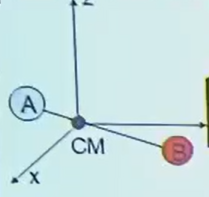
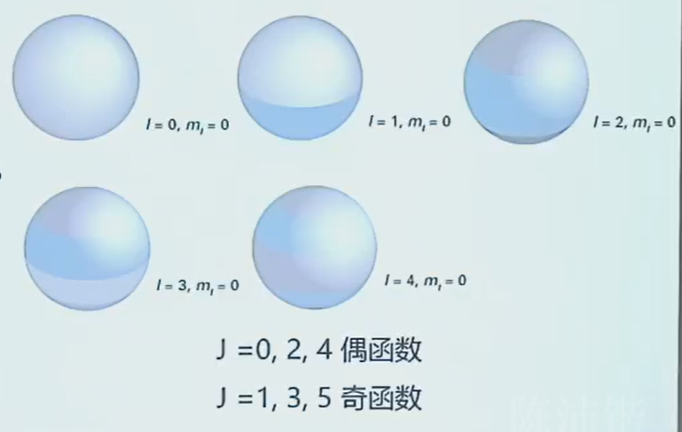
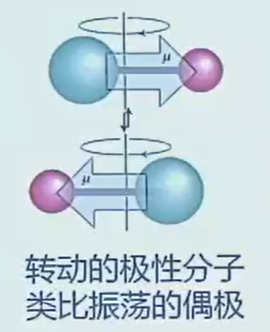
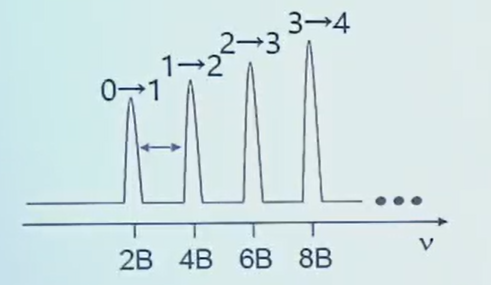
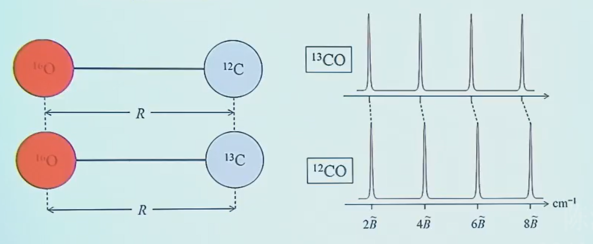
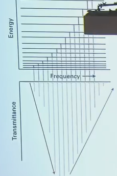

# Chapter 3：转动光谱

**转动**: 非限域、自由空间
**波段**：微波、毫米波

- 0.1mm ～ 1mm

- 10GHz ～ 1THz

## 3.1 转动惯量

### 3.1.1 定义
$$
I = \sum_{i} m_i r_i^2
$$

- $m_i$：第 $i$ 个质点的质量

- $r_i$：第 $i$ 个质点到**转轴**的垂直距离

- 旋转轴穿过质心

从数学和几何角度看，存在无数条穿过质心的旋转轴，对应无数个转动惯量数值。通过对角化转动惯量这个二阶张量，我们总能找到一组特殊的坐标系（三个相互垂直的主轴），对应的三个转动惯量 $I_A​,I_B​,I_C$​ 叫做主转动惯量。

---

### 3.1.2 典型分子的转动惯量

#### 线性双原子分子

$$
\begin{aligned}
I &= \mu R^2 \\
\mu &= \frac{m_A m_B}{m}
\end{aligned}
$$
- \( \mu \)：约化质量
- \( R \)：两原子间距
- \( m = m_A + m_B \)：总质量

---

####  线性三原子分子
$$
I = m_A R^2 + m_C R'^2 - \frac{(m_A R - m_C R')^2}{m}
$$

---

#### 球形转子
$$
\begin{aligned}
I &= \frac{8}{3} m_A R^2 \quad(CH_4) 
\end{aligned}
$$

$$
\begin{aligned}
I &= 4 m_A R^2 \quad (SF_6)
\end{aligned}
$$

| 分子类型 | 主转动惯量关系 | Example |
| :--- | :--- | :--- |
| 线性分子 | $I_A \approx 0, \quad I_B = I_C$ | CO₂, HCl |
| 球形转子 | $I_A = I_B = I_C$ | CH₄, SF₆ |
| 对称转子 | $I_A = I_B \neq I_C$ | NH₃, 苯 |
| 不对称转子 | $I_A \neq I_B \neq I_C$ | H₂O, 乙醇 |

---

## 3.2 线性刚性转子转动能级

### 3.2.1 转动哈密顿量

哈密顿量为动能之和（无势阱非限域V=0）
$$
T_N = -\frac{\hbar^2}{2m_A}\nabla_A^2 - \frac{\hbar^2}{2m_B}\nabla_B^2
$$

分解内外运动模式为质心平动与内部转动

$$
T_N = -\frac{\hbar^2}{2M}\nabla_{CM}^2 - \frac{\hbar^2}{2\mu}\nabla_{\text{int}}^2
$$

其中
- 平动总质量
$$
\begin{aligned}
M &= m_A + m_B 
\end{aligned}
$$

- 约化质量
$$
\begin{aligned}
\mu &= \frac{m_A m_B}{m_A + m_B}
\end{aligned}
$$

转动模式球坐标变化与刚性转子化简
$$
\begin{aligned}
T_N &= -\frac{\hbar^2}{2\mu}\nabla_{\text{int}}^2 = -\frac{\hbar^2}{2\mu}\left( \frac{\partial^2}{\partial R^2} + \frac{2}{R}\frac{\partial}{\partial R} - \frac{\hat{L}^2}{R^2 \hbar^2} \right)
\end{aligned}
$$

刚性转子，$R$不变： 
$$
\begin{aligned}
T_N &= \frac{\hbar^2 \hat{L}^2}{2\mu R^2 \hbar^2} = \frac{\hat{L}^2}{2I} \quad (\text{转动哈密顿量})
\end{aligned}
$$

其中角动量平方算符：

$$
\hat{L}^2 = -\hbar^2 \left[ \frac{1}{\sin\theta}\frac{\partial}{\partial\theta}\left( \sin\theta \frac{\partial}{\partial\theta} \right) + \frac{1}{\sin^2\theta}\frac{\partial^2}{\partial\phi^2} \right]
$$

---

### 3.2.2 转动能级

求解薛定谔方程，得到转动能级：

$$
E_{\text{rot}} = \frac{\hbar^2}{2I}J(J+1) \quad (J=0,1,2,\dots)
$$

>无外场，无限域能，最低能量可取到0。

定义转动常数

$$
\begin{aligned}
B &= \frac{h}{8\pi^2 I} \quad (\text{单位 } \text{s}^{-1}) \\
\tilde{B} &= \frac{h}{8\pi^2 c I} \quad (\text{单位 } \text{cm}^{-1})
\end{aligned}
$$

转动能级表达式

$$
{E_{\text{rot}} = h B J(J+1) = h c \tilde{B} J(J+1)}
$$

若以$\text{cm}^{-1}$为能量单位：

$$
\tilde{E}_{\text{rot}} = \tilde{B} J(J+1)
$$

---

### 3.2.3 转动波函数

$$
Y(\theta, \phi) = \Theta(\theta)\Phi(\phi)
$$

球谐函数完整表达式
$$
Y_{Jm}(\theta, \phi) = \sqrt{\frac{2J + 1}{4\pi} \frac{(J - |m|)!}{(J + |m|)!}} P_J^{|m|}(\cos\theta) e^{im\phi}
$$

- 转动量子数：$J = 0,1,2,\dots$

- 磁量子数：$m_j = 0,\pm1,\dots,\pm J$ （简并度 $2J + 1$）

---

### 3.2.4 跃迁偶极

$$
\langle i | \hat{\mu} | f \rangle
$$

>此处$\mu$是分子的永久偶极矩，不同于（类）氢原子，原子核的正电荷和核外电子的负电荷的相对位置，偶极矩的变化来自电子在不同轨道间跃迁时，电荷空间分布的改变。

电偶极矩算符
$$
\begin{aligned}
\hat{\mu} &= -e\vec{r}
\end{aligned}
$$

$$
\begin{aligned}
\mu_x &= -er \sin\theta \cos\phi
\end{aligned}
$$

$$
\begin{aligned}
\mu_y &= -er \sin\theta \sin\phi
\end{aligned}
$$

$$
\begin{aligned}
\mu_z &= -er \cos\theta
\end{aligned}
$$

转动波函数
$$
Y(\theta, \phi) = \Theta(\theta)\Phi(\phi)
$$

$$
= \mu \int Y_{JM}(\theta, \phi)
\begin{pmatrix}
\sin\theta \cos\phi \\
\sin\theta \sin\phi \\
\cos\theta
\end{pmatrix}
Y_{J'M'}(\theta, \phi) d\tau
$$

---

### 3.2.5 跃迁选择定则

- 必须是具有永久偶极的分子

$$
\mu = er \neq 0
$$

极性越强，跃迁越强

- 相邻转动能级跃迁
$$
\begin{aligned}
\Delta J &= \pm1 \\
\Delta m_J &= 0,\pm1
\end{aligned}
$$

---

### 3.2.5 转动光谱

**光谱谱线等间隔**，间隔为$2\tilde{B}$。
同位素效应使大的等间距谱线间有小的等间距谱线。

- 小峰 $^{13}\text{CO}$ 1.1% 天然丰度

- 大峰 $^{12}\text{CO}$ 98.9% 天然丰度

光谱的包络形状影响因素：

- $J \to J+1$ 对应能级之间跃迁偶极矩大小
  
$$
\left| \mu_{J+1 \leftarrow J} \right|^2 = \left( \frac{J+1}{2J+1} \right) \mu_0^2
$$

不同J差别不大

- 转动能级上的分子布局数：初始有多少分子
  简并度因子：态数
  玻尔兹曼因子：单态分布
  
$$
\frac{N_J}{N_0} = \frac{g_J e^{-E_J/k_B T}}{g_0 e^{-E_0/k_B T}} = g_J e^{-E_J/k_B T} = (2J+1)e^{-hc\tilde{B}J(J+1)/k_B T}
$$

对$J$求导取极值：

$$
\frac{d(N_J/N_0)}{dJ} = 0
$$

得到最概然转动量子数：
$$
{J_{\text{max}} = \sqrt{\frac{k_B T}{2hc\tilde{B}}} - \frac{1}{2}}
$$

谱线强度规律
- 强度随$J$快速上升（简并度上升），然后下降（玻尔兹曼因子指数衰减）
- 谱线强度分布取决于温度

---

## 3.3 线性刚性转子转动光谱

## 3.4 对称转子转动能级和光谱

## 3.5 不对称转子光谱
