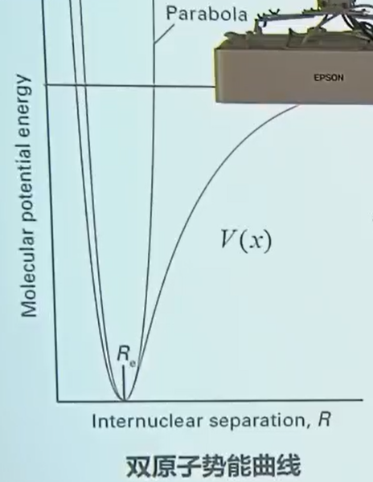
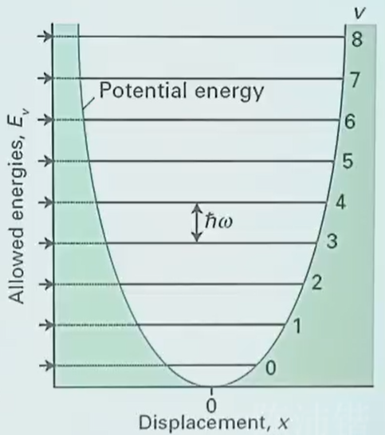
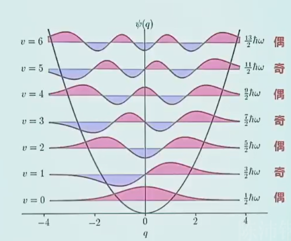
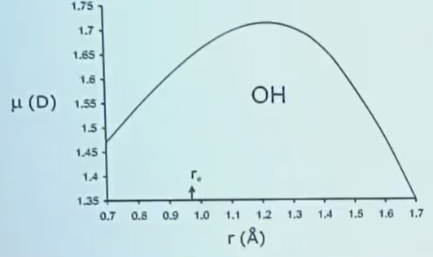
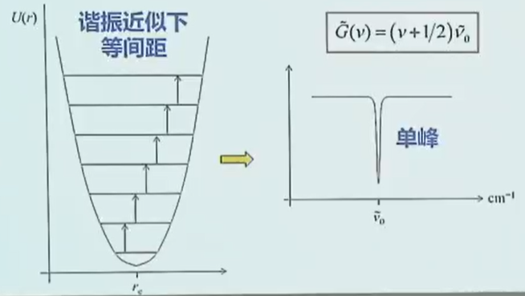
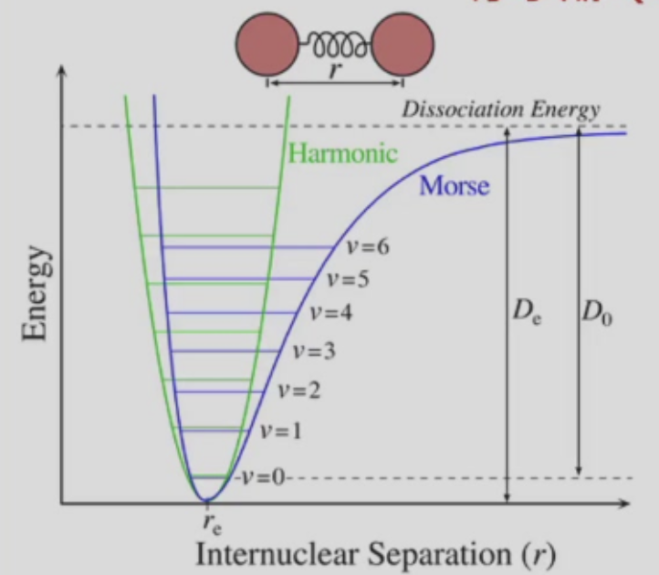
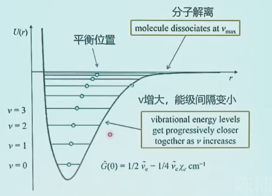
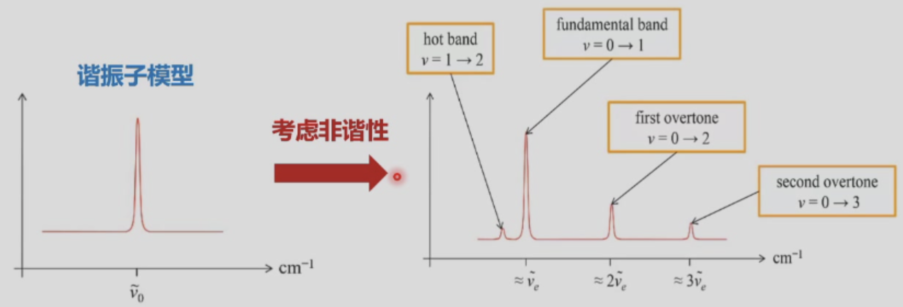
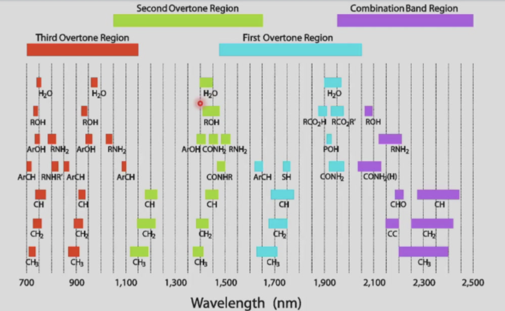

# Chapter 4：振动光谱1.双原子分子

**分子运动**: 振动，在平衡位置附近

**波段**：中红外，$1$–$30\ \mu\text{m}$

**样品**：固液气

## 4.1 双原子分子振动能级

### 4.1.1 简谐振动 

$$
\begin{aligned}
-k(r - r_e) = -kx \quad \text{弹簧力常数} k
\end{aligned}
$$

振动势能：
$$
\begin{aligned}
V(x) = \frac{1}{2}kx^2
\end{aligned}
$$

运动方程：
$$
\begin{aligned}
F = \mu \frac{d^2x}{dt^2} = -kx
\end{aligned}
$$

**约化质量**：

$$
\begin{aligned}
\mu = \frac{m_1 m_2}{m_1 + m_2}
\end{aligned}
$$

>双原子分子的振动\是两个原子围绕共同的质心同时运动，我们关心的是两个原子的相对运动（如核间距的变化 $r−r_e$​ ），须用约化质量做等效简化,等效成了一个质量为$μ$的虚拟质点的单体运动。

简谐振子

$$
\begin{aligned}
x = A\sin(\omega t + \varphi)
\end{aligned}
$$

**振动频率**：
$$
\begin{aligned}
\omega = \sqrt{k/\mu}
\end{aligned}
$$

---

### 4.1.2 双原子分子

#### 谐振子近似

双原子势能曲线

$\boldsymbol{x = R - R_e}$（相对于平衡位置的核位移）

$V(x)$ 为分子实际势能曲线，Parabola 为简谐近似的抛物线势能

势能在最低点$x=0$的泰勒展开

$$
\begin{aligned}
V(x) = V(0) + \left(\frac{dV}{dx}\right)_0 x + \frac{1}{2}\left(\frac{d^2V}{dx^2}\right)_0 x^2 + \dots
\end{aligned}
$$

1.  $V(0)$：平衡位置的势能，可设为势能零点，取值为0
2.  $\left(\frac{dV}{dx}\right)_0$：势能在平衡位置的一阶导数，势能最低点处一阶导数为0，该项为0
3.  $x^3$及以上的高阶小项，在简谐近似下忽略

**谐振子近似**: 量子简谐振子

$$
\begin{aligned}
V(x) \approx \frac{1}{2}\left(\frac{d^2V}{dx^2}\right)_0 x^2 = \frac{1}{2} k x^2
\end{aligned}
$$

其中弹簧力常数 $k = \left(\frac{d^2V}{dx^2}\right)_0$，即势能曲线在平衡位置的二阶导数。

---

### 振动能级

一维谐振子薛定谔方程：
$$
\begin{aligned}
\left( -\frac{\hbar^2}{2\mu}\frac{\partial^2}{\partial x^2} + V(x) \right) \psi = E \psi
\end{aligned}
$$

**约化质量**：
$$
\begin{aligned}
\mu = \frac{m_1 m_2}{m_1 + m_2}
\end{aligned}
$$

振动能级（$\boldsymbol{J}$）
$$
\begin{aligned}
E_v = \left(v+\frac{1}{2}\right)\hbar\omega
\end{aligned}
$$

**角频率**：
$$
\begin{aligned}
\omega = \sqrt{\frac{k}{\mu}}
\end{aligned}
$$

**振动量子数**：
$$
\begin{aligned}
v = 0,\ 1,\ 2\dots
\end{aligned}
$$

振动能级（$\boldsymbol{\text{cm}^{-1}}$）
$$
\begin{aligned}
\tilde{G}_v = \left(v+\frac{1}{2}\right)\tilde{\nu}
\end{aligned}
$$

**振动波数**：
$$
\begin{aligned}
\tilde{\nu} = \frac{1}{2\pi c}\sqrt{\frac{k}{\mu}}
\end{aligned}
$$

 
- 振动零点能，在绝对零度也有振动（不确定原理：若静止则位置和动量可同时确定）
  
- 振动能级等间隔
  
---

### 振动波函数

$$
\begin{aligned}
\psi_v(x) = N_v H_v(y) e^{-y^2/2}
\end{aligned}
$$
其中：

- $N_v$：谐振子波函数归一化常数
  
- $H_v(y)$：$v$阶厄米多项式
  
- 无量纲变量：$\displaystyle y = \frac{x}{\alpha}$
  
- 特征长度参数：$\displaystyle \alpha = \left( \frac{\hbar^2}{\mu k_f} \right)^{1/4}$，$\mu$为约化质量，$k_f$为振动力常数

| 振动量子数 $v$ | 厄米多项式 $H_v(y)$ |
| :-------------: | :------------------: |
| 0               | $1$                  |
| 1               | $2y$                 |
| 2               | $4y^2 - 2$           |
| 3               | $8y^3 - 12y$         |
| 4               | $16y^4 - 48y^2 + 12$ |
| 5               | $32y^5 - 160y^3 + 120y$ |
| 6               | $64y^6 - 480y^4 + 720y^2 - 120$ |

---

## 4.2 振动光谱选择定则

### 4.2.1 跃迁偶极

振动能级跃迁偶极矩
$$
\begin{aligned}
\mu_{if} = \left\langle \psi_{v'}(x) \left| \vec{\mu}(x) \right| \psi_v(x) \right\rangle
\end{aligned}
$$

偶极矩随核位移的变化：原子间距离改变的同时影响了电荷的空间分布，偶极随核位移变化非线性。

电偶极$\vec{\mu}$是$x$的函数，在平衡位置附近做泰勒展开：

$$
\begin{aligned}
\mu(x) = \mu_{x=0} + \left( \frac{\partial \mu}{\partial x} \right)_0 x + \frac{1}{2}\left( \frac{\partial^2 \mu}{\partial x^2} \right)_0 x^2 + \dots
\end{aligned}
$$

忽略高阶项，认为电偶极矩在平衡位置附近是$x$的**线性**函数。

跃迁偶极矩的拆分

$$
\begin{aligned}
\mu_{if} &= \left\langle \psi_{v'}(x) \left| \mu_0 + \left( \frac{\partial \mu}{\partial x} \right)_0 x \right| \psi_v(x) \right\rangle \\
&= \underbrace{\left\langle \psi_{v'}(x) \left| \mu_0 \right| \psi_v(x) \right\rangle}_{\text{谐振近似下，振动波函数正交}\to 0} + \underbrace{\left( \frac{\partial \mu}{\partial x} \right)_0 \left\langle \psi_{v'}(x) \left| x \right| \psi_v(x) \right\rangle}_{\text{必须} \neq 0}
\end{aligned}
$$

其中$\mu_0 = \mu_{x=0}$，为平衡位置的固有偶极矩。

---

### 4.2.2 选择定则

振动跃迁非零条件
$$
\left( \frac{\partial \mu}{\partial x} \right)_0 \left\langle \psi'(x) \left| x \right| \psi(x) \right\rangle \neq 0 
$$

①
$$
\boldsymbol{\left( \frac{\partial \mu}{\partial x} \right)_0 \neq 0}
$$

**电偶极矩大小需要随振动发生改变**

- **同核双原子分子**：
  $$
  \begin{cases}
  \vec{\mu}_e = 0 \\
  d\vec{\mu}/dr = 0
  \end{cases}
  $$

- **异核对称分子**：
  $$
  \begin{cases}
  \vec{\mu}_e \text{ 可能} = 0 \\
  d\vec{\mu}/dr \text{ 可能} \neq 0
  \end{cases}
  $$

线性三原子分子（CO₂型）：对称伸缩非红外活性（有振动能级，但红外谱上看不到），非对称伸缩和弯曲振动（xz和yz平面，像水分子）具有红外活性。

②
$$
\left\langle \psi'(x) \left| x \right| \psi(x) \right\rangle \neq 0
$$

$$
\left\langle v' | x | v \right\rangle = \left( \frac{\hbar}{2m\omega} \right)^{1/2} \left( \sqrt{v+1}\delta_{v',v+1} + \sqrt{v}\delta_{v',v-1} \right)
$$

其中$\delta_{i,j}$为克罗内克δ函数。

振动跃迁选择定则
$$
\boldsymbol{\Delta v = \pm 1}
$$

- 谐振近似下振动能级等间距
    能级公式：
    $$
    \tilde{G}(v) = \left(v+\frac{1}{2}\right)\tilde{\nu}_0
    $$

- 光谱特征：
    跃迁对应**单峰**，峰位置为$\tilde{\nu}_0$，横坐标为波数$\text{cm}^{-1}$。

室温下的振动布居与光谱特征

- 室温下，$k_\text{B}T \sim 200\ \text{cm}^{-1}$
  
- 转动能隙大，较难通过热运动跃迁，大部分分子都处于振动基态，$v=0$
  
- 主要的跃迁来自$v=0 \to 1$，表现出单个跃迁谱线

常见振动光谱：

[NIST Chemistry WebBook](https://webbook.nist.gov/chemistry)

---

## 4.3 振动非谐性

### 4.3.1 莫尔斯（Morse）势

曲线右侧开口，能量较高时键断裂，更接近真实势能曲线。

**只有在平衡位置附近的低能级振动满足简谐振子模型**

莫尔斯势表达式

$$
\begin{aligned}
V(q) = hcD_e \left(1 - e^{-\alpha x}\right)^2
\end{aligned}
$$

其中参数：

$$
\begin{aligned}
\alpha = \left( \frac{k}{2hcD_e} \right)^{1/2}
\end{aligned}
$$

- $x = r - r_e$：相对于平衡位置的核位移
  
- $k$：振动力常数
   
- $D_e$：势能曲线最小值对应的深度

---

### 4.3.2 非谐振动能级
 

能级公式（$\boldsymbol{J}$）

$$
\begin{aligned}
E_v = \left(v+\frac{1}{2}\right)\hbar\omega_e - \left(v+\frac{1}{2}\right)^2 \hbar\omega_e \chi_e
\end{aligned}
$$

能级公式（$\boldsymbol{\text{cm}^{-1}}$）
$$
\begin{aligned}
\tilde{G}_v = \left(v+\frac{1}{2}\right)\tilde{\nu}_e - \left(v+\frac{1}{2}\right)^2 \tilde{\nu}_e \chi_e
\end{aligned}
$$

后项作为非谐修正，在$v$大时产生显著影响

非谐常数
$$
\begin{aligned}
\chi_e = \frac{\alpha^2 h}{2\mu\omega} = \frac{\tilde{\nu}}{4D_e}
\end{aligned}
$$

与谐振子近似不同，平衡位置向右移动，化学键变长。

>这里的平衡位置理解成振动的平均核间距似乎更好，平衡位置指势能最低点。

---

### 4.3.3 选律与光谱

#### 倍频（泛频）跃迁

所有跃迁都从振动基态$\boldsymbol{v=0}$出发，核心差异为振动量子数变化量$\Delta v$：
- **基带（基频）跃迁**：$\boldsymbol{v=0 \to v=1}$，$\Delta v=+1$，对应光谱主峰，信号最强
  
- **第一倍频（第一泛频）**：$\boldsymbol{v=0 \to v=2}$，$\Delta v=+2$
  
- **第二倍频（第二泛频）**：$\boldsymbol{v=0 \to v=3}$，$\Delta v=+3$

倍频跃迁是**非谐性**的直接结果：
- 简谐近似下，振动选择定则严格为$\Delta v=\pm1$，倍频跃迁完全禁阻
  
- 非谐性放宽了选择定则，使$\Delta v=\pm2、\pm3\dots$的跃迁不再严格禁阻，可以发生

倍频跃迁信号强度远弱于基频峰：跃迁偶极矩极小，第一倍频强度不足基频的1/20，高阶倍频信号更弱。峰位略低于基频的整数倍（非谐性导致能级间隔随$v$升高减小）。倍频峰在分析中十分常用。

---

#### 基带与热带跃迁

- 基带跃迁（Fundamental band）：$\boldsymbol{v=0 \to v=1}$，从振动基态出发的跃迁，对应红外光谱的基频主峰，信号最强。

- 热带跃迁（Hot band）：从振动激发态出发的跃迁，典型如：
  
  - 第一热带：$\boldsymbol{v=1 \to v=2}$
  
  - 第二热带：$\boldsymbol{v=2 \to v=3}$

热带跃迁信号远弱于基带，核心原因是**玻尔兹曼分布**。

简谐近似下，所有$\Delta v=+1$的跃迁能量相同，基带与热带谱线完全重合。非谐性下，振动能级间隔随$v$升高逐渐减小，不同初始态的$\Delta v=+1$跃迁能量不同，**基带与热带跃迁的谱线不再重合**，热带跃迁峰向低波数方向偏移。

---

## 4.4 振-转跃迁

#### 4.4.1 哈密顿量与能级

**刚性转子-谐振子**模型（忽略振动对转动的影响）

振动与转动运动相互独立，总哈密顿量为振动项与转动项之和：
$$
\hat{H} = \hat{H}_{\text{vib}}(R) + \hat{H}_{\text{rot}}(\theta,\varphi)
$$

总波函数为振动波函数与转动波函数的乘积（波恩-奥本海默近似下可分离）：
$$
\psi = \psi_{\text{vib}}(R) \psi_{\text{rot}}(\theta,\varphi)
$$

振-转总能量公式
能量单位：$\boldsymbol{\text{J}}$

$$
E_{v,J} = \left(v+\frac{1}{2}\right)\hbar\omega + hBJ(J+1)
$$

波数单位：$\boldsymbol{\text{cm}^{-1}}$

$$
\tilde{S}_{v,J} = \tilde{G}_v + \tilde{F}_J = \left(v+\frac{1}{2}\right)\tilde{\nu} + J(J+1)\tilde{B}
$$

