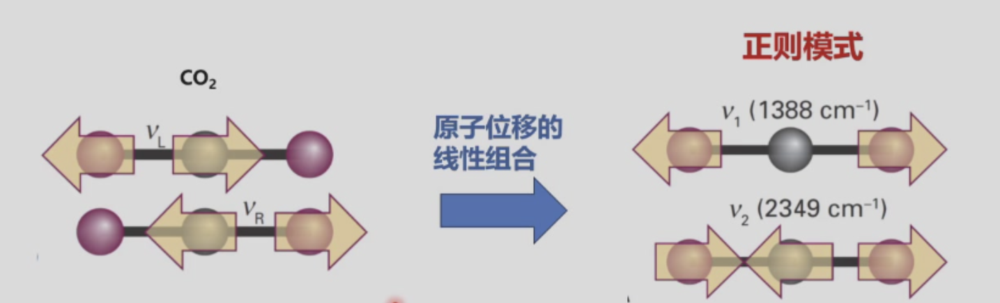
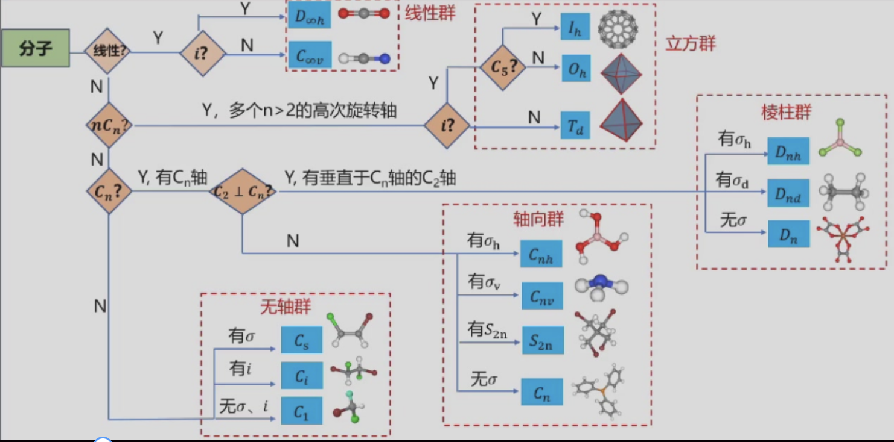

# Chapter 5：振动光谱2.多原子分子

## 5.1 多原子分子振动

### 5.1.1 振动模式数目

- 分子所含原子数：$\boldsymbol{N}$
  
- 线性分子振动模式数：$\boldsymbol{3N-5}$
  
- 非线性分子振动模式数：$\boldsymbol{3N-6}$

**计算逻辑**：
振动自由度 = 总自由度 - 平动自由度（恒为$3$） - 转动自由度（取向角度，$2/3$个）

### 5.1.2 正则模式

**质量矩阵 M** \quad $3N \times 3N$

$$
M = \begin{pmatrix}
m_1 & & & & & & \\
& m_1 & & & & & \\
& & m_1 & & & & \\
& & & \ddots & & & \\
& & & & m_N & & \\
& & & & & m_N & \\
& & & & & & m_N
\end{pmatrix}
$$

**力常数矩阵 F** $3N \times 3N$

$$
F_{ij} = \left( \frac{\partial^2 V}{\partial x_i \partial x_j} \right)_0
$$

$F_{ij}$表示第j个原子在第j个方向的单位位移，对第i个原子在第i个方向产生的力

**求解广义本征值**

$$
\boldsymbol{F A} = \omega^2 \boldsymbol{M A}
$$

**本征值 $\omega_q^2$**：对应第q个正则模式的角频率平方(3N个)

振动频率（波数）：
$$
\tilde{\nu}_q = \frac{\omega_q}{2\pi c}
$$

**本征向量 $\boldsymbol{A}_q$**：对应第q个正则模式的**原子位移向量** (3N个)

* 向量的每个元素表示对应原子在x/y/z方向的位移幅度
* 所有原子同时按这个向量运动，就是该正则模式的振动形式

**局域耦合振动** $\xrightarrow{\text{原子位移的线性组合}}$ **正则振动模式**

**局域耦合振动**

 核心特征：

  - 原子间的振动不是独立的，是耦合的

  - 振动不是两个原子之间简单的事

  - 质心在动，牵涉到整体运动了

**正则振动模式**

  核心特征：

  - 多个原子的集体振动（同样的频率和相位）
  
  - 模式独立，非耦合
  
  - 可以选择性单独激发某个模式
  
  - 不牵涉分子整体的平动或者转动

>有机物中常说的特定键的振动波数，在正则模式（真实情况）下可以认为是这根键多动一点，别的动得小一点，所以也会有一定的波数范围，受整体影响。

对于每个正则模式$\boldsymbol{q}$（忽略非谐性），均可视为独立的谐振子。

正则模式的振动能级（波数形式）

$$\tilde{G}_q(v) = \left(v+\frac{1}{2}\right)\tilde{\nu}_q$$

正则模式的特征振动波数

$$\tilde{\nu}_q = \frac{1}{2\pi c}\left( \frac{k_q}{m_q} \right)^{1/2}$$

$k_q$、$m_q$：分别对应振动模式$q$的**力常数**和**有效质量**

正则模式的核心特征：

- 只有在特殊情况下（如$\text{CO}_2$），正则模式是纯粹拉伸或弯曲（键角改变）。一般来说，是同时拉伸和弯曲键的复合运动
  
- 在正常情况下，重原子的运动通常少于轻原子模式（质心不动）
  
- 但就算非常大的分子的正则模式，也通常由一小群原子的运动主要构成
  

跃迁定则

- 正则振动模式有**偶极矩的变化** $\boldsymbol{\rightarrow}$ 对应振动模式才具有**红外活性**

- 谐振近似下，对应正则模式$q$的振动跃迁选律：
$$\boldsymbol{\Delta v_q = \pm1}$$

---

## 5.2 分子对称操作与点群

>目前正则模式均可用Gussian计算。这里用群论判断。

