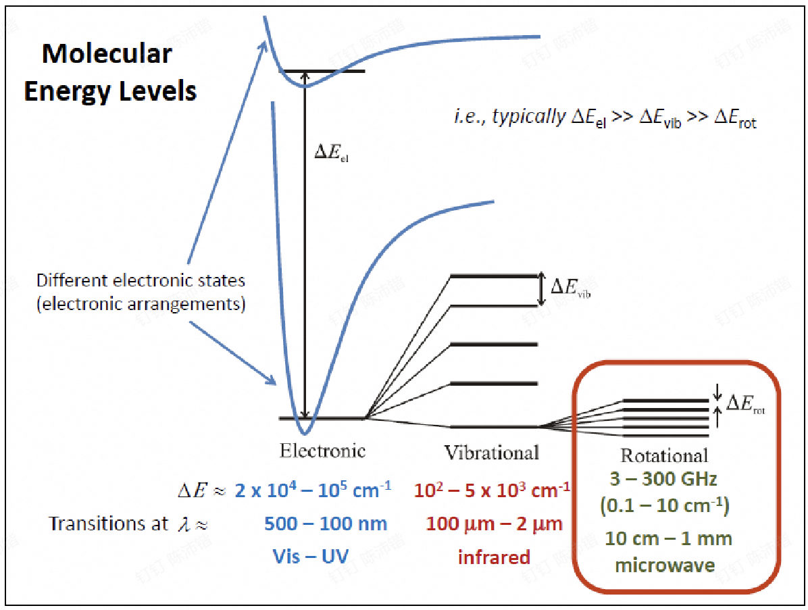
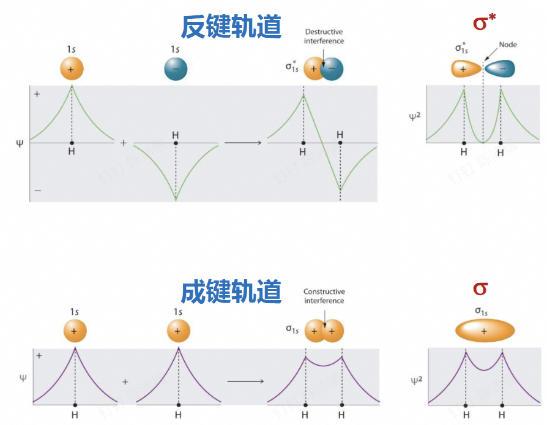
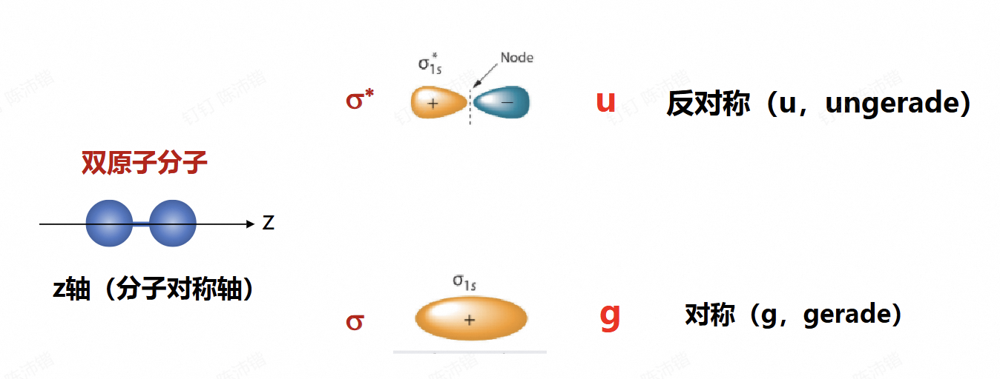
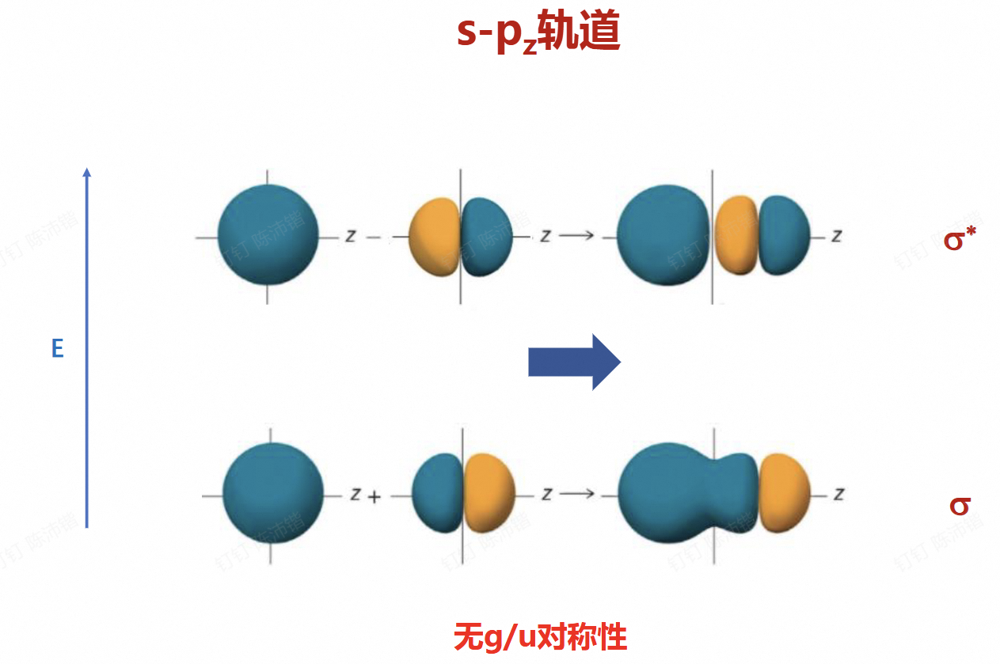

# Chapter 6: 分子电子光谱

| 能级类型 | 能量差 ($\Delta E$) 数量级 / $\text{cm}^{-1}$ | 对应光谱区 | 典型波长范围 | 结构嵌套关系 |
| :--- | :--- | :--- | :--- | :--- |
| **电子能级** | $2 \times 10^4 \sim 10^5$ | 紫外 - 可见光 (UV - Vis) | $100 \sim 500 \text{ nm}$ | 能量跨度最大，势能井内包含多个振动能级。 |
| **振动能级** | $10^2 \sim 5 \times 10^3$ | 红外光 (Infrared) | $2 \sim 100 \, \mu\text{m}$ | 嵌套于特定的电子态内，其内部包含多个转动能级。 |
| **转动能级** | $0.1 \sim 10$ (或 $3 \sim 300 \text{ GHz}$) | 微波 (Microwave) | $1 \text{ mm} \sim 10 \text{ cm}$ | 能量跨度最小，嵌套于特定的振动能级内，最为精细。 |

##  6.1 双原子分子轨道

在玻恩奥本海默近似下，只有一个分子的薛定谔方程可以精确求解 $\rightarrow \text{H}_2^+$

其他的，**分子轨道** $\leftarrow$ 原子轨道的线性组合

linear combination of atomic orbitals (LCAO)

$$\text{MO: } \Psi = \sum_i c_i\psi_i \text{ ( AO )}$$

---

### 6.1.1 分子轨道

**两项的LCAO**

$$\Psi = c_1\psi_1 + c_2\psi_2$$

**代入薛定谔方程**

$$H(c_1\psi_1 + c_2\psi_2) = E(c_1\psi_1 + c_2\psi_2)$$

$$c_1(H - E)\psi_1 + c_2(H - E)\psi_2 = 0$$

**乘以 $\psi_1^*$**

$$c_1 \int \psi_1(H - E)\psi_1 d\tau + c_2 \int \psi_1(H - E)\psi_2 d\tau = 0$$

$$c_1(H_{11} - E) + c_2(H_{12} - E S_{12}) = 0$$

**同样，乘以 $\psi_2^*$**

$$c_1(H_{21} - E S_{21}) + c_2(H_{22} - E) = 0$$

**求解久期方程**

$$
\begin{vmatrix}
H_{11} - E & H_{12} - E S_{12} \\
H_{21} - E S_{21} & H_{22} - E
\end{vmatrix} = 0
$$

**积分项定义：**

* **库仑积分** $H_{ii} = \int \psi_i H \psi_i d\tau$：初始原子轨道中一个电子的能量
  
* **转移积分** $H_{ij} = \int \psi_i H \psi_j d\tau$：处于两个原子轨道重叠中的电子能量为**负值**
  
* **重叠积分** $S_{ij} = \int \psi_i \psi_j d\tau$：不同原子轨道在空间重叠程度，小于1

**分子轨道：原子轨道线性组合**

* **低能级（成键轨道）**
    $$E_+ = \frac{H_{11} + H_{12}}{1 + S_{12}}$$

    $$\psi_+ = \frac{\psi_1 + \psi_2}{\sqrt{2(1+S)}}$$

* **高能级（反键轨道）**
    $$E_- = \frac{H_{11} - H_{12}}{1 - S_{12}}$$

    $$\psi_- = \frac{\psi_1 - \psi_2}{\sqrt{2(1-S)}}$$

* **近似 $S_{12} \approx 0$**：
    $$E_{\pm} = H_{11} \pm H_{12}$$

    $$\psi_{\pm} = \frac{\psi_1 \pm \psi_2}{\sqrt{2}}$$

**LCAO-MO原则：**

1. 原子间距离足够小
2. 能量足够接近价层轨道
3. 轨道延主轴对称性一致
4. 分子轨道和原子数目相等

---

### 6.1.2 中心对称性

同核双原子有$g/u$对称性，异核双原子无$g/u$对称性

---

### 6.1.3 电子组态

举例：

$\text{O}_2$:  $(\sigma_g1s)^2(\sigma_u^*1s)^2(\sigma_g2s)^2(\sigma_u^*2s)^2(\sigma_g2p)^2(\pi_u2p)^4(\pi_g^*2p)^2$

- 能量最低原理

- 洪特规则（见后）

- 泡利原理：全同费米子体系总波函数的反对称性。如果体系中两个电子处于完全相同的量子态（即四个量子数完全相同，意味着它们的空间和自旋坐标完全重合 $x_i = x_j$），那么交换这两个电子，波函数本身不应发生改变。为了同时满足波函数不变和改变符号的要求，必须有：
 
$$\Psi = -\Psi \implies \Psi = 0$$

---

## 6.2 双原子分子光谱项

**分子都是多电子体系，考虑所有电子组成的总分子轨道性质**

$${}^{2S+1}\Lambda^{+/-}_{g/u}$$

* **$\Lambda$**: 总轨道角动量量子数（z轴）
  
* **$S$**: 总自旋量子数
  
* **g/u**: 中心对称性（仅同核双原子分子）
  
* **+,-**: 延分子轴镜面对称性

---

### 6.2.1 角量子数

* **MO总轨道角量子数（只考虑分子轴分量）**

    $$\Lambda = \left| \sum_i \lambda_i \right|$$

    $\lambda_i$ 为电子 $i$ 对应分子轨道角动量在 **z轴（分子对称轴）** 方向的投影，正负号为沿轴方向

    $\sigma$键：$\lambda = 0$ &emsp; $\pi$键：$\lambda = \pm 1$ &emsp; $\delta$键：$\lambda = \pm 2$

    | $\Lambda =$ | 0 | 1 | 2 | 3 |
    | :--- | :---: | :---: | :---: | :---: |
    | **符号** | $\Sigma$ | $\Pi$ | $\Delta$ | $\Phi$ |

* 总自旋量子数 $S = \left| \sum_i s_i \right|$

    $\text{H}_2^+$: $S=1/2$  &emsp;   $\text{H}_2$: $S=0$

* 总自旋角动量 $\vec{S}$ 在z轴投影 $\Sigma = S, S - 1, \dots, -S + 1, -S$

* 若考虑旋轨耦合，MO总角量子数 $\Omega = \Lambda + \Sigma$

---

### 6.2.2 中心对称性

**g/u 对称性**：总轨道波函数中心对称 (g, gerade) 或反对称 (u, ungerade)

各分子轨道（MO）的奇偶对称性如下：

* **$\sigma$ 轨道**：g

* **$\sigma^*$ 轨道**：u

* **$\pi$ 轨道**：u

* **$\pi^*$ 轨道**：g

应用规则

* 只考虑同核双原子分子

* **多电子规则**：所有电子MO g/u 的乘积

**乘积规则：**
* $g \times g = g$

* $u \times u = g$

* $u \times g = u$

---

### 6.2.3 镜面对称性

**+, - 对称性**：总轨道波函数延分子轴镜面对称（+）或者反对称（-）

* 总波函数等于所有电子+-乘积，只需要考虑**未填满电子**

* 所有 **$\sigma$ 轨道，+对称**（未填满电子都在 $\sigma$ 轨道上 $\rightarrow \Sigma^+$）；$\pi$ 和 $\delta$，无确定对称性

* 只需要标记 **$\Sigma$光谱项**：轨道角动量为0，波函数的对称性主要由电子分布的空间对称性决定

* 未成对电子在 $\pi$ 轨道上，同一分子轨道内$\Sigma$可结合Pauli原理确定，不同轨道$\Sigma$ +-均可
    * 两个等价 $\pi$ 电子的三重态：$\Sigma^-$
  
    * 两个等价 $\pi$ 电子的单重态：$\Sigma^+$
  
    * 不同 $\pi$ 轨道的电子：$\pm$ 均可

