# Chapter 6：分子电子光谱

**分子运动**：电子在不同分子轨道之间跃迁

**波段**：紫外-可见-近红外

**典型波长范围**：$100\sim1000\ \text{nm}$

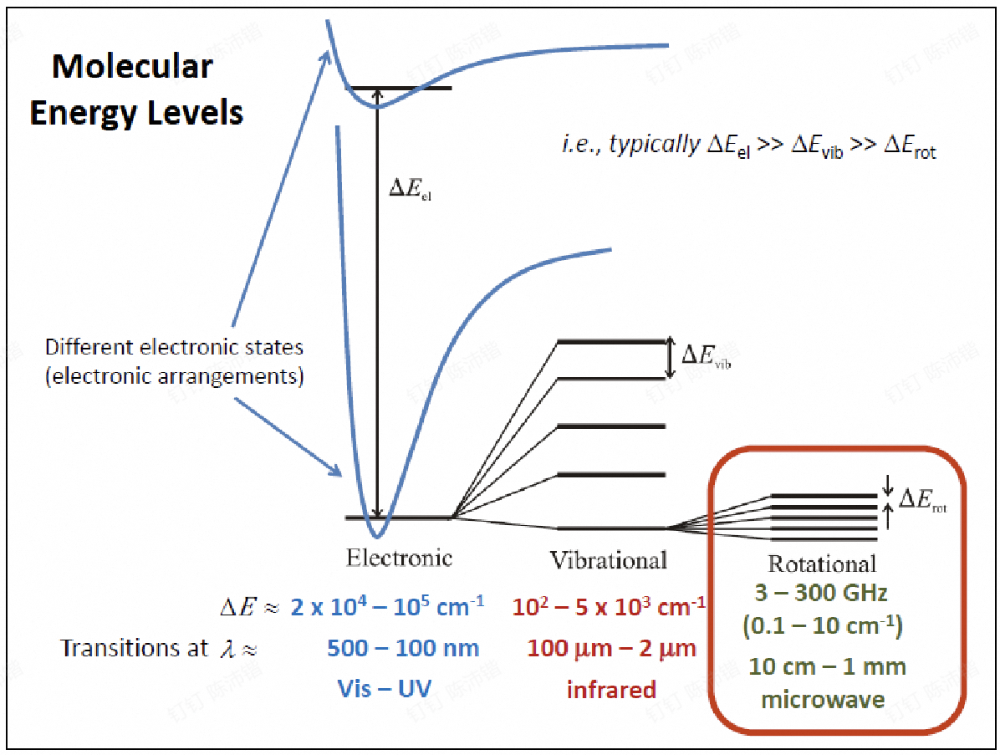

分子的总能量可近似分解为

$$
E_{\text{mol}}=E_{\text{elec}}+E_{\text{vib}}+E_{\text{rot}}
$$

且通常满足

$$
\Delta E_{\text{elec}}\gg \Delta E_{\text{vib}}\gg \Delta E_{\text{rot}}
$$

| 能级类型 | 能量差数量级 / $\text{cm}^{-1}$ | 对应光谱区 | 典型波长范围 |
| :--- | :---: | :---: | :---: |
| 电子能级 | $2\times10^4\sim10^5$ | 紫外-可见 | $100\sim500\ \text{nm}$ |
| 振动能级 | $10^2\sim5\times10^3$ | 红外 | $2\sim100\ \mu\text{m}$ |
| 转动能级 | $0.1\sim10$ | 微波 | $1\ \text{mm}\sim10\ \text{cm}$ |

电子跃迁发生时，电子态、振动态和转动态会同时参与，因此电子光谱通常表现为**带状光谱**。

---

## 6.1 双原子分子轨道

在玻恩-奥本海默近似下，$\mathrm{H_2^+}$ 是最简单的单电子双原子分子。多电子分子的分子轨道通常由原子轨道线性组合得到：

$$
\psi_{\text{MO}}=\sum_i c_i\phi_i
$$

这种方法称为原子轨道线性组合（linear combination of atomic orbitals，LCAO）。

### 6.1.1 两个原子轨道的线性组合

取两个原子轨道 $\phi_1$ 和 $\phi_2$：

$$
\psi=c_1\phi_1+c_2\phi_2
$$

代入薛定谔方程：

$$
\hat H(c_1\phi_1+c_2\phi_2)=E(c_1\phi_1+c_2\phi_2)
$$

分别左乘 $\phi_1^*$ 和 $\phi_2^*$ 并积分，得到

$$
\begin{cases}
c_1(H_{11}-E)+c_2(H_{12}-ES_{12})=0\\
c_1(H_{21}-ES_{21})+c_2(H_{22}-E)=0
\end{cases}
$$

非零解要求久期行列式为零：

$$
\begin{vmatrix}
H_{11}-E & H_{12}-ES_{12}\\
H_{21}-ES_{21} & H_{22}-E
\end{vmatrix}=0
$$

其中：

- **库仑积分**

  $$
  H_{ii}=\int\phi_i^*\hat H\phi_i\,d\tau
  $$

  表示电子处于原子轨道 $\phi_i$ 时的能量。

- **共振积分（转移积分）**

  $$
  H_{ij}=\int\phi_i^*\hat H\phi_j\,d\tau
  $$

  反映电子在两个原子轨道间离域所产生的相互作用。

- **重叠积分**

  $$
  S_{ij}=\int\phi_i^*\phi_j\,d\tau
  $$

  表示两个原子轨道的空间重叠程度。

对于同核双原子分子，$H_{11}=H_{22}$。两个解分别为

$$
\begin{aligned}
E_+&=\frac{H_{11}+H_{12}}{1+S_{12}},
&
\psi_+&=\frac{\phi_1+\phi_2}{\sqrt{2(1+S_{12})}}
\\
E_-&=\frac{H_{11}-H_{12}}{1-S_{12}},
&
\psi_-&=\frac{\phi_1-\phi_2}{\sqrt{2(1-S_{12})}}
\end{aligned}
$$

在 $S_{12}\approx0$ 时：

$$
E_\pm\approx H_{11}\pm H_{12},
\qquad
\psi_\pm\approx\frac{\phi_1\pm\phi_2}{\sqrt 2}
$$

对于通常的成键相位选择，$H_{12}<0$：

- 同相组合 $\psi_+$：核间电子密度增大，能量降低，形成**成键轨道**；
- 反相组合 $\psi_-$：核间出现节面，能量升高，形成**反键轨道**。

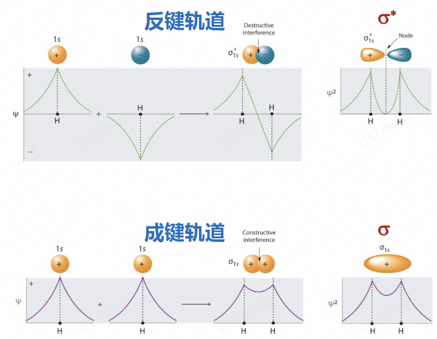

**LCAO-MO 形成条件：**

1. 原子间距离足够小，原子轨道能够有效重叠；
2. 参与组合的原子轨道能量接近；
3. 原子轨道关于分子轴的对称性相同；
4. 组合前后轨道总数不变：参与组合的原子轨道数等于生成的分子轨道数。

---

### 6.1.2 轨道类型与中心反演对称性

取核间轴为 $z$ 轴：

- 沿核间轴头碰头重叠形成 $\sigma$ 轨道；
- 垂直于核间轴的 $p_x$、$p_y$ 轨道侧向重叠形成二重简并的 $\pi$ 轨道；
- $s$ 与 $p_z$ 轨道可形成 $\sigma$ 轨道，但异核组合一般没有 $g/u$ 标记。

同核双原子分子具有反演中心。对分子轨道施加中心反演操作 $\hat i$：

$$
\hat i\psi=
\begin{cases}
+\psi,&g\ (\text{gerade，对称})\\
-\psi,&u\ (\text{ungerade，反对称})
\end{cases}
$$

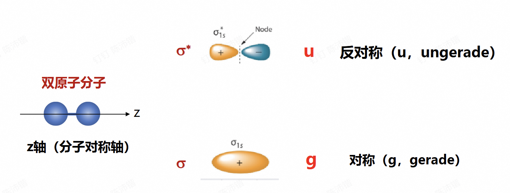

课件中所示轨道的对应关系为

| 原子轨道组合 | 成键轨道 | 反键轨道 |
| :--- | :---: | :---: |
| $s-s$ 或 $p_z-p_z$ | $\sigma_g$ | $\sigma_u^*$ |
| $p_x-p_x$、$p_y-p_y$ | $\pi_u$ | $\pi_g^*$ |
| 异核 $s-p_z$ | $\sigma$ | $\sigma^*$ |

异核双原子分子没有反演中心，因此不使用 $g/u$ 标记。

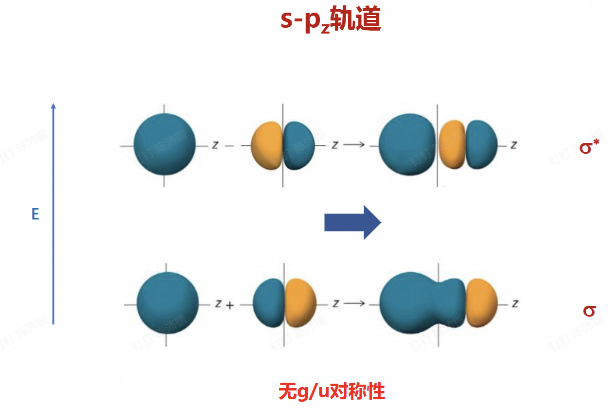

---

### 6.1.3 基态电子组态

第二周期同核双原子分子的价层分子轨道由 $2s$、$2p_x$、$2p_y$、$2p_z$ 组合而成。填充电子时遵循：

- **能量最低原理**：电子优先占据低能轨道；
- **Pauli 不相容原理**：同一分子轨道最多容纳两个自旋相反的电子；
- **Hund 规则**：简并轨道先以自旋平行的方式单占，再发生配对。

Pauli 原理的本质是：交换任意两个电子后，多电子总波函数必须反对称。若两个电子占据完全相同的自旋轨道，由它们构成的反对称波函数恒为零。

$\mathrm{O_2}$ 的电子组态可写为

$$
(\sigma_g1s)^2(\sigma_u^*1s)^2
(\sigma_g2s)^2(\sigma_u^*2s)^2
(\sigma_g2p_z)^2(\pi_u2p)^4(\pi_g^*2p)^2
$$

最高占据的两个电子分别单占两个简并的 $\pi_g^*$ 轨道且自旋平行，因此 $\mathrm{O_2}$ 基态含两个未成对电子，表现为顺磁性。

---

## 6.2 双原子分子光谱项

光谱项描述一个电子组态中所有电子共同形成的总轨道角动量、总自旋和对称性：

$$
{}^{2S+1}\Lambda_{g/u}^{+/-}
$$

- $2S+1$：自旋多重度；
- $\Lambda$：总轨道角动量在分子轴上的投影量子数；
- $g/u$：中心反演对称性，仅用于同核双原子分子；
- $+/-$：包含分子轴的镜面反射对称性，仅在 $\Sigma$ 态中标出。

电子态还常在光谱项前加字母编号：

- 基态用 $X$；
- 与基态自旋多重度相同的激发态用 $A,B,C,\dots$；
- 与基态自旋多重度不同的激发态用 $a,b,c,\dots$。

### 6.2.1 角动量量子数

单电子轨道角动量在分子轴上的投影为 $\lambda_i$：

$$
\sigma:\lambda=0,\qquad
\pi:\lambda=\pm1,\qquad
\delta:\lambda=\pm2
$$

多电子体系的总投影量子数为

$$
\Lambda=\left|\sum_i\lambda_i\right|
$$

| $\Lambda$ | $0$ | $1$ | $2$ | $3$ |
| :---: | :---: | :---: | :---: | :---: |
| 光谱符号 | $\Sigma$ | $\Pi$ | $\Delta$ | $\Phi$ |

各电子自旋角动量进行矢量耦合，得到总自旋量子数 $S$。自旋多重度为

$$
2S+1
$$

总自旋在分子轴上的投影通常记为 $\Sigma_s$：

$$
\Sigma_s=S,S-1,\dots,-S
$$

考虑自旋-轨道耦合时，

$$
\Omega=|\Lambda+\Sigma_s|
$$

其中 $\Omega$ 是总电子角动量在分子轴上的投影量子数。

---

### 6.2.2 多电子态的 $g/u$ 对称性

同核双原子分子的总轨道波函数的反演对称性，等于所有占据分子轨道的 $g/u$ 对称性之积：

$$
g\times g=g,\qquad
u\times u=g,\qquad
g\times u=u
$$

成对占据同一轨道时，其贡献总为 $g$：

$$
g^2=u^2=g
$$

因此实际判断时通常只需考虑开壳层轨道。

---

### 6.2.3 镜面反射对称性

$+/-$ 表示总轨道波函数对于任一包含分子轴的镜面反射是对称还是反对称：

$$
\hat\sigma_v\psi=
\begin{cases}
+\psi,&\Sigma^+\\
-\psi,&\Sigma^-
\end{cases}
$$

- 闭壳层和仅含未成对 $\sigma$ 电子的 $\Sigma$ 态通常为 $\Sigma^+$；
- $\pi$、$\delta$ 等轨道本身不能简单指定 $+/-$；
- 只有 $\Lambda=0$ 的 $\Sigma$ 态需要标记 $+/-$；
- 两个等价 $\pi$ 电子形成的三重 $\Sigma$ 态为 $\Sigma^-$，单重 $\Sigma$ 态为 $\Sigma^+$；
- 位于不同 $\pi$ 轨道的电子可形成 $\Sigma^+$ 或 $\Sigma^-$。

---

### 6.2.4 从电子组态确定光谱项

判断时只需处理未满壳层电子，闭壳层部分的总贡献为

$$
{}^1\Sigma_g^+
$$

常见开壳层组态对应：

| 开壳层电子组态 | $\Lambda$ | $S$ | 对称性 | 可能的光谱项 |
| :--- | :---: | :---: | :---: | :--- |
| $\sigma^1$ | $0$ | $\frac12$ | $g$ | $\,{}^2\Sigma_g^+$ |
| $\pi^1$ | $1$ | $\frac12$ | $u$ | $\,{}^2\Pi_u$ |
| $\sigma^1\pi^1$ | $1$ | $0,1$ | $u$ | $\,{}^1\Pi_u,\ {}^3\Pi_u$ |
| $\sigma^2$ | $0$ | $0$ | $g$ | $\,{}^1\Sigma_g^+$ |
| $\pi^4$ | $0$ | $0$ | $g$ | $\,{}^1\Sigma_g^+$ |

---

### 6.2.5 光谱项的能量次序

在同一电子组态产生的光谱项之间，可用课件给出的 Hund 规则判断相对能量：

1. 自旋多重度 $2S+1$ 越大，能量越低；
2. 自旋多重度相同时，$\Lambda$ 越大，能量越低，即通常有 $\Delta<\Pi<\Sigma$；
3. $S$ 和 $\Lambda$ 都相同时，$\Sigma^+$ 态通常低于 $\Sigma^-$ 态。

---

### 6.2.6 $\mathrm{H_2}$、$\mathrm{O_2}$ 与 $\mathrm{NO}$ 的光谱项

#### $\mathrm{H_2}$

基态组态为 $(\sigma_g1s)^2$：

$$
\Lambda=0,\qquad S=0,\qquad g\times g=g
$$

因此基态为

$$
X\,{}^1\Sigma_g^+
$$

第一激发电子组态 $(\sigma_g1s)^1(\sigma_u^*1s)^1$ 可形成

$$
b\,{}^3\Sigma_u^+,\qquad B\,{}^1\Sigma_u^+
$$

由 Hund 第一规则，三重态 $b\,{}^3\Sigma_u^+$ 低于单重态 $B\,{}^1\Sigma_u^+$。

第二激发电子组态 $(\sigma_g1s)^1(\sigma_g2s)^1$ 可形成

$$
{}^3\Sigma_g^+,\qquad{}^1\Sigma_g^+
$$

#### $\mathrm{O_2}$

基态开壳层为 $(\pi_g^*2p)^2$。形式上的组合给出

$$
\Lambda=0,2,\qquad S=0,1
$$

但 Pauli 原理排除 $\,{}^3\Delta_g$，最终只有

$$
{}^3\Sigma_g^-,\qquad{}^1\Delta_g,\qquad{}^1\Sigma_g^+
$$

其能量由低到高为

$$
X\,{}^3\Sigma_g^-<a\,{}^1\Delta_g<b\,{}^1\Sigma_g^+
$$

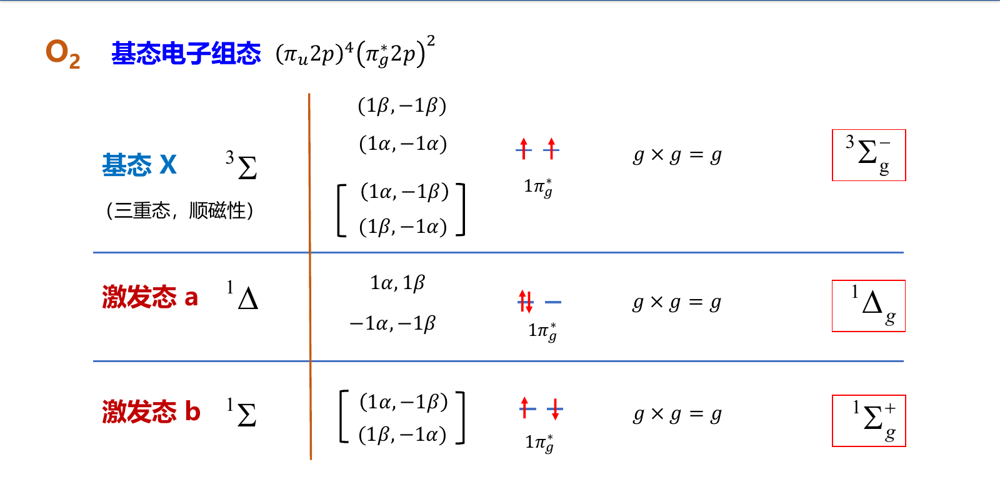

第一激发组态 $(\pi_u2p)^3(\pi_g^*2p)^3$ 可产生

$$
{}^3\Sigma_u^+,\ {}^3\Sigma_u^-,\
{}^1\Sigma_u^+,\ {}^1\Sigma_u^-,\
{}^1\Delta_u,\ {}^3\Delta_u
$$

课件重点给出的两个较低三重激发态为

$$
A\,{}^3\Sigma_u^+,\qquad B\,{}^3\Sigma_u^-
$$

#### $\mathrm{NO}$

$\mathrm{NO}$ 的基态开壳层为 $(\pi^*2p)^1$：

$$
\Lambda=1,\qquad S=\frac12
$$

故光谱项为

$$
{}^2\Pi
$$

考虑自旋-轨道耦合后，

$$
\Omega=\frac12,\frac32
$$

分裂为

$$
{}^2\Pi_{1/2},\qquad{}^2\Pi_{3/2}
$$

---

## 6.3 双原子分子电子跃迁规则

### 6.3.1 电子激发与势能曲线

在玻恩-奥本海默近似下，每个电子态都有一条关于核间距 $R$ 的势能曲线。电子由成键轨道跃迁到反键轨道后：

$$
\text{键级降低}
\longrightarrow
\begin{cases}
\text{键能减弱}\\
\text{平衡键长增大}
\end{cases}
$$

因此基态和激发态的势能曲线通常具有不同的平衡核间距和振动能级结构。

### 6.3.2 Franck-Condon 原理

电子运动的时间尺度约为阿秒，核运动和振动的时间尺度约为皮秒。电子跃迁远快于原子核响应，因此跃迁瞬间核构型近似保持不变。

在以核坐标为横轴的势能曲线上，这种跃迁表现为**垂直跃迁**。

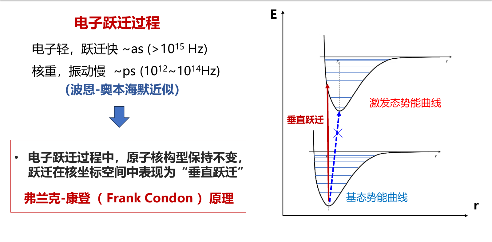

> Franck-Condon 原理描述的是跃迁过程中核坐标近似不变，并不是说电子跃迁前后平衡构型相同。

---

### 6.3.3 跃迁偶极矩的分解

在玻恩-奥本海默近似下，总波函数近似写为

$$
\Psi=\psi_{\text{elec}}\psi_v\chi_s
$$

在 Condon 近似下，分子电偶极跃迁矩阵元可分解为

$$
\begin{aligned}
\mu_{if}
&=\langle\Psi_i|\hat\mu|\Psi_f\rangle\\
&\approx
\underbrace{\langle\psi_{i,\text{elec}}|\hat\mu|
\psi_{f,\text{elec}}\rangle}_{\text{电子部分}}
\underbrace{\langle\psi_{i,v}|\psi_{f,v'}\rangle}_{\text{振动部分}}
\underbrace{\langle\chi_{i,s}|\chi_{f,s'}\rangle}_{\text{自旋部分}}
\end{aligned}
$$

因此跃迁要有强度，三个部分都不能为零：

- 电子跃迁偶极矩决定电子跃迁是否允许；
- 初、末振动波函数的重叠决定振动带的相对强度；
- 自旋波函数的重叠给出自旋选择定则。

---

### 6.3.4 电偶极跃迁选择定则

| 性质 | 选择定则 | 含义 |
| :--- | :---: | :--- |
| 总自旋 | $\Delta S=0$ | 单重态与三重态之间的电偶极跃迁禁阻 |
| 轨道角动量投影 | $\Delta\Lambda=0,\pm1$ | $\Sigma\leftrightarrow\Sigma$、$\Sigma\leftrightarrow\Pi$ 等可允许 |
| 总角动量投影 | $\Delta\Omega=0,\pm1$ | 适用于明显的自旋-轨道耦合 |
| 反演宇称 | $g\leftrightarrow u$ | 同核双原子分子中 $g\leftrightarrow g$、$u\leftrightarrow u$ 禁阻 |
| $\Sigma$ 态镜面对称性 | $\Sigma^+\leftrightarrow\Sigma^+$，$\Sigma^-\leftrightarrow\Sigma^-$ | $\Sigma^+\leftrightarrow\Sigma^-$ 禁阻 |

“禁阻”表示电偶极近似下跃迁偶极矩为零。磁偶极、振动耦合或自旋-轨道耦合可使禁阻跃迁获得微弱强度。

---

### 6.3.5 跃迁实例

#### $\mathrm{H_2}$ 的 Lyman 带

从 $X\,{}^1\Sigma_g^+$ 到 $B\,{}^1\Sigma_u^+$：

- $\Delta S=0$；
- $\Delta\Lambda=0$；
- $g\rightarrow u$；
- $\Sigma^+\rightarrow\Sigma^+$。

因此该跃迁允许，形成 $91\sim110\ \text{nm}$ 的 Lyman 吸收带。

从 $X\,{}^1\Sigma_g^+$ 到 $b\,{}^3\Sigma_u^+$ 时 $\Delta S\ne0$，属于自旋禁阻跃迁。

#### $\mathrm{O_2}$

- $B\,{}^3\Sigma_u^-\leftarrow X\,{}^3\Sigma_g^-$：满足主要电偶极选律，对应 $175\sim200\ \text{nm}$ 的 Schumann-Runge 强吸收带；
- $A\,{}^3\Sigma_u^+\leftarrow X\,{}^3\Sigma_g^-$：违反 $\Sigma$ 态的镜面对称性规则；
- $b\,{}^1\Sigma_g^+\leftarrow X\,{}^3\Sigma_g^-$：同时受到自旋和宇称禁阻；
- $a\,{}^1\Delta_g\leftarrow X\,{}^3\Sigma_g^-$：受到自旋、宇称及轨道角动量选律限制。

$\mathrm{O_2}$ 在约 $690\ \text{nm}$ 和 $1270\ \text{nm}$ 的吸收主要通过很弱的磁偶极等机制出现，需要较长光程才能清楚观测。

---

## 6.4 电子-振动光谱

### 6.4.1 Franck-Condon 因子

忽略自旋部分后，电子-振动跃迁强度近似为

$$
I_{v,v'}\propto
\left|
\langle\psi_{\text{elec}}|\hat\mu|
\psi'_{\text{elec}}\rangle
\right|^2
\left|
\langle\psi_v|\psi_{v'}\rangle
\right|^2
$$

定义 Franck-Condon 因子

$$
S_{v,v'}^2=
\left|\langle\psi_v|\psi_{v'}\rangle\right|^2,
\qquad 0\le S_{v,v'}^2\le1
$$

其物理意义是初、末振动波函数的重叠程度。

- 基态和激发态的平衡构型接近时，$0\rightarrow0$ 跃迁最强；
- 平衡构型差异较大时，垂直跃迁到多个激发态振动能级，形成 Franck-Condon 跃迁序列；
- 各峰间距近似等于激发电子态的振动能级间隔。

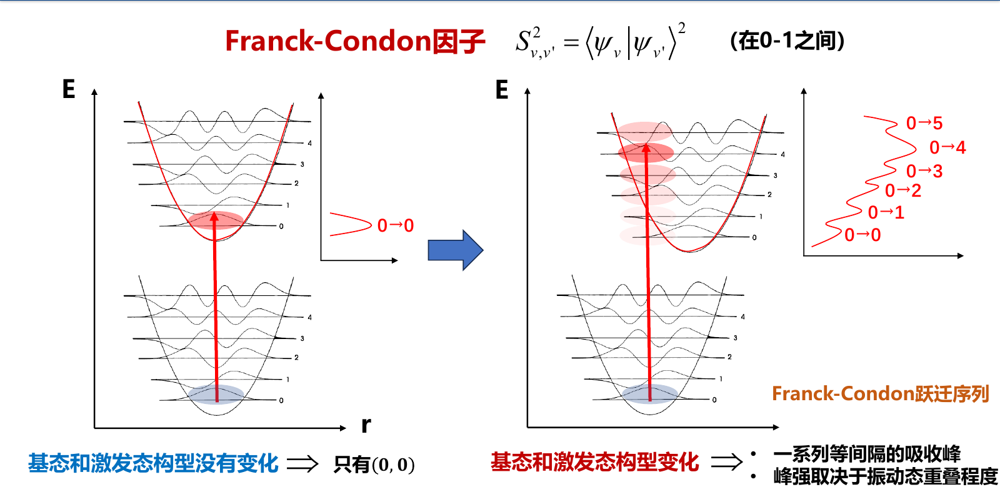

---

### 6.4.2 位移谐振子模型

若基态与激发态势能曲线具有相同曲率，只相差平衡位置，则从基态振动能级 $v=0$ 跃迁到激发态 $v'$ 的 Franck-Condon 因子为

$$
S_{0,v'}^2
=\frac{1}{v'!}
\left(\frac{\Delta^2}{2}\right)^{v'}
e^{-\Delta^2/2}
$$

其中无量纲位移

$$
\Delta=
\sqrt{\frac{\mu\omega}{\hbar}}
\left(R_e'-R_e\right)
$$

特别地，

$$
S_{0,0}^2=e^{-\Delta^2/2}
$$

所以基态与激发态的平衡构型差异越大，$0\rightarrow0$ 跃迁越弱，强度最大值会移向更高的 $v'$。

---

### 6.4.3 电子-振动吸收光谱

以下用 $(v'',v')$ 表示“基态振动量子数 $v''$ 到激发态振动量子数 $v'$”：

- $(0,0)$ 峰对应两个电子态最低振动能级之间的能差；
- $(0,1)$、$(0,2)$ 等峰还包含激发态的振动能量；
- 各振动带的强度由电子跃迁偶极矩、Franck-Condon 因子和初态的 Boltzmann 布居共同决定。

室温下多数分子位于基电子态的 $v''=0$，所以吸收谱通常以 $(0,v')$ 序列为主。

---

### 6.4.4 荧光与 Kasha-Vavilov 规则

分子吸收光子后通常先到达 $S_1$ 的较高振动态，随后通过快速的振动弛豫降到 $S_1$ 的最低振动态，再辐射跃迁回到 $S_0$ 的不同振动态并产生荧光。

**Kasha-Vavilov 规则**：发光通常从最低激发单重态 $S_1$ 或最低激发三重态 $T_1$ 的最低振动态发生。

非辐射振动弛豫会以热的形式耗散一部分能量，因此荧光光子的能量通常低于吸收光子的能量。

---

### 6.4.5 吸收-发射光谱与 Stokes 位移

**Stokes 位移**：吸收峰与荧光发射峰之间的能量或波长差。由于发射能量较低，荧光峰通常位于吸收峰的长波方向。

若基态和激发态的振动势能曲线形状相近，吸收谱和荧光谱常呈近似镜面对称。

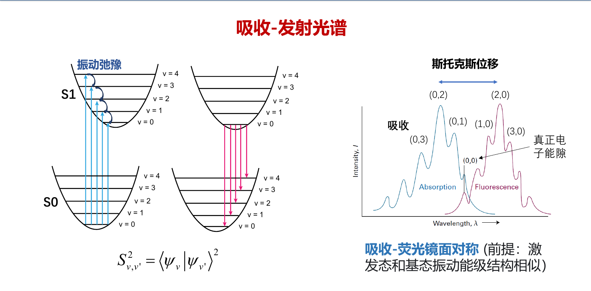

多原子分子振动模式多，液相中还存在碰撞和溶剂导致的谱线展宽，因此大部分液相紫外-可见吸收谱不能分辨出精细的振动结构。

---

## 6.5 单重态、三重态跃迁与磷光

### 6.5.1 单重态与三重态波函数

对占据不同空间轨道 $\psi_a$、$\psi_b$ 的两个电子，总波函数必须满足电子交换反对称性。

单重态 $S=0$ 的自旋波函数反对称：

$$
\chi_{\text{singlet}}
=\frac{1}{\sqrt2}
\left[\alpha(1)\beta(2)-\alpha(2)\beta(1)\right]
$$

对应的空间波函数必须对称：

$$
\psi_{\text{orb,singlet}}
=\frac{1}{\sqrt2}
\left[\psi_a(1)\psi_b(2)+\psi_a(2)\psi_b(1)\right]
$$

三重态 $S=1$ 的三个自旋波函数均为对称组合：

$$
\begin{aligned}
\chi_{1,1}&=\alpha(1)\alpha(2)\\
\chi_{1,0}&=\frac{1}{\sqrt2}
\left[\alpha(1)\beta(2)+\alpha(2)\beta(1)\right]\\
\chi_{1,-1}&=\beta(1)\beta(2)
\end{aligned}
$$

对应的空间波函数必须反对称：

$$
\psi_{\text{orb,triplet}}
=\frac{1}{\sqrt2}
\left[\psi_a(1)\psi_b(2)-\psi_a(2)\psi_b(1)\right]
$$

交换相互作用通常使同一电子组态的三重态低于单重态，课件将二者能量差写为

$$
\Delta E=2J
$$

其中 $J$ 为交换积分。

---

### 6.5.2 系间窜跃与磷光

若忽略自旋-轨道耦合，自旋是好量子数且 $\Delta S=0$：

- $S_0\rightarrow S_1$ 吸收允许；
- $S_1\rightarrow S_0$ 荧光允许；
- $S_0\leftrightarrow T_1$ 跃迁自旋禁阻。

自旋-轨道耦合会混合不同多重度的波函数，使自旋不再是严格的好量子数，从而产生：

- **系间窜跃（intersystem crossing，ISC）**：$S_1\rightarrow T_1$ 的非辐射过程；
- **磷光**：$T_1\rightarrow S_0$ 的辐射跃迁。

由于磷光仍然是部分禁阻跃迁，其寿命一般比荧光长。

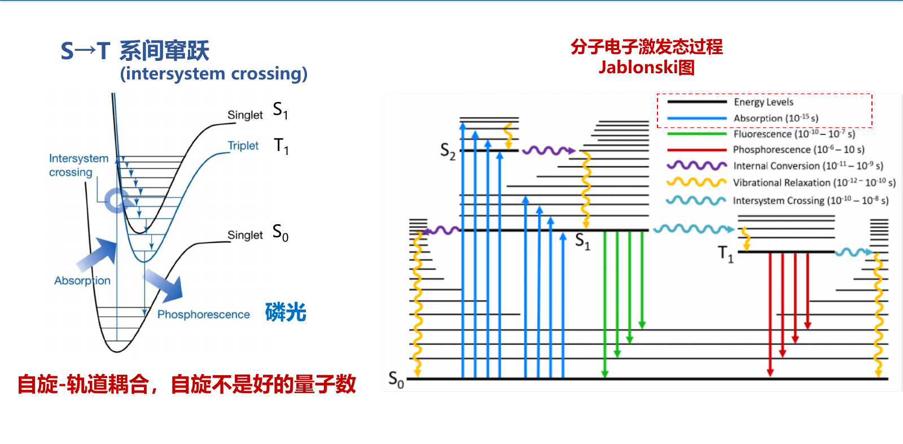

| 过程 | 典型时间尺度 |
| :--- | :---: |
| 吸收 | $10^{-15}\ \text{s}$ |
| 振动弛豫 | $10^{-12}\sim10^{-10}\ \text{s}$ |
| 内转换 | $10^{-11}\sim10^{-9}\ \text{s}$ |
| 系间窜跃 | $10^{-10}\sim10^{-8}\ \text{s}$ |
| 荧光 | $10^{-10}\sim10^{-7}\ \text{s}$ |
| 磷光 | $10^{-6}\sim10\ \text{s}$ |

---

## 6.6 多原子分子电子光谱

### 6.6.1 基本分析方法

多原子分子不再使用双原子分子的 $\Lambda$、$g/u$ 和 $\Sigma^\pm$ 体系，而采用分子点群的不可约表示描述轨道和电子态的对称性。

基本步骤为

$$
\text{多原子分子轨道}
\longrightarrow
\text{电子态（量子数与点群对称性）}
\longrightarrow
\text{选择定则}
$$

电偶极跃迁允许的群论条件是

$$
\Gamma(\psi_i)\otimes
\Gamma(\hat\mu_\alpha)\otimes
\Gamma(\psi_f)
\supset
\Gamma_{\text{tot.sym.}}
$$

其中 $\alpha=x,y,z$。即初态、偶极矩分量与末态的直积必须包含全对称表示。

例如水分子的孤对电子 $n$ 向反键轨道 $\pi^*$ 跃迁在约 $167\ \text{nm}$ 产生强吸收。

---

### 6.6.2 生色团

**生色团（chromophore）**是分子中负责特征紫外-可见吸收的结构单元。

#### d-d 跃迁

在八面体配位场中，金属 $d$ 轨道分裂为较低的 $t_{2g}$ 和较高的 $e_g$：

$$
t_{2g}\rightarrow e_g
$$

- 常位于可见光区，因此过渡金属配合物常显色；
- 中心对称配合物中的 d-d 跃迁属于 $g\rightarrow g$，受 Laporte 选律禁阻；
- 与非中心对称振动耦合后可获得一定强度，但通常仍较弱；
- 常见于 $\mathrm{Fe^{2+}}$、$\mathrm{Fe^{3+}}$ 等离子。

#### 电荷转移跃迁

1. **配体到金属电荷转移（LMCT）**

   $$
   \text{配体占据轨道}\rightarrow\text{金属空轨道}
   $$

   例如 $\mathrm{KMnO_4}$ 的强烈颜色主要来自 LMCT。

2. **金属到配体电荷转移（MLCT）**

   $$
   \text{金属 }d\text{ 轨道}\rightarrow\text{配体空 }\pi^*\text{ 轨道}
   $$

   具有低能空 $\pi^*$ 轨道的 $\mathrm{CO}$、$\mathrm{CN^-}$ 和联吡啶类配体容易参与 MLCT。

LMCT 和 MLCT 通常为强而宽的吸收带，并且对溶剂环境敏感。

#### $\pi^*\leftarrow\pi$ 与 $\pi^*\leftarrow n$ 跃迁

- $\pi^*\leftarrow\pi$ 跃迁通常允许，摩尔吸光系数较大；
- $\pi^*\leftarrow n$ 跃迁常受对称性限制，强度较弱；
- 共轭程度增大使 $\pi$ 与 $\pi^*$ 能隙减小，吸收向长波方向移动，即发生红移。

课件中的共轭体系示例：

$$
\begin{aligned}
\text{孤立乙烯}&:\ \lambda\approx180\ \text{nm}\\
\text{丁二烯}&:\ \lambda\approx217\ \text{nm}\\
\beta\text{-胡萝卜素}&:\ \lambda\approx490\ \text{nm}
\end{aligned}
$$

羰基中氧的孤对电子可发生 $n\rightarrow\pi^*$ 跃迁，典型波长约为 $270\sim290\ \text{nm}$。

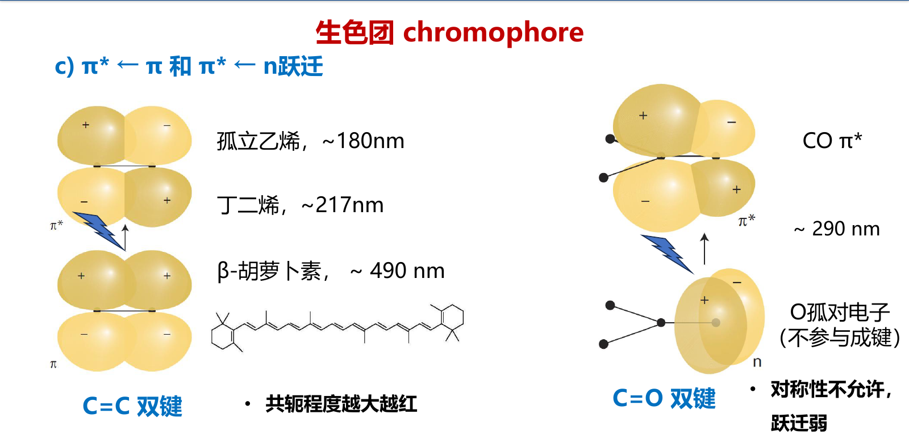

---

### 6.6.3 常见吸收的数量级

| 基团或分子 | 跃迁 | $\tilde\nu/\text{cm}^{-1}$ | $\lambda_{\max}/\text{nm}$ | $\varepsilon/(\text{dm}^3\text{mol}^{-1}\text{cm}^{-1})$ |
| :--- | :---: | :---: | :---: | :---: |
| $\mathrm{C=C}$ | $\pi^*\leftarrow\pi$ | $61000;\ 57300$ | $163;\ 174$ | $15000;\ 5500$ |
| $\mathrm{C=O}$ | $\pi^*\leftarrow n$ | $35000\sim37000$ | $270\sim290$ | $10\sim20$ |
| $\mathrm{H_2O}$ | $\pi^*\leftarrow n$ | $60000$ | $167$ | $7000$ |

由表中摩尔吸光系数可见，允许的 $\pi^*\leftarrow\pi$ 跃迁通常比受对称性限制的羰基 $\pi^*\leftarrow n$ 跃迁强得多。

---

## 6.7 紫外-可见吸收与荧光光谱仪

### 6.7.1 紫外-可见吸收光谱仪

基本光路为

$$
\text{光源}
\rightarrow
\text{准直系统}
\rightarrow
\text{单色器}
\rightarrow
\text{样品}
\rightarrow
\text{检测器}
$$

仪器比较入射光强 $I_0$ 和透射光强 $I_t$，得到透光率和吸光度：

$$
T=\frac{I_t}{I_0},
\qquad
A=-\log_{10}T
=\log_{10}\frac{I_0}{I_t}
$$

### 6.7.2 荧光光谱仪

荧光测量需要分别选择激发波长和发射波长，基本光路为

$$
\text{光源}
\rightarrow
\text{激发单色器}
\rightarrow
\text{样品}
\rightarrow
\text{发射单色器}
\rightarrow
\text{检测器}
$$

发射光通常从与激发光路近似垂直的方向收集，以减少透射激发光和散射光对检测的干扰。扫描发射单色器可获得发射光谱；扫描激发单色器并监测固定发射波长可获得激发光谱。

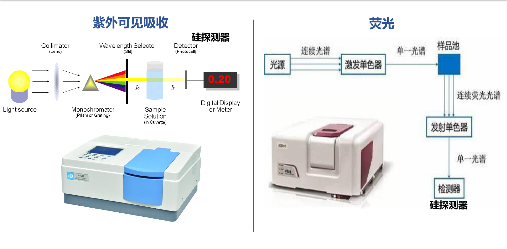
